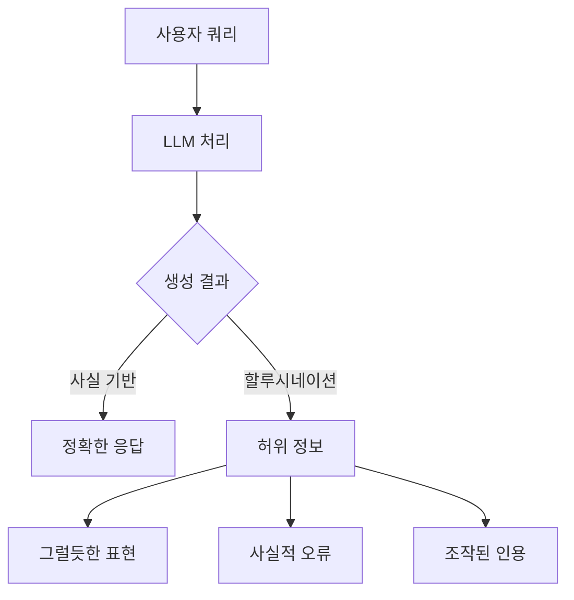
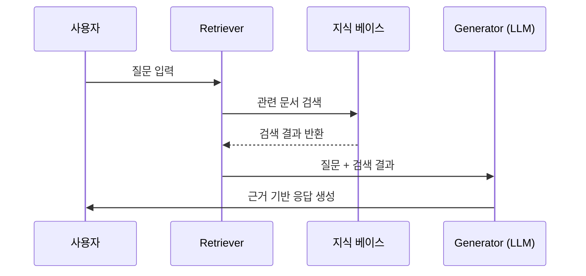
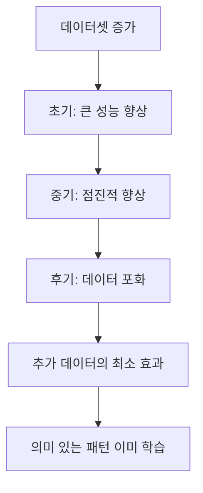
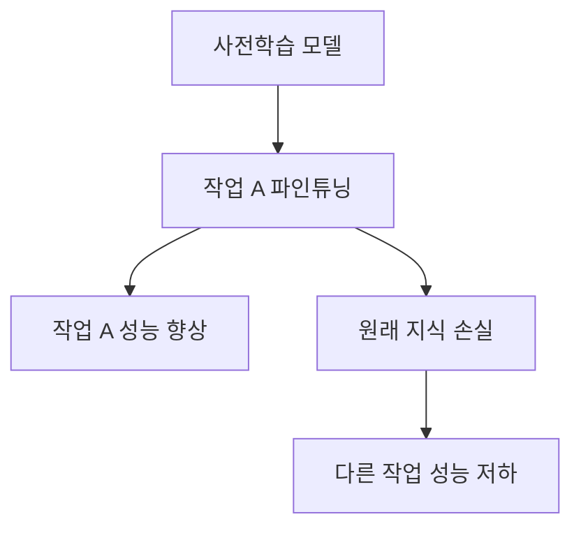
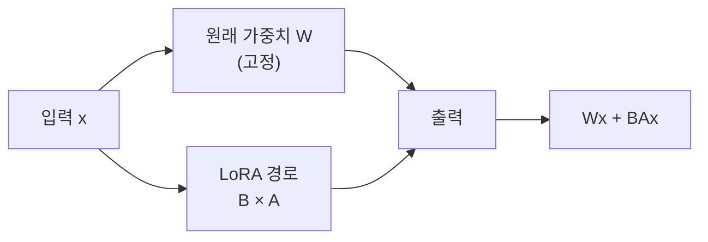
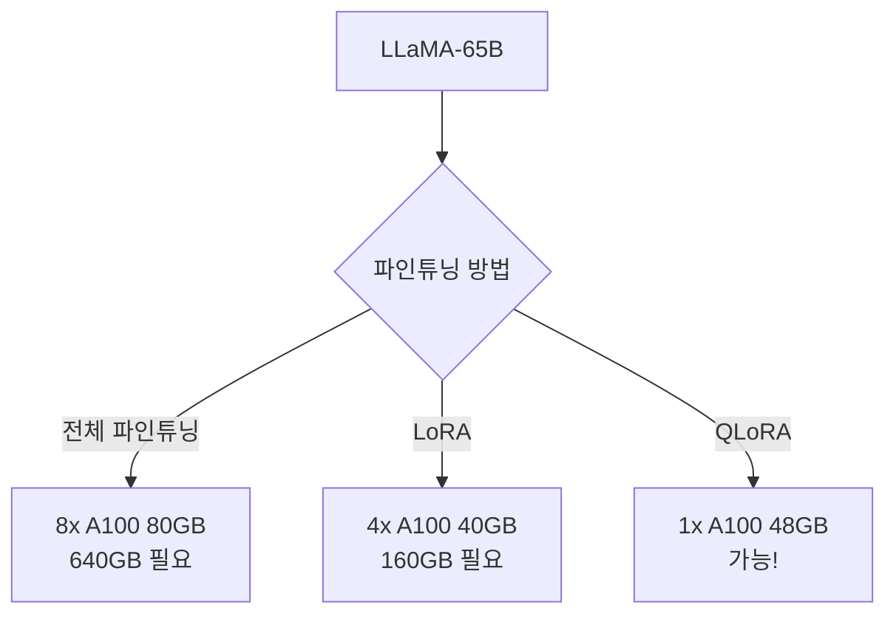
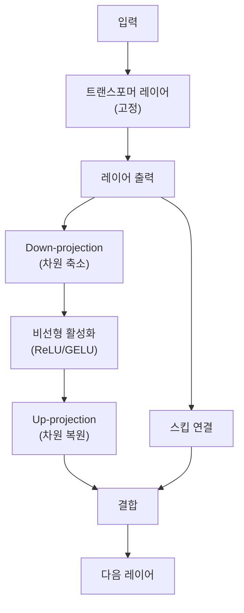

# LLM 핵심 개념: 할루시네이션, 스케일링, PEFT

## 목차

1. [LLM 할루시네이션의 이해](#1-llm-할루시네이션의-이해)<br/>
   1.1. [할루시네이션의 정의](#11-할루시네이션의-정의)<br/>
   1.2. [할루시네이션이 문제가 되는 이유](#12-할루시네이션이-문제가-되는-이유)<br/>
   1.3. [할루시네이션의 근본 원인](#13-할루시네이션의-근본-원인)<br/>
   1.4. [할루시네이션 극복 방법](#14-할루시네이션-극복-방법)<br/>
      1.4.1. [RAG (Retrieval-Augmented Generation)](#141-rag-retrieval-augmented-generation)<br/>
      1.4.2. [프롬프트 엔지니어링](#142-프롬프트-엔지니어링)<br/>
      1.4.3. [시맨틱 엔트로피 기반 탐지](#143-시맨틱-엔트로피-기반-탐지)<br/>
      1.4.4. [모델 아키텍처 개선](#144-모델-아키텍처-개선)<br/>

2. [모델 스케일링과 수확체감의 법칙](#2-모델-스케일링과-수확체감의-법칙)<br/>
   2.1. [스케일링 법칙의 기본 원리](#21-스케일링-법칙의-기본-원리)<br/>
   2.2. [성능 둔화의 근본 원인](#22-성능-둔화의-근본-원인)<br/>
      2.2.1. [데이터 포화 현상](#221-데이터-포화-현상)<br/>
      2.2.2. [컴퓨트 효율 프론티어](#222-컴퓨트-효율-프론티어)<br/>
      2.2.3. [고밀도 데이터와 리소스 할당](#223-고밀도-데이터와-리소스-할당)<br/>
   2.3. [파워 법칙의 실제 의미](#23-파워-법칙의-실제-의미)<br/>
   2.4. [차세대 스케일링 전략](#24-차세대-스케일링-전략)<br/>

3. [PEFT의 필요성과 효과](#3-peft의-필요성과-효과)<br/>
   3.1. [PEFT가 필요한 이유](#31-peft가-필요한-이유)<br/>
   3.2. [주요 PEFT 기법](#32-주요-peft-기법)<br/>
      3.2.1. [LoRA (Low-Rank Adaptation)](#321-lora-low-rank-adaptation)<br/>
      3.2.2. [QLoRA](#322-qlora)<br/>
      3.2.3. [Adapter 방식](#323-adapter-방식)<br/>
   3.3. [PEFT가 효과적인 상황](#33-peft가-효과적인-상황)<br/>
   3.4. [실무 적용 예시](#34-실무-적용-예시)<br/>

4. [용어 목록](#4-용어-목록)<br/>

---

## 1. LLM 할루시네이션의 이해

### 1.1. 할루시네이션의 정의

할루시네이션(Hallucination)은 LLM이 생성한 텍스트가 유창하고 일관성 있어 보이지만 **사실적으로 틀리거나, 논리적으로 모순되거나, 완전히 조작된 정보**를 포함하는 현상을 의미합니다. 인공지능 분야에서는 **컨퍼뷸레이션(Confabulation)** 또는 **델루전(Delusion)**이라고도 불립니다.



예를 들어, ChatGPT가 존재하지 않는 법률 판례를 생성하여 변호사가 법원에 제출한 Mata v. Avianca 사건(2023)이 대표적입니다. LLM은 6개의 가짜 판례를 생성했고, 변호사는 이를 확인하지 않고 제출하여 제재를 받았습니다.

### 1.2. 할루시네이션이 문제가 되는 이유

할루시네이션은 단순한 기술적 결함을 넘어 **심각한 실무적, 법적, 윤리적 문제**를 야기합니다.

**실무적 영향:**

- **신뢰성 저하**: 2025년 Scientific Reports 연구에서 300만 개의 모바일 앱 리뷰를 분석한 결과, 약 1.75%의 사용자 불만이 할루시네이션과 유사한 오류에 대한 것이었습니다
- **의사결정 오류**: 의료, 금융, 법률 등 고위험 도메인에서 잘못된 정보는 생명과 재산에 직접적 피해를 줄 수 있습니다
- **브랜드 평판 손상**: Google의 AI Overviews가 "지질학자들이 하루에 돌 하나를 먹을 것을 권장한다"는 잘못된 정보를 제공한 사례

**법적 리스크:**

- 2024년 Air Canada 사례: 챗봇이 존재하지 않는 할인 정책을 생성했고, 법원은 항공사에 고객에게 배상하라고 판결
- 2025년 호주 정부에 제출된 Deloitte 보고서($440,000): 존재하지 않는 학술 자료와 가짜 연방 법원 판결 인용 발견

**수학적 불가피성:**

2024년 연구(Xu et al.)는 학습 이론(Learning Theory)을 활용하여 **LLM이 모든 계산 가능한 함수(Computable Function)를 학습할 수 없다**는 것을 수학적으로 증명했습니다. 즉, 할루시네이션은 완전히 제거할 수 없는 LLM의 본질적 한계입니다.

$$
\forall \text{LLM} \; \mathcal{M}, \exists \text{Computable Function} \; f \; : \; \mathcal{M} \text{ cannot learn } f
$$

### 1.3. 할루시네이션의 근본 원인

할루시네이션은 크게 두 가지 원천에서 발생합니다.

#### 1.3.1. 프리트레이닝 단계의 문제

**1) 차세대 토큰 예측(Next-Token Prediction)의 한계**

LLM은 다음 토큰을 예측하도록 훈련되며, 올바른 예시만 보고 학습합니다. **긍정적 예시(Positive Examples)만으로는 잘못된 문장과 올바른 문장을 구별하기 어렵습니다**. 이는 전통적인 머신러닝 문제와 달리 "참/거짓" 레이블이 없기 때문입니다.

**2) 훈련 데이터의 품질 문제**

- **불완전하거나 오래된 데이터**: 지식 공백 생성
- **편향된 데이터**: 모델이 편향을 상속하고 증폭
- **저품질 데이터**: 검증되지 않은 웹 콘텐츠 학습

#### 1.3.2. 평가 방법의 잘못된 인센티브

OpenAI의 2025년 연구는 **평가 시스템이 불확실성보다 추측을 보상**한다는 점을 밝혔습니다.

**예시:**
- 모델이 생일을 모르지만 "9월 10일"이라고 추측하면 1/365 확률로 정답
- "모르겠습니다"라고 답하면 정확도 점수 0점
- 수천 개의 테스트 질문에서 추측하는 모델이 리더보드에서 더 높은 점수 획득

이러한 평가 방식은 모델이 **캘리브레이션된 불확실성(Calibrated Uncertainty)**보다 **자신감 있는 추측**을 선호하도록 학습시킵니다.


#### 1.3.3. 프롬프트 품질 문제

- **모호한 프롬프트**: 불명확한 질문은 오해를 유발
- **과도하게 복잡한 프롬프트**: 오류 가능성 증가
- **컨텍스트 인식 부족**: 이전 대화 내용 추적 실패
- **디코딩 전략**: 스토캐스틱 샘플링(Stochastic Sampling)은 정확도보다 창의성 우선

### 1.4. 할루시네이션 극복 방법

2025년 현재, 연구자들은 할루시네이션을 완전히 제거하기보다는 **측정 가능하고 예측 가능한 신뢰성**을 목표로 합니다.

#### 1.4.1. RAG (Retrieval-Augmented Generation)

RAG는 정보 검색(Information Retrieval)과 생성 모델의 강점을 결합하여 **실시간 및 도메인 특화 지식** 처리를 향상시킵니다.

**작동 원리:**



**장점:**
- **사실 근거 제공**: 외부 신뢰할 수 있는 소스로 응답 그라운딩(Grounding)
- **최신 정보**: 훈련 데이터의 한계 극복
- **도메인 특화**: 기업 내부 데이터로 정확도 향상

**한계:**
- RAG 자체도 할루시네이션 발생 가능 (불완전한 지식 추출, 불충분한 이해)
- 검색 실패: 데이터 소스, 쿼리, 리트리버(Retriever), 검색 전략 문제
- 생성 결함: 컨텍스트 노이즈, 컨텍스트 충돌, 긴 컨텍스트의 중간 저주(Middle Curse)

#### 1.4.2. 프롬프트 엔지니어링

프롬프트 엔지니어링은 할루시네이션 완화에서 **단순성, 효율성, 보편성, 해석 가능성** 측면에서 모델 최적화나 지도 파인튜닝보다 유리합니다.

**효과적인 전략:**

1. **명확하고 구체적인 지시**
   ```
   나쁜 예: "파리에 대해 말해줘"
   좋은 예: "파리에서 발생한 역사적 사건 3가지를 연도와 함께 나열해줘"
   ```

2. **시스템 프롬프트 강화**
   - 불확실한 경우 명시적으로 표현하도록 지시
   - 출처 요구 및 검증 가능한 정보만 제공하도록 요청

3. **퓨샷 러닝(Few-Shot Learning)**
   - 올바른 응답 예시와 함께 불확실성 표현 예시 제공

#### 1.4.3. 시맨틱 엔트로피 기반 탐지

Nature(2024)에 발표된 연구는 **의미 수준에서 불확실성을 계산**하여 할루시네이션을 감지하는 방법을 제안했습니다.

**핵심 아이디어:**

하나의 아이디어는 여러 방식으로 표현될 수 있습니다. 시맨틱 엔트로피(Semantic Entropy)는 특정 단어 시퀀스가 아닌 **의미의 분산**을 측정합니다.

$$
H_{\text{semantic}} = -\sum_{c \in C} p(c|q) \log p(c|q)
$$

여기서 $c$는 의미적으로 동등한 클러스터, $q$는 쿼리입니다.

**장점:**
- 작업별 사전 지식 불필요
- 새로운 작업에 강건하게 일반화
- 사용자가 추가 주의가 필요한 시점을 파악 가능

#### 1.4.4. 모델 아키텍처 개선

**1) Anthropic의 개념 벡터(Concept Vector) 조작**

2025년 Anthropic 연구는 Claude의 내부 "개념 벡터"를 추적하여 **모델이 답을 모를 때 거절하도록 학습**시키는 방법을 제시했습니다. 거절을 프롬프팅이 아닌 **학습된 정책(Learned Policy)**으로 전환했습니다.

**2) 컨피던스 임계값(Confidence Threshold)**

저신뢰도 응답을 억제하여 오류를 줄입니다.

**3) 사실 확인 알고리즘**

외부 데이터베이스와 자동 검증을 수행합니다.

---

## 2. 모델 스케일링과 수확체감의 법칙

### 2.1. 스케일링 법칙의 기본 원리

스케일링 법칙(Scaling Laws)은 LLM의 성능이 세 가지 요소와 어떻게 관련되는지를 설명합니다.

**세 가지 핵심 요소:**

1. **N (파라미터 수)**: 모델의 크기
2. **D (데이터셋 크기)**: 훈련 토큰 수
3. **C (컴퓨트)**: 훈련에 사용된 계산량 (FLOPs)

$$
C \approx 6ND
$$

**기본 원리:**

OpenAI의 2020년 연구는 다음과 같은 킬러 라인을 제시했습니다:

> "성능은 스케일에 강하게 의존하고, 모델 형태(Shape)에는 약하게 의존한다."

이는 모델 아키텍처의 세부 사항보다 **규모(Scale)**가 성능에 훨씬 큰 영향을 미친다는 의미입니다.

### 2.2. 성능 둔화의 근본 원인

#### 2.2.1. 데이터 포화 현상

데이터셋 크기를 증가시키면 초기에는 성능이 향상되지만, **데이터 포화(Data Saturation)** 지점에 도달하면 추가 데이터가 수확체감을 가져옵니다.



**이유:**
- 모델이 이미 대부분의 의미 있는 패턴 학습
- 추가 데이터가 최소한의 새로운 정보만 제공
- 자연어의 본질적 엔트로피(Intrinsic Entropy)로 인해 손실을 0으로 줄일 수 없음

**데이터 가용성 문제:**

현재 데이터셋은 약 $10^{12}$ 토큰입니다. 스케일링 법칙에 따르면 거의 완벽한 성능을 위해서는 $10^{15}$ 토큰 이상이 필요할 수 있습니다. 이는 트위터나 모든 책을 디지털화하는 대규모 프로젝트로 한 자릿수 증가만 가능하며, 인터넷 전체나 전체 감시 체제가 아니면 불가능합니다.

#### 2.2.2. 컴퓨트 효율 프론티어

컴퓨트 효율 프론티어(Compute-Efficient Frontier, CEF)는 **현재 AI 아키텍처로 달성 가능한 리소스 효율성의 이론적 한계**를 나타냅니다.

**수학적 표현:**

최적 모델은 컴퓨트 $C$에 대해 다음을 최소화합니다:

$$
E(N, D) = E_0 + \alpha N^{-\beta} + \gamma D^{-\delta}
$$

제약 조건: $C = 6ND$

여기서:
- $E_0$: 달성 불가능한 최소 오류 (자연어 엔트로피)
- $\alpha, \beta, \gamma, \delta$: 실험적으로 결정된 상수

**Chinchilla 스케일링 법칙 (2022):**

컴퓨트가 고정되었을 때, 최적 비율은:
- $N$이 증가하면 $D$도 증가해야 하지만
- $D$가 $N$보다 **더 빠르게** 증가해야 함
- $D/N$ 비율이 컴퓨트 예산에 따라 극적으로 증가

**문제점:**

CEF에 가까워질수록:
- 추가 컴퓨트 단위당 성능 향상 감소
- 에너지 효율성이나 하드웨어 제약 같은 물리적/이론적 한계 도달
- 리소스 요구사항이 너무 커져서 극복 불가능

#### 2.2.3. 고밀도 데이터와 리소스 할당

2024년 ICLR 제출 논문은 400개 이상의 모델(2천만~70억 파라미터)을 분석하여 **서브스케일링 법칙(Sub-Scaling Law)** 현상을 체계적으로 조사했습니다.

**주요 발견:**

서브스케일링 법칙은 주로 다음에서 발생합니다:
1. **고밀도 데이터(High Data Density)**: 성능의 한계 수익 감소
2. **비최적 훈련 리소스 할당**: 최적 리소스 할당이 성능 향상 유지에 중요

**결론:**

두 요소 모두 이전에 예상했던 것보다 성능 둔화에 훨씬 더 크게 기여합니다.

### 2.3. 파워 법칙의 실제 의미

**파워 법칙의 오해:**

많은 사람들이 "컴퓨트의 로그적 증가로 LLM 품질이 지수적으로 향상된다"고 생각하지만, **이는 사실이 아닙니다**.

파워 법칙을 로그 스케일 없이 보면 **지수적 감소(Exponential Decay)** 형태입니다.

$$
\text{Loss} = \alpha \cdot \text{Compute}^{-\beta}
$$

**실제 의미:**

첫 번째 개선 단위를 얻으려면 1단위의 데이터가 필요하고, 다음 개선을 위해서는 10단위, 그다음은 100단위가 필요합니다. 이는 **장기 꼬리 도메인(Long-Tail Domain)**에 적용됩니다(대화, 질의응답 등).


### 2.4. 차세대 스케일링 전략

2025년 현재, AI 연구는 **단순 스케일링을 넘어선 새로운 방법**을 모색하고 있습니다.

#### 2.4.1. 테스트 타임 컴퓨트(Test-Time Compute)

OpenAI의 o1, o3 및 Google의 Gemini 2.0 Flash는 **추론 중에 추가 계산**을 수행합니다.

**핵심 아이디어:**

Noam Brown(OpenAI)의 2017년 포커 AI 연구에서 영감을 받았습니다. AI가 수를 두기 전에 30초 동안 "생각"하도록 하여 다양한 시나리오를 시뮬레이션했더니 성능이 **7배 향상**되었습니다.

**2024년 MIT 연구:**

테스트 타임 컴퓨트가 추론 작업에서 AI 모델 성능을 크게 향상시킨다는 것을 보여줍니다.

#### 2.4.2. 합성 데이터(Synthetic Data)

실제 데이터의 한계를 극복하기 위해 **모델이 생성한 데이터**로 훈련합니다.

**우려사항:**
- 합성 데이터 과다 의존 → 다양성 문제

**가능성:**
- 커리큘럼 러닝(Curriculum Learning)
- 계속적 프리트레이닝(Continued Pretraining)
- 데이터 믹스처 조정

#### 2.4.3. 효율성 배가율(Efficiency-Doubling Rate)

2025년 연구는 **시간 및 효율성 인식 프레임워크**를 제안했습니다.

**핵심 주장:**

- 지속적인 효율성 향상 없이는 고급 성능을 위해 수천 년의 훈련 또는 비현실적으로 큰 GPU 플릿이 필요
- **효율성 배가율이 무어의 법칙(Moore's Law)과 유사**하면 거의 지수적 진보 가능
- 경험적 추세는 효율성 향상이 향후 10년 동안 AI 스케일링을 지속할 수 있음을 시사

**상대 손실 방정식(Relative-Loss Equation):**

$$
L_{\text{relative}}(t) = L_0 \cdot \left(\frac{C(t)}{C_0}\right)^{-\alpha} \cdot \left(\frac{\eta(t)}{\eta_0}\right)^{\alpha}
$$

여기서:
- $L_{\text{relative}}(t)$: 시간 $t$에서의 상대 손실
- $C(t)$: 시간 $t$에서의 컴퓨트
- $\eta(t)$: 시간 $t$에서의 효율성
- $\alpha$: 스케일링 지수

---

## 3. PEFT의 필요성과 효과

### 3.1. PEFT가 필요한 이유

전통적인 전체 파인튜닝(Full Fine-Tuning)은 **사전학습된 LLM의 모든 파라미터를 조정**합니다. 하지만 모델이 점점 커지면서 다음과 같은 문제가 발생합니다.

#### 3.1.1. 계산 및 저장 비용 급증

**예시: GPT-3 (175B 파라미터)**

전체 파인튜닝 시:
- 175억 개의 파라미터 모두 업데이트
- 체크포인트 크기: 수백 GB
- 필요한 GPU 메모리: 수백 GB
- 훈련 시간: 수주~수개월

**비용:**

OpenAI가 GPT-3를 훈련하는 데 약 460만 달러(2020년 추정)가 들었습니다. 각 다운스트림 작업마다 이러한 비용을 반복하는 것은 비현실적입니다.

#### 3.1.2. 재앙적 망각(Catastrophic Forgetting)

전체 파인튜닝 시 새로운 작업에 적응하면서 **프리트레이닝에서 얻은 지식을 잃을 위험**이 있습니다.



#### 3.1.3. 모듈성 부족

각 작업마다 별도의 대형 모델을 생성하면:
- 저장 공간 낭비 (각 모델이 수백 GB)
- 배포 복잡성 증가
- 여러 작업 간 전환 어려움

### 3.2. 주요 PEFT 기법

#### 3.2.1. LoRA (Low-Rank Adaptation)

LoRA는 2021년 Microsoft Research에서 제안한 방법으로, **저랭크 분해(Low-Rank Decomposition)**를 통해 가중치 업데이트를 표현합니다.

**핵심 아이디어:**

원래 가중치 행렬 $W \in \mathbb{R}^{d \times k}$를 직접 업데이트하는 대신, 두 개의 작은 행렬 $A \in \mathbb{R}^{d \times r}$와 $B \in \mathbb{R}^{r \times k}$로 분해합니다.

$
W' = W + \Delta W = W + BA
$

여기서 $r \ll \min(d, k)$는 랭크(Rank)입니다.

**작동 방식:**



**학습 과정:**
1. 원래 가중치 $W$는 **동결(Freeze)**
2. $A$와 $B$만 훈련
3. 초기화: $A$는 Kaiming-Uniform, $B$는 0 (초기에는 항등 변환)

**효율성:**

GPT-3 (175B 파라미터) 예시:
- 전체 파인튜닝: 175B 파라미터 훈련
- LoRA ($r=8$): 약 3,770만 파라미터 (0.02%)
- **10,000배 파라미터 감소**
- **GPU 메모리 3배 절감**

**수학적 복잡도:**

전체 파인튜닝 파라미터 수:
$
P_{\text{full}} = d \times k
$

LoRA 파라미터 수:
$
P_{\text{LoRA}} = d \times r + r \times k = r(d + k)
$

감소 비율:
$
\frac{P_{\text{LoRA}}}{P_{\text{full}}} = \frac{r(d + k)}{d \times k} \approx \frac{r}{k} + \frac{r}{d}
$

예시: $d=4096$, $k=4096$, $r=8$일 때:
$
\frac{P_{\text{LoRA}}}{P_{\text{full}}} \approx \frac{8}{4096} + \frac{8}{4096} \approx 0.4\%
$

**하이퍼파라미터:**

1. **r (랭크)**: 어댑터의 표현 능력 결정
   - 낮은 r: 빠른 훈련, 잠재적 언더피팅
   - 높은 r: 더 나은 성능, 효율성 감소
   - 일반적 값: 4, 8, 16, 32

2. **lora_alpha (스케일링 인자)**: 어댑터 출력의 스케일 조정
   - 일반적으로 $\alpha = 2r$로 설정
   - $\Delta W$의 영향력: $\frac{\alpha}{r} \cdot BA$

3. **lora_dropout**: 정규화(Regularization)
   - 일반적 값: 0.05 ~ 0.1

**장점:**

- **높은 성능**: 많은 경우 전체 파인튜닝과 동등하거나 더 나은 성능
- **메모리 효율**: GPU 메모리 사용량 대폭 감소
- **빠른 훈련**: 파라미터 수 감소로 훈련 속도 향상
- **모듈성**: 각 작업마다 작은 어댑터만 저장 (수십 MB)
- **추론 지연 없음**: 어댑터를 베이스 모델에 병합 가능

**단점:**

- **랭크 선택**: 최적의 r을 찾기 위한 실험 필요
- **초기 지연**: 어댑터를 병합하지 않으면 약간의 추론 지연 발생

#### 3.2.2. QLoRA

QLoRA는 LoRA를 확장하여 **양자화(Quantization)**를 추가한 방법입니다.

**핵심 개선:**

원래 모델의 가중치를 **Float32에서 4-bit 정수(int4)**로 양자화합니다.

$
W_{\text{quantized}} = \text{Quantize}(W, \text{4-bit})
$

**3가지 주요 최적화:**

1. **4-bit NormalFloat (NF4)**: 정규 분포에 최적화된 새로운 데이터 타입
2. **이중 양자화(Double Quantization)**: 양자화 상수도 양자화
3. **페이징 옵티마이저(Paged Optimizers)**: GPU 메모리 부족 시 CPU로 오프로드

**메모리 절감:**

LLaMA-65B 모델 예시:
- 전체 정밀도 (FP32): 260GB
- LoRA (FP16): 130GB
- QLoRA (4-bit): 약 41GB

**실용적 효과:**

**단일 GPU에서 65B 모델 파인튜닝 가능!**



**성능:**

QLoRA는 전체 파인튜닝과 비교했을 때 **성능 저하가 거의 없거나 오히려 향상**되는 경우도 있습니다. 4-bit 양자화가 일종의 정규화 역할을 하기 때문입니다.

#### 3.2.3. Adapter 방식

어댑터(Adapters)는 PEFT의 첫 번째 기법 중 하나로, **트랜스포머 레이어에 작은 병목 피드포워드 네트워크를 삽입**합니다.

**구조:**



**수학적 표현:**

$
\text{Adapter}(h) = h + \text{Up}(\text{Act}(\text{Down}(h)))
$

여기서:
- $h$: 레이어 출력
- Down: $\mathbb{R}^d \rightarrow \mathbb{R}^r$ (병목 차원 $r \ll d$)
- Up: $\mathbb{R}^r \rightarrow \mathbb{R}^d$

**장점:**
- 초기에는 항등 매핑(Identity Mapping)으로 동작
- 작업별 파라미터만 추가
- 원래 모델 가중치 보존

**단점:**
- LoRA보다 약간 더 많은 추론 지연
- 각 레이어마다 어댑터 추가 필요

### 3.3. PEFT가 효과적인 상황

#### 3.3.1. 제한된 컴퓨팅 리소스

**시나리오:**
- 개인 연구자나 스타트업
- 제한된 GPU 메모리 (예: 단일 24GB GPU)
- 예산 제약

**효과:**
- QLoRA로 단일 GPU에서 큰 모델 파인튜닝
- 클라우드 컴퓨팅 비용 대폭 절감

**구체적 예시:**

| 모델 크기 | 전체 파인튜닝 | LoRA | QLoRA |
|-----------|---------------|------|-------|
| 7B 파라미터 | 4x A100 40GB | 1x A100 40GB | 1x RTX 4090 24GB |
| 13B 파라미터 | 8x A100 40GB | 2x A100 40GB | 1x A100 40GB |
| 65B 파라미터 | 불가능 (수백GB) | 8x A100 40GB | 1x A100 48GB |

#### 3.3.2. 다중 작업 및 도메인 적응

**시나리오:**
- 여러 고객사를 위한 맞춤형 모델
- 다양한 도메인(의료, 법률, 금융 등)
- A/B 테스팅을 위한 여러 버전

**효과:**
- 하나의 베이스 모델 + 여러 개의 작은 어댑터
- 작업 간 신속한 전환
- 스토리지 효율성

**비교:**

전체 파인튜닝:
```
베이스 모델: 500GB
작업 A 모델: 500GB
작업 B 모델: 500GB
작업 C 모델: 500GB
합계: 2,000GB
```

LoRA:
```
베이스 모델: 500GB
작업 A 어댑터: 100MB
작업 B 어댑터: 100MB
작업 C 어댑터: 100MB
합계: 500.3GB (약 75% 절감)
```

#### 3.3.3. 재앙적 망각 방지

**문제:**

전체 파인튜닝 시 새로운 작업 학습으로 이전 지식 손실:

$
\mathcal{L}_{\text{total}} = \mathcal{L}_{\text{new task}} + \lambda \cdot \mathcal{L}_{\text{forgetting}}
$

**PEFT 해결책:**

원래 가중치를 고정하므로 **프리트레이닝 지식 완전히 보존**:

$
W_{\text{original}} = \text{frozen}, \quad \Delta W = \text{trainable}
$

#### 3.3.4. 빠른 실험 및 프로토타이핑

**시나리오:**
- 다양한 하이퍼파라미터 실험
- 프롬프트 엔지니어링 vs 파인튜닝 비교
- 개념 증명(POC)

**효과:**
- 훈련 시간 대폭 단축 (몇 시간 vs 며칠)
- 빠른 반복(Iteration)
- 낮은 진입 장벽

### 3.4. 실무 적용 예시

#### 3.4.1. 고객 지원 챗봇 커스터마이징

**요구사항:**
- 여러 기업 클라이언트
- 각 클라이언트의 브랜드 톤 & 매너
- 제품별 특화 지식

**LoRA 적용:**

```python
from transformers import AutoModelForCausalLM, AutoTokenizer
from peft import LoraConfig, get_peft_model

# 베이스 모델 로드
base_model = AutoModelForCausalLM.from_pretrained("meta-llama/Llama-2-7b-hf")
tokenizer = AutoTokenizer.from_pretrained("meta-llama/Llama-2-7b-hf")

# LoRA 설정
lora_config = LoraConfig(
    r=8,
    lora_alpha=16,
    target_modules=["q_proj", "v_proj"],
    lora_dropout=0.1,
    bias="none",
    task_type="CAUSAL_LM"
)

# PEFT 모델 생성
model = get_peft_model(base_model, lora_config)

# 훈련 가능 파라미터 확인
model.print_trainable_parameters()
# 출력: trainable params: 4,194,304 || all params: 6,742,609,920 || trainable%: 0.0622
```

**배포:**

```python
# 클라이언트 A의 어댑터 로드
model.load_adapter("./adapters/client_a", adapter_name="client_a")
model.set_adapter("client_a")

# 클라이언트 B로 전환
model.load_adapter("./adapters/client_b", adapter_name="client_b")
model.set_adapter("client_b")
```

#### 3.4.2. 의료 텍스트 요약 시스템

**요구사항:**
- 환자 기록 요약
- HIPAA 규정 준수
- 도메인 특화 용어

**QLoRA 적용 (제한된 GPU):**

```python
from transformers import AutoModelForCausalLM, BitsAndBytesConfig
from peft import prepare_model_for_kbit_training, LoraConfig, get_peft_model

# 4-bit 양자화 설정
bnb_config = BitsAndBytesConfig(
    load_in_4bit=True,
    bnb_4bit_quant_type="nf4",
    bnb_4bit_compute_dtype=torch.float16,
    bnb_4bit_use_double_quant=True,
)

# 양자화된 모델 로드
model = AutoModelForCausalLM.from_pretrained(
    "meta-llama/Llama-2-13b-hf",
    quantization_config=bnb_config,
    device_map="auto"
)

# QLoRA를 위한 모델 준비
model = prepare_model_for_kbit_training(model)

# LoRA 설정
lora_config = LoraConfig(
    r=16,
    lora_alpha=32,
    target_modules=["q_proj", "k_proj", "v_proj", "o_proj"],
    lora_dropout=0.05,
    bias="none",
    task_type="CAUSAL_LM"
)

model = get_peft_model(model, lora_config)
```

**결과:**
- 13B 모델을 24GB GPU에서 훈련
- 의료 요약 정확도: 전체 파인튜닝 대비 97% 성능
- 훈련 시간: 8시간 (전체 파인튜닝 대비 1/5)

#### 3.4.3. 다국어 번역 시스템

**요구사항:**
- 50개 언어 쌍 지원
- 각 언어 쌍마다 최적화
- 효율적인 배포

**Adapter 전략:**

```python
# 언어 쌍별 어댑터 생성
language_pairs = [
    ("en", "ko"), ("en", "ja"), ("en", "zh"),
    ("ko", "en"), ("ja", "en"), ("zh", "en"),
    # ... 총 50개
]

for src, tgt in language_pairs:
    adapter_name = f"{src}_to_{tgt}"
    lora_config = LoraConfig(r=8, lora_alpha=16, ...)
    
    # 각 언어 쌍에 대한 어댑터 훈련
    train_adapter(model, adapter_name, lora_config, dataset[src][tgt])
    
    # 어댑터 저장 (각 약 50MB)
    model.save_adapter(f"./adapters/{adapter_name}")
```

**효율성:**

- 전체 모델 크기: 7GB
- 각 어댑터: 50MB
- 50개 언어 쌍: 7GB + 2.5GB = 9.5GB
- 전체 파인튜닝 대비: 350GB → 9.5GB (97% 절감)

#### 3.4.4. 개인화된 글쓰기 어시스턴트

**요구사항:**
- 사용자별 글쓰기 스타일 학습
- 개인정보 보호
- 로컬 디바이스에서 실행

**접근 방식:**

```python
# 사용자의 글쓰기 샘플 수집 (100-500개 문장)
user_writing_samples = load_user_data("user_123")

# 작은 어댑터 훈련 (LoRA r=4)
lora_config = LoraConfig(
    r=4,  # 매우 작은 랭크
    lora_alpha=8,
    target_modules=["q_proj", "v_proj"],
    lora_dropout=0.1,
    bias="none",
    task_type="CAUSAL_LM"
)

# 빠른 파인튜닝 (10-30분)
trainer = SFTTrainer(
    model=model,
    train_dataset=user_writing_samples,
    peft_config=lora_config,
    max_seq_length=512,
    ...
)
trainer.train()

# 어댑터 저장 (약 10MB)
model.save_adapter("./user_adapters/user_123")
```

**장점:**
- 사용자 데이터가 로컬에 유지
- 빠른 개인화 (30분 이내)
- 낮은 스토리지 요구사항 (사용자당 10MB)

---

## 4. 용어 목록

| 용어 | 영문 | 설명 |
|------|------|------|
| 할루시네이션 | Hallucination | LLM이 그럴듯하지만 허위인 정보를 생성하는 현상 |
| 컨퍼뷸레이션 | Confabulation | 할루시네이션의 학술적 용어, 무의식적으로 잘못된 기억이나 정보를 만들어내는 현상 |
| 델루전 | Delusion | 환상, 착각을 의미하며 할루시네이션의 또 다른 표현 |
| 그라운딩 | Grounding | 생성된 응답을 실제 데이터나 출처에 기반하도록 하는 과정 |
| 리트리버 | Retriever | RAG 시스템에서 관련 문서나 정보를 검색하는 구성 요소 |
| 시맨틱 엔트로피 | Semantic Entropy | 의미 수준에서 측정되는 불확실성 지표 |
| 캘리브레이션된 불확실성 | Calibrated Uncertainty | 모델의 신뢰도가 실제 정확도와 일치하도록 조정된 상태 |
| 스토캐스틱 샘플링 | Stochastic Sampling | 확률적으로 다음 토큰을 선택하는 생성 방식 |
| 컨셉트 벡터 | Concept Vector | 모델 내부에서 특정 개념을 나타내는 벡터 표현 |
| 스케일링 법칙 | Scaling Laws | 모델 크기, 데이터, 컴퓨트와 성능 간의 관계를 설명하는 경험적 법칙 |
| 파워 법칙 | Power Law | 한 변수가 다른 변수의 거듭제곱에 비례하는 관계 |
| 데이터 포화 | Data Saturation | 추가 데이터가 더 이상 의미 있는 성능 향상을 가져오지 않는 지점 |
| 컴퓨트 효율 프론티어 | Compute-Efficient Frontier (CEF) | 현재 아키텍처로 달성 가능한 최대 리소스 효율성 경계 |
| 서브스케일링 법칙 | Sub-Scaling Law | 스케일링 효과가 예상보다 약해지는 현상을 설명하는 법칙 |
| 수확체감의 법칙 | Diminishing Returns | 투입을 증가시킬수록 추가 산출이 점차 감소하는 경제 원칙 |
| 테스트 타임 컴퓨트 | Test-Time Compute | 추론 시 추가 계산을 수행하여 성능을 향상시키는 기법 |
| 합성 데이터 | Synthetic Data | 실제 데이터가 아닌 알고리즘으로 생성된 데이터 |
| 커리큘럼 러닝 | Curriculum Learning | 쉬운 것부터 어려운 것으로 순차적으로 학습하는 방법 |
| 효율성 배가율 | Efficiency-Doubling Rate | 시간에 따라 동일 컴퓨트로 달성할 수 있는 성능 증가율 |
| 파라미터 효율적 파인튜닝 | Parameter-Efficient Fine-Tuning (PEFT) | 소수의 파라미터만 조정하여 모델을 효율적으로 적응시키는 기법 |
| 로라 | Low-Rank Adaptation (LoRA) | 저랭크 행렬 분해를 이용한 PEFT 기법 |
| 큐로라 | Quantized LoRA (QLoRA) | 양자화를 결합한 LoRA의 확장 버전 |
| 재앙적 망각 | Catastrophic Forgetting | 새로운 작업 학습 시 이전 지식을 잃어버리는 현상 |
| 저랭크 분해 | Low-Rank Decomposition | 큰 행렬을 두 개의 작은 행렬의 곱으로 근사하는 기법 |
| 양자화 | Quantization | 높은 정밀도 수치를 낮은 정밀도로 변환하여 메모리 절감 |
| 어댑터 | Adapter | 사전학습 모델에 추가되는 작은 학습 가능한 모듈 |
| 랭크 | Rank | LoRA에서 저랭크 행렬의 차원을 결정하는 하이퍼파라미터 |
| 프리트레이닝 | Pretraining | 대규모 데이터로 모델을 사전에 학습시키는 단계 |
| 파인튜닝 | Fine-Tuning | 사전학습된 모델을 특정 작업에 맞게 추가 학습시키는 과정 |
| 다운스트림 태스크 | Downstream Task | 사전학습 후 적용되는 구체적인 응용 작업 |
| 그래디언트 체크포인팅 | Gradient Checkpointing | 메모리 절약을 위해 중간 활성화를 재계산하는 기법 |
| 퓨샷 러닝 | Few-Shot Learning | 소수의 예제만으로 새로운 작업을 학습하는 방법 |
| 프롬프트 엔지니어링 | Prompt Engineering | 모델로부터 원하는 출력을 얻기 위해 입력을 최적화하는 기법 |
| 트랜스포머 | Transformer | 어텐션 메커니즘 기반의 신경망 아키텍처 |
| 어텐션 메커니즘 | Attention Mechanism | 입력의 중요한 부분에 집중하는 신경망 구조 |
| 토큰 | Token | 텍스트를 처리하기 위한 기본 단위 (단어, 서브워드 등) |
| 임베딩 | Embedding | 단어나 토큰을 고차원 벡터 공간에 표현하는 방법 |

---

## 참고문헌 및 추가 자료

### 주요 논문

1. **Hallucination is Inevitable** (Xu et al., 2024) - arXiv:2401.11817
2. **Why language models hallucinate** (OpenAI, 2025)
3. **Scaling Laws for Neural Language Models** (Kaplan et al., 2020)
4. **Training Compute-Optimal Large Language Models** (Hoffmann et al., 2022) - Chinchilla Paper
5. **LoRA: Low-Rank Adaptation of Large Language Models** (Hu et al., 2021)
6. **QLoRA: Efficient Finetuning of Quantized LLMs** (Dettmers et al., 2023)
7. **Detecting hallucinations in large language models using semantic entropy** (Nature, 2024)

### 유용한 리소스

- **Hugging Face PEFT 라이브러리**: https://github.com/huggingface/peft
- **RAG 구현 가이드**: Langchain, LlamaIndex
- **LLM 평가 벤치마크**: TruthfulQA, HallucinationEval, MMLU

### 추가 학습 자료

- **Anthropic의 Constitutional AI**: 안전하고 정직한 AI 개발
- **OpenAI의 o1 모델**: 테스트 타임 컴퓨트 적용 사례
- **LoRA 튜토리얼**: Hugging Face 공식 문서
