# RAG 시스템 : LangChain을 활용한 구축과 평가

## 목차

1. [RAG 시스템 개요](#1-rag-시스템-개요)
   - 1.1. [RAG란 무엇인가?](#11-rag란-무엇인가)
   - 1.2. [RAG의 필요성과 활용 사례](#12-rag의-필요성과-활용-사례)
   - 1.3. [RAG의 기본 아키텍처](#13-rag의-기본-아키텍처)

2. [LangChain을 활용한 RAG 구성 요소](#2-langchain을-활용한-rag-구성-요소)
   - 2.1. [문서 로더 (Document Loaders)](#21-문서-로더-document-loaders)
   - 2.2. [텍스트 분할기 (Text Splitters)](#22-텍스트-분할기-text-splitters)
   - 2.3. [임베딩 모델 (Embedding Models)](#23-임베딩-모델-embedding-models)
   - 2.4. [벡터 스토어 (Vector Stores)](#24-벡터-스토어-vector-stores)
   - 2.5. [리트리버 (Retrievers)](#25-리트리버-retrievers)
   - 2.6. [프롬프트 템플릿 (Prompt Templates)](#26-프롬프트-템플릿-prompt-templates)
   - 2.7. [LLM 통합](#27-llm-통합)
   - 2.8. [체인 구성 (Chains)](#28-체인-구성-chains)

3. [RAG 시스템 구현](#3-rag-시스템-구현)
   - 3.1. [기본 RAG 파이프라인 구축](#31-기본-rag-파이프라인-구축)
   - 3.2. [고급 RAG 기법](#32-고급-rag-기법)

4. [RAG 에이전트 (RAG Agents)](#4-rag-에이전트-rag-agents)
   - 4.1. [에이전트의 개념](#41-에이전트의-개념)
   - 4.2. [에이전트 아키텍처](#42-에이전트-아키텍처)
   - 4.3. [LangChain 에이전트 구현](#43-langchain-에이전트-구현)
   - 4.4. [실전 에이전트 사례](#44-실전-에이전트-사례)

5. [RAG 시스템 평가](#5-rag-시스템-평가)
   - 5.1. [평가의 중요성](#51-평가의-중요성)
   - 5.2. [독립 평가 (Component-wise Evaluation)](#52-독립-평가-component-wise-evaluation)
   - 5.3. [종단간 평가 (End-to-End Evaluation)](#53-종단간-평가-end-to-end-evaluation)
   - 5.4. [평가 프레임워크](#54-평가-프레임워크)
   - 5.5. [독립 평가 vs 종단간 평가](#55-독립-평가-vs-종단간-평가)

6. [RAG 최적화 및 모범 사례](#6-rag-최적화-및-모범-사례)
   - 6.1. [성능 최적화](#61-성능-최적화)
   - 6.2. [비용 최적화](#62-비용-최적화)
   - 6.3. [일반적인 문제와 해결책](#63-일반적인-문제와-해결책)

7. [실습 프로젝트 가이드라인](#7-실습-프로젝트-가이드라인)
   - 7.1. [기본 RAG 시스템 구축](#71-기본-rag-시스템-구축)
   - 7.2. [평가 파이프라인 구현](#72-평가-파이프라인-구현)
   - 7.3. [에이전트 기반 RAG 시스템](#73-에이전트-기반-rag-시스템)

8. [용어 목록 (Glossary)](#8-용어-목록-glossary)

---

## 1. RAG 시스템 개요

### 1.1. RAG란 무엇인가?

**RAG**(Retrieval-Augmented Generation, 검색 증강 생성)는 대규모 언어 모델(LLM)의 응답 품질을 향상시키기 위해 외부 지식 소스에서 관련 정보를 검색하여 생성 과정에 통합하는 기술입니다.

#### 1.1.1. RAG의 핵심 원리

RAG는 두 가지 주요 단계로 구성됩니다:

1. **검색 단계(Retrieval)**: 사용자 쿼리와 관련된 문서나 정보를 외부 데이터베이스에서 검색
2. **생성 단계(Generation)**: 검색된 컨텍스트를 활용하여 LLM이 답변을 생성

수학적으로 표현하면, RAG는 다음과 같이 모델링할 수 있습니다:

$$P(y|x) = \sum_{d \in D} P(d|x) \cdot P(y|x, d)$$

여기서:
- $x$: 입력 쿼리
- $y$: 생성된 응답
- $d$: 검색된 문서
- $D$: 전체 문서 컬렉션
- $P(d|x)$: 쿼리에 대한 문서의 관련성
- $P(y|x, d)$: 문서를 조건으로 하는 응답 생성 확률

#### 1.1.2. RAG의 작동 방식

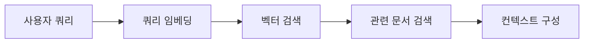

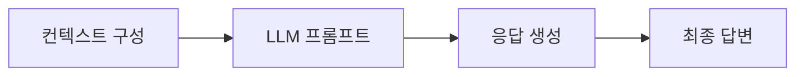


### 1.2. RAG의 필요성과 활용 사례

#### 1.2.1. 기존 LLM의 한계점

순수 LLM은 다음과 같은 근본적인 한계를 가지고 있습니다:

**지식 컷오프(Knowledge Cutoff)**: 모델이 학습된 시점 이후의 정보를 알지 못합니다. 예를 들어, 2023년에 학습된 모델은 2024년의 사건이나 발전을 반영할 수 없습니다.

**환각(Hallucination)**: LLM은 사실이 아닌 정보를 그럴듯하게 생성할 수 있습니다. 이는 특히 전문적이거나 구체적인 정보를 요구하는 경우 문제가 됩니다.

**도메인 특화 지식 부족**: 특정 기업의 내부 문서, 최신 연구 논문, 개인 데이터 등 공개적으로 학습되지 않은 정보는 접근할 수 없습니다.

**출처 검증 불가**: 순수 LLM은 정보의 출처를 명확히 제시하지 못하므로 신뢰성 검증이 어렵습니다.

#### 1.2.2. RAG가 해결하는 문제

RAG는 이러한 한계를 다음과 같이 극복합니다:

**실시간 정보 접근**: 외부 데이터베이스를 쿼리하여 최신 정보를 가져올 수 있습니다.

**사실 기반 응답**: 검색된 실제 문서를 기반으로 응답하므로 환각이 크게 감소합니다.

**도메인 특화**: 특정 조직이나 개인의 문서를 인덱싱하여 맞춤형 지식 베이스를 구축할 수 있습니다.

**추적 가능성**: 각 응답에 대해 참조한 문서를 제시하여 출처를 검증할 수 있습니다.

#### 1.2.3. 실제 활용 사례

**고객 지원 챗봇**: 제품 매뉴얼, FAQ, 이전 고객 상담 기록을 검색하여 정확한 답변을 제공합니다. 예를 들어, 특정 제품의 문제 해결 방법을 찾을 때 관련 매뉴얼 섹션을 검색하고 이를 기반으로 단계별 가이드를 생성합니다.

**내부 문서 검색 시스템**: 기업 내부의 정책 문서, 프로젝트 기록, 회의록 등을 검색하여 직원들이 필요한 정보를 빠르게 찾을 수 있도록 합니다. 예를 들어, "휴가 정책"에 대한 질문에 최신 인사 규정을 검색하여 답변합니다.

**의료 정보 시스템**: 의학 논문, 진료 가이드라인, 약물 정보를 검색하여 의료진의 의사결정을 지원합니다. 특정 질병의 최신 치료법이나 약물 상호작용 정보를 제공할 수 있습니다.

**법률 연구 도구**: 판례, 법령, 법률 해석을 검색하여 법률 전문가의 연구를 돕습니다. 특정 법률 쟁점과 관련된 판례를 찾고 요약하여 제시할 수 있습니다.

**교육 플랫폼**: 교과서, 강의 자료, 연습 문제를 검색하여 학생들의 질문에 맞춤형 설명을 제공합니다. 특정 개념을 이해하지 못한 학생에게 관련 섹션을 찾아 쉽게 설명해줄 수 있습니다.

### 1.3. RAG의 기본 아키텍처

#### 1.3.1. 전체 시스템 구조

RAG 시스템은 크게 두 가지 주요 파이프라인으로 구성됩니다:

**인덱싱 파이프라인(Indexing Pipeline)**: 데이터를 준비하고 검색 가능한 형태로 저장하는 오프라인 프로세스입니다.

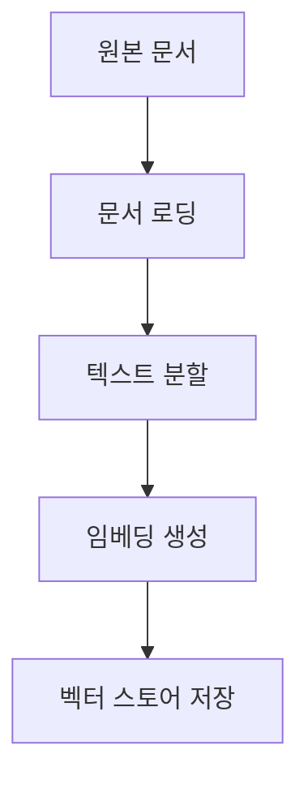

**검색 파이프라인(Retrieval Pipeline)**: 사용자 쿼리를 처리하고 응답을 생성하는 온라인 프로세스입니다.

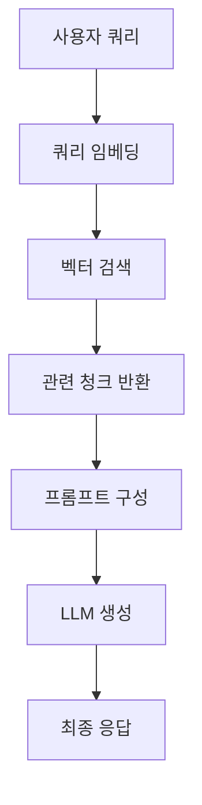

#### 1.3.2. 주요 구성 요소

**데이터 소스**: PDF, 웹 페이지, 데이터베이스, API 등 다양한 형태의 원본 데이터입니다.

**문서 로더**: 다양한 형식의 문서를 읽고 텍스트를 추출하는 모듈입니다.

**텍스트 분할기**: 긴 문서를 의미 있는 작은 단위(청크, Chunk)로 나누는 모듈입니다.

**임베딩 모델**: 텍스트를 고차원 벡터 공간의 점으로 변환하는 모델입니다.

**벡터 스토어**: 임베딩 벡터를 저장하고 효율적으로 검색할 수 있는 데이터베이스입니다.

**리트리버**: 쿼리에 가장 관련성 높은 문서를 검색하는 컴포넌트입니다.

**LLM**: 검색된 컨텍스트를 바탕으로 최종 응답을 생성하는 언어 모델입니다.

#### 1.3.3. 데이터 흐름

RAG 시스템의 데이터 흐름은 다음과 같습니다:

**인덱싱 단계**:
1. 원본 문서를 로드
2. 문서를 청크로 분할
3. 각 청크를 임베딩 벡터로 변환
4. 벡터와 메타데이터를 벡터 스토어에 저장

**검색 단계**:
1. 사용자 쿼리를 임베딩 벡터로 변환
2. 벡터 스토어에서 유사한 벡터를 검색
3. 상위 k개의 관련 청크를 반환

**생성 단계**:
1. 검색된 청크들을 컨텍스트로 구성
2. 쿼리와 컨텍스트를 프롬프트에 결합
3. LLM에 전달하여 응답 생성
4. 필요시 출처 정보를 포함하여 반환

---

## 2. LangChain을 활용한 RAG 구성 요소

LangChain은 RAG 시스템 구축을 위한 포괄적인 프레임워크를 제공합니다. 각 구성 요소는 모듈화되어 있어 쉽게 교체하고 조합할 수 있습니다.

### 2.1. 문서 로더 (Document Loaders)

#### 2.1.1. 문서 로더의 역할

문서 로더는 다양한 소스에서 데이터를 읽어들이고 표준화된 형식으로 변환하는 첫 번째 단계입니다. LangChain은 100개 이상의 문서 로더를 제공하여 거의 모든 형태의 데이터 소스를 지원합니다.

#### 2.1.2. 지원되는 데이터 소스

**파일 기반 로더**:
- **PDF**: PyPDF, PDFMiner, PDFPlumber 등 다양한 PDF 파싱 라이브러리를 지원합니다. PDF의 텍스트, 표, 이미지를 추출할 수 있습니다.
- **Word 문서**: DOCX 파일에서 텍스트, 서식, 메타데이터를 추출합니다.
- **CSV/Excel**: 구조화된 데이터를 행 단위 또는 전체 테이블로 로드합니다.
- **Markdown/HTML**: 웹 페이지나 마크다운 문서를 로드하며 링크와 구조를 보존합니다.
- **텍스트 파일**: 일반 텍스트, 로그 파일, 코드 파일 등을 지원합니다.

**웹 기반 로더**:
- **웹 스크래핑**: BeautifulSoup, Selenium을 활용한 웹 페이지 크롤링
- **웹 API**: REST API, GraphQL 엔드포인트에서 데이터 가져오기
- **RSS 피드**: 뉴스, 블로그 피드 구독

**클라우드 스토리지**:
- **S3**: AWS S3 버킷에서 파일 로드
- **Google Drive**: Google Docs, Sheets, Slides 지원
- **Dropbox**: Dropbox 파일 시스템 접근

**데이터베이스**:
- **SQL**: PostgreSQL, MySQL, SQLite 등의 관계형 데이터베이스
- **NoSQL**: MongoDB, Elasticsearch 등의 문서 데이터베이스

**협업 도구**:
- **Notion**: Notion 페이지와 데이터베이스
- **Confluence**: Atlassian Confluence 문서
- **Slack**: Slack 메시지 히스토리

#### 2.1.3. 문서 로더의 출력 형식

모든 문서 로더는 `Document` 객체의 리스트를 반환합니다. 각 Document 객체는:

- **page_content**: 문서의 텍스트 내용
- **metadata**: 소스, 페이지 번호, 작성자, 날짜 등의 메타데이터

메타데이터는 이후 검색 필터링, 출처 표시, 시간 기반 검색 등에 활용됩니다.

### 2.2. 텍스트 분할기 (Text Splitters)

#### 2.2.1. 텍스트 분할의 필요성

대부분의 문서는 LLM의 컨텍스트 윈도우보다 훨씬 큽니다. 또한, 의미적으로 관련 없는 정보를 함께 제공하면 LLM의 성능이 저하됩니다. 따라서 문서를 적절한 크기의 의미 있는 단위로 나누는 것이 중요합니다.

#### 2.2.2. 청킹 전략

**고정 크기 분할(Fixed-size Chunking)**: 가장 단순한 방법으로, 문서를 고정된 문자 수나 토큰 수로 나눕니다. 간단하지만 문장이나 단락 중간에서 잘릴 수 있습니다.

**문장/단락 기반 분할**: 자연어 처리 기법을 사용하여 문장이나 단락 경계에서 분할합니다. 의미 단위를 보존하지만 청크 크기가 불균일할 수 있습니다.

**재귀적 분할(Recursive Splitting)**: LangChain의 `RecursiveCharacterTextSplitter`가 사용하는 방법으로, 여러 구분자를 우선순위에 따라 시도합니다:
1. 이중 줄바꿈(`\n\n`) - 단락 구분
2. 단일 줄바꿈(`\n`) - 줄 구분
3. 공백(` `) - 단어 구분
4. 빈 문자열(`""`) - 문자 단위 구분

**의미 기반 분할(Semantic Chunking)**: 임베딩을 사용하여 의미적으로 유사한 문장들을 같은 청크로 묶습니다. 가장 정교하지만 계산 비용이 높습니다.

**구조 인식 분할**: 마크다운 헤더, HTML 태그, 코드 블록 등 문서 구조를 인식하여 분할합니다.

#### 2.2.3. 청크 크기와 오버랩

**청크 크기(Chunk Size)**: 일반적으로 200-1000 토큰 사이를 사용합니다. 작은 청크는 검색 정밀도가 높지만 충분한 컨텍스트를 제공하지 못할 수 있고, 큰 청크는 관련 없는 정보가 포함될 수 있습니다.

최적 청크 크기는 다음 요인에 따라 결정됩니다:
- 문서의 특성 (기술 문서 vs 서사적 텍스트)
- LLM의 컨텍스트 윈도우 크기
- 검색 성능과 생성 품질의 트레이드오프

**청크 오버랩(Chunk Overlap)**: 인접한 청크들 사이에 중복 영역을 두는 것입니다. 일반적으로 청크 크기의 10-20%를 오버랩으로 설정합니다.

오버랩의 장점:
- 분할 경계에서 정보가 손실되는 것을 방지
- 문맥 연속성 유지
- 검색 재현율 향상

수식으로 표현하면:

$$\text{Overlap} = \text{Chunk Size} \times \alpha, \quad 0.1 \leq \alpha \leq 0.2$$

#### 2.2.4. 분할 방법 비교

| 방법 | 장점 | 단점 | 사용 사례 |
|------|------|------|-----------|
| 고정 크기 | 빠르고 간단 | 의미 단위 무시 | 균일한 텍스트 |
| 문장 기반 | 의미 보존 | 불균일한 크기 | 일반 문서 |
| 재귀적 | 균형잡힌 성능 | 다소 복잡 | 대부분의 경우 |
| 의미 기반 | 최고 품질 | 높은 비용 | 고품질 요구 시 |
| 구조 인식 | 문서 구조 활용 | 형식 의존적 | 구조화된 문서 |

### 2.3. 임베딩 모델 (Embedding Models)

#### 2.3.1. 임베딩의 원리

임베딩(Embedding)은 텍스트를 고차원 벡터 공간의 점으로 변환하는 과정입니다. 의미적으로 유사한 텍스트는 벡터 공간에서 가까운 위치에 배치됩니다.

수학적으로, 임베딩 함수는 다음과 같이 표현됩니다:

$$f: \mathcal{T} \rightarrow \mathbb{R}^d$$

여기서:
- $\mathcal{T}$: 텍스트 공간
- $\mathbb{R}^d$: d차원 실수 벡터 공간 (일반적으로 $d = 384, 768, 1536$ 등)
- $f$: 임베딩 함수 (신경망 모델)

두 텍스트의 유사도는 코사인 유사도로 측정됩니다:

$$\text{similarity}(v_1, v_2) = \frac{v_1 \cdot v_2}{\|v_1\| \|v_2\|} = \cos(\theta)$$

여기서 $\theta$는 두 벡터 사이의 각도입니다.

#### 2.3.2. 주요 임베딩 모델

**OpenAI Embeddings**:
- **text-embedding-3-small**: 1536차원, 빠르고 비용 효율적
- **text-embedding-3-large**: 3072차원, 최고 성능
- 특징: 높은 품질, API 기반, 사용하기 쉬움
- 적합한 경우: 품질이 중요하고 API 비용을 감당할 수 있는 경우

**HuggingFace Embeddings**:
- **sentence-transformers/all-MiniLM-L6-v2**: 384차원, 빠르고 가벼움
- **sentence-transformers/all-mpnet-base-v2**: 768차원, 균형잡힌 성능
- **BAAI/bge-large-en**: 1024차원, MTEB 벤치마크에서 우수한 성능
- 특징: 로컬 실행 가능, 무료, 다국어 지원 모델 다수
- 적합한 경우: 데이터 프라이버시가 중요하거나 비용을 최소화하려는 경우

**Cohere Embeddings**:
- **embed-english-v3.0**: 1024차원, 검색에 최적화
- **embed-multilingual-v3.0**: 다국어 지원
- 특징: 의미 검색에 특화, 압축 옵션 제공
- 적합한 경우: 다국어 지원이 필요하거나 검색 성능이 중요한 경우

**도메인 특화 모델**:
- **BioBERT**: 의료/생명과학 분야
- **SciBERT**: 과학 논문
- **FinBERT**: 금융 도메인
- 특징: 특정 도메인에서 우수한 성능
- 적합한 경우: 전문 분야 애플리케이션

#### 2.3.3. 임베딩 모델 선택 기준

**차원 수**: 높은 차원은 더 많은 정보를 표현할 수 있지만, 저장 공간과 검색 시간이 증가합니다.

**언어 지원**: 다국어 지원이 필요한 경우 multilingual 모델을 선택해야 합니다.

**도메인 적합성**: 일반 도메인 vs 전문 도메인

**배포 방식**: 
- API 기반: 간편하지만 비용 발생, 네트워크 의존
- 로컬 실행: 초기 설정 필요하지만 비용 절감, 프라이버시 보장

**성능 지표**:
- MTEB(Massive Text Embedding Benchmark) 점수
- 검색 태스크에서의 Recall@k
- 도메인 특화 벤치마크 점수

### 2.4. 벡터 스토어 (Vector Stores)

#### 2.4.1. 벡터 데이터베이스의 필요성

벡터 스토어(Vector Store)는 임베딩 벡터를 효율적으로 저장하고 검색하기 위한 특수한 데이터베이스입니다. 전통적인 데이터베이스와 달리, 벡터 스토어는 고차원 벡터 간의 유사도 검색에 최적화되어 있습니다.

**근사 최근접 이웃(ANN, Approximate Nearest Neighbor)** 알고리즘을 사용하여 수백만 개의 벡터에서도 밀리초 단위로 유사한 벡터를 찾을 수 있습니다.

#### 2.4.2. 벡터 데이터베이스 종류

**Chroma**:
- 오픈소스, 로컬 실행
- Python 네이티브, 쉬운 시작
- 중소 규모 애플리케이션에 적합
- 메모리 또는 디스크 영구 저장

**Pinecone**:
- 관리형 클라우드 서비스
- 확장성이 뛰어남 (수십억 벡터)
- 하이브리드 검색 지원
- 엔터프라이즈급 애플리케이션

**Weaviate**:
- 오픈소스, GraphQL 쿼리
- 멀티모달 검색 지원
- 자동 스케일링
- 복잡한 쿼리에 적합

**FAISS** (Facebook AI Similarity Search):
- 메타에서 개발한 오픈소스 라이브러리
- 매우 빠른 검색 속도
- 로컬 실행, 경량
- 프로토타이핑과 연구에 적합

**Milvus**:
- 오픈소스, 분산 시스템
- GPU 가속 지원
- 대규모 프로덕션 환경
- Kubernetes 배포 용이

**Qdrant**:
- Rust로 작성, 고성능
- 필터링 기능 강력
- 로컬 또는 클라우드 배포
- 정교한 검색 요구사항

#### 2.4.3. 인덱싱 알고리즘

벡터 데이터베이스는 다양한 인덱싱 알고리즘을 사용하여 빠른 검색을 가능하게 합니다:

**HNSW** (Hierarchical Navigable Small World):
- 그래프 기반 알고리즘
- 계층적 구조로 검색 속도 향상
- 높은 정확도와 빠른 속도
- 메모리 사용량이 높음

**IVF** (Inverted File Index):
- 벡터를 클러스터로 그룹화
- 검색 시 관련 클러스터만 탐색
- 메모리 효율적
- 정확도와 속도의 트레이드오프 조정 가능

**LSH** (Locality Sensitive Hashing):
- 해시 함수를 사용한 근사 검색
- 매우 빠른 검색 속도
- 메모리 효율적
- 정확도가 다소 낮을 수 있음

**PQ** (Product Quantization):
- 벡터 압축 기법
- 메모리 사용량 대폭 감소
- 검색 속도 향상
- 일부 정확도 손실

#### 2.4.4. 벡터 스토어 비교표

| 특성 | Chroma | Pinecone | FAISS | Weaviate | Milvus |
|------|--------|----------|-------|----------|--------|
| 배포 | 로컬 | 클라우드 | 로컬 | 둘 다 | 둘 다 |
| 확장성 | 중 | 높음 | 낮음 | 높음 | 높음 |
| 학습 곡선 | 쉬움 | 쉬움 | 중간 | 중간 | 어려움 |
| 비용 | 무료 | 유료 | 무료 | 무료/유료 | 무료 |
| 필터링 | 기본 | 고급 | 없음 | 고급 | 고급 |
| 속도 | 빠름 | 매우 빠름 | 매우 빠름 | 빠름 | 매우 빠름 |
| 적합 규모 | 소-중 | 대 | 소-중 | 중-대 | 대 |

#### 2.4.5. 메타데이터 필터링

대부분의 벡터 스토어는 메타데이터 기반 필터링을 지원합니다. 이를 통해 벡터 검색과 전통적인 데이터베이스 쿼리를 결합할 수 있습니다.

예를 들어:
- 특정 날짜 범위의 문서만 검색
- 특정 저자의 문서만 검색
- 특정 카테고리나 태그가 있는 문서만 검색

필터링은 검색 품질을 크게 향상시킬 수 있습니다:

$$\text{filtered\_search}(q) = \{d \in D : \text{similarity}(q, d) > \tau \land \text{filter}(d.metadata)\}$$

### 2.5. 리트리버 (Retrievers)

#### 2.5.1. 리트리버의 역할

리트리버(Retriever)는 벡터 스토어와 상호작용하여 쿼리에 가장 관련성 높은 문서를 검색하는 추상화된 인터페이스입니다. LangChain은 다양한 검색 전략을 구현한 여러 리트리버를 제공합니다.

#### 2.5.2. 검색 알고리즘

**유사도 검색(Similarity Search)**: 가장 기본적인 방법으로, 쿼리 벡터와 가장 가까운 k개의 문서 벡터를 반환합니다.

$$\text{top\_k} = \arg\max_{d_1, \ldots, d_k \in D} \sum_{i=1}^{k} \text{similarity}(q, d_i)$$

**MMR** (Maximal Marginal Relevance): 관련성과 다양성을 모두 고려하는 알고리즘입니다. 이미 선택된 문서와 너무 유사한 문서는 제외하여 정보의 다양성을 보장합니다.

$$\text{MMR} = \arg\max_{d_i \in D \setminus S} \left[\lambda \cdot \text{Sim}(q, d_i) - (1-\lambda) \cdot \max_{d_j \in S} \text{Sim}(d_i, d_j)\right]$$

여기서:
- $S$: 이미 선택된 문서 집합
- $\lambda$: 관련성과 다양성의 균형을 조절하는 파라미터 (일반적으로 0.5-0.7)

**유사도 점수 임계값(Similarity Score Threshold)**: 일정 유사도 점수 이상의 문서만 반환하여 관련 없는 문서를 필터링합니다.

$$\text{results} = \{d \in D : \text{similarity}(q, d) \geq \tau\}$$

#### 2.5.3. 고급 검색 기법

**하이브리드 검색(Hybrid Search)**: 벡터 검색과 키워드 기반 검색(예: BM25)을 결합합니다.

$$\text{score}_{\text{hybrid}}(q, d) = \alpha \cdot \text{score}_{\text{vector}}(q, d) + (1-\alpha) \cdot \text{score}_{\text{keyword}}(q, d)$$

벡터 검색은 의미적 유사성을 잘 포착하고, 키워드 검색은 정확한 용어 매칭에 강점이 있습니다. 두 방법을 결합하면 더 강건한 검색이 가능합니다.

**컨텍스트 압축(Contextual Compression)**: 검색된 문서에서 쿼리와 가장 관련 있는 부분만 추출하여 LLM에 전달합니다. 이는 토큰 사용량을 줄이고 생성 품질을 향상시킵니다.

**부모 문서 검색(Parent Document Retriever)**: 작은 청크로 검색하지만 전체 부모 문서나 더 큰 청크를 반환합니다. 검색 정밀도와 충분한 컨텍스트 사이의 균형을 맞춥니다.

**멀티 쿼리 검색(Multi-Query Retrieval)**: 원본 쿼리에서 여러 변형 쿼리를 생성하여 각각 검색한 후 결과를 통합합니다. 쿼리 표현의 다양성을 통해 재현율을 향상시킵니다.

**시간 가중 검색(Time-Weighted Retrieval)**: 최신 문서에 더 높은 가중치를 부여합니다.

$$\text{score}_{\text{time}}(d) = \text{similarity}(q, d) \cdot e^{-\lambda \cdot (t_{\text{now}} - t_d)}$$

여기서 $t_d$는 문서의 타임스탬프이고, $\lambda$는 시간 감쇠 계수입니다.

### 2.6. 프롬프트 템플릿 (Prompt Templates)

#### 2.6.1. 프롬프트 엔지니어링의 중요성

RAG 시스템에서 프롬프트 템플릿은 검색된 컨텍스트와 사용자 쿼리를 LLM이 이해할 수 있는 형식으로 구성하는 역할을 합니다. 잘 설계된 프롬프트는 응답의 품질을 크게 향상시킵니다.

#### 2.6.2. 효과적인 RAG 프롬프트 구조

**시스템 지시사항(System Instructions)**: LLM의 역할과 행동 방식을 정의합니다.

```
당신은 제공된 컨텍스트를 기반으로 정확하게 답변하는 도우미입니다.
컨텍스트에 답이 없으면 "제공된 정보로는 답변할 수 없습니다"라고 말하세요.
```

**컨텍스트 제공(Context Provision)**: 검색된 문서들을 명확하게 구분하여 제시합니다.

```
다음은 관련 문서들입니다:

문서 1: [내용]
출처: [source]

문서 2: [내용]
출처: [source]
```

**명확한 질문(Clear Question)**: 사용자 쿼리를 명시적으로 제시합니다.

```
질문: {user_query}
```

**답변 형식 지정(Response Format)**: 원하는 답변 형식을 지정합니다.

```
답변은 다음 형식으로 제공하세요:
1. 간단한 요약 (2-3 문장)
2. 상세 설명
3. 참조한 문서 출처
```

#### 2.6.3. 프롬프트 최적화 기법

**Few-shot 예제**: 원하는 응답 스타일의 예제를 포함합니다.

**체인 오브 쏘트(Chain-of-Thought)**: 단계적 추론을 유도합니다.

```
단계별로 생각하며 답변하세요:
1. 컨텍스트에서 관련 정보 찾기
2. 정보의 신뢰성 평가
3. 논리적으로 답변 구성
```

**출처 인용 강제**: 답변에 출처를 명시하도록 요구합니다.

```
각 주장마다 [문서 X]와 같이 출처를 표시하세요.
```

**환각 방지**: LLM이 추측하지 않도록 명시적으로 지시합니다.

```
확실하지 않은 정보는 "불확실합니다" 또는 "추가 정보가 필요합니다"라고 말하세요.
컨텍스트에 없는 내용을 추측하거나 창작하지 마세요.
```

### 2.7. LLM 통합

#### 2.7.1. LLM 선택

LangChain은 다양한 LLM을 지원합니다:

**OpenAI Models**:
- GPT-4 Turbo: 최고 성능, 128K 컨텍스트
- GPT-4: 고품질 응답
- GPT-3.5 Turbo: 빠르고 비용 효율적

**Anthropic Claude**:
- Claude 3 Opus: 가장 강력
- Claude 3 Sonnet: 균형잡힌 성능
- Claude 3 Haiku: 빠른 응답

**오픈소스 Models**:
- Llama 2/3: 메타의 오픈소스 모델
- Mistral: 고성능 오픈소스
- Gemma: 구글의 경량 모델

#### 2.7.2. 컨텍스트 윈도우 관리

LLM의 컨텍스트 윈도우 크기는 한 번에 처리할 수 있는 토큰 수를 제한합니다. RAG 시스템에서는 이를 고려하여 검색 문서 수와 청크 크기를 조정해야 합니다.

$$\text{tokens}_{\text{total}} = \text{tokens}_{\text{system}} + \text{tokens}_{\text{context}} + \text{tokens}_{\text{query}} + \text{tokens}_{\text{response}}$$

컨텍스트 윈도우를 초과하면:
- 가장 관련성 높은 문서만 선택
- 문서를 요약하여 전달
- 여러 번의 LLM 호출로 분할 처리

#### 2.7.3. 온도와 기타 파라미터

**온도(Temperature)**: 출력의 무작위성을 조절합니다.
- 낮은 온도 (0.0-0.3): 결정적이고 일관된 응답, 사실 기반 QA에 적합
- 높은 온도 (0.7-1.0): 창의적이고 다양한 응답, 창작 작업에 적합

**Top-p (Nucleus Sampling)**: 누적 확률이 p인 토큰들만 고려합니다.

**Max Tokens**: 생성할 최대 토큰 수를 제한합니다.

**Frequency/Presence Penalty**: 반복을 줄이고 다양성을 높입니다.

### 2.8. 체인 구성 (Chains)

#### 2.8.1. 체인의 개념

체인(Chain)은 여러 컴포넌트를 순차적으로 연결하여 복잡한 워크플로우를 구성하는 LangChain의 핵심 개념입니다.

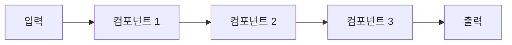

#### 2.8.2. RAG 체인의 구조

**기본 RAG 체인**:

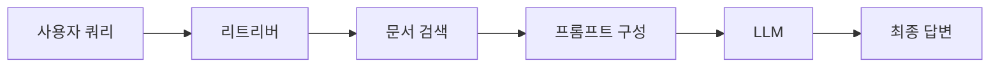

**고급 RAG 체인**:

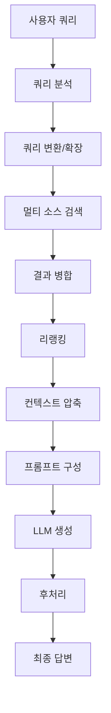

#### 2.8.3. LCEL (LangChain Expression Language)

LCEL은 체인을 선언적으로 구성하는 문법입니다. 파이프(`|`) 연산자를 사용하여 컴포넌트를 연결합니다.

개념적 구조:
```
chain = component1 | component2 | component3
```

LCEL의 장점:
- **가독성**: 데이터 흐름을 직관적으로 표현
- **스트리밍**: 중간 결과를 스트리밍 가능
- **병렬 실행**: 독립적인 컴포넌트를 병렬로 실행
- **폴백**: 실패 시 대체 경로 지정

---

## 3. RAG 시스템 구현

### 3.1. 기본 RAG 파이프라인 구축

#### 3.1.1. 환경 설정

RAG 시스템을 구축하기 위한 핵심 라이브러리:

- **LangChain**: RAG 프레임워크
- **벡터 스토어**: Chroma, Pinecone, FAISS 등
- **임베딩 모델**: OpenAI, HuggingFace 등
- **LLM**: OpenAI GPT, Claude, 오픈소스 모델 등

필요한 API 키:
- OpenAI API 키 (OpenAI 모델 사용 시)
- Pinecone API 키 (Pinecone 사용 시)
- HuggingFace 토큰 (HF 모델 사용 시)

#### 3.1.2. 단계별 구현 프로세스

**1단계: 문서 로딩**

다양한 소스에서 문서를 로드합니다. PDF, 웹 페이지, 텍스트 파일 등 필요한 데이터를 수집합니다.

**2단계: 텍스트 분할**

로드된 문서를 적절한 크기의 청크로 분할합니다. 청크 크기와 오버랩을 조정하여 최적의 검색 성능을 얻습니다.

**3단계: 임베딩 생성**

각 청크를 벡터로 변환합니다. 선택한 임베딩 모델을 사용하여 텍스트의 의미를 수치적으로 표현합니다.

**4단계: 벡터 스토어에 저장**

임베딩 벡터와 메타데이터를 벡터 데이터베이스에 저장합니다. 인덱싱을 통해 빠른 검색이 가능하도록 합니다.

**5단계: 리트리버 설정**

벡터 스토어를 기반으로 리트리버를 구성합니다. 검색 알고리즘과 파라미터를 설정합니다.

**6단계: 프롬프트 템플릿 작성**

효과적인 프롬프트 템플릿을 작성합니다. 시스템 지시사항, 컨텍스트 제공 방식, 답변 형식을 정의합니다.

**7단계: 체인 구성**

리트리버, 프롬프트, LLM을 연결하여 완전한 RAG 체인을 구성합니다.

**8단계: 쿼리 실행**

사용자 쿼리를 받아 체인을 실행하고 응답을 반환합니다.

#### 3.1.3. 전체 파이프라인 흐름

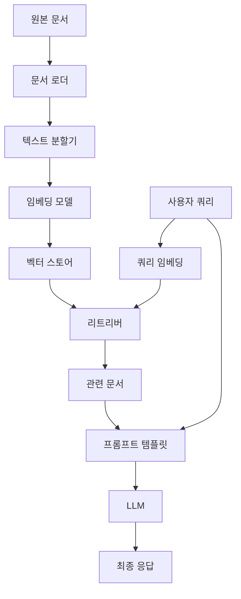

### 3.2. 고급 RAG 기법

#### 3.2.1. 하이브리드 검색

하이브리드 검색은 벡터 검색과 키워드 검색을 결합하여 더 강건한 검색을 제공합니다.

**벡터 검색의 장점**:
- 의미적 유사성 포착
- 동의어와 관련 개념 이해
- 언어 변형에 강건

**키워드 검색(BM25)의 장점**:
- 정확한 용어 매칭
- 드문 단어나 고유명사 처리
- 빠른 실행 속도

**결합 방식**:

$$\text{score}_{\text{final}}(q, d) = \alpha \cdot \text{normalize}(\text{score}_{\text{vector}}(q, d)) + (1-\alpha) \cdot \text{normalize}(\text{score}_{\text{BM25}}(q, d))$$

여기서:
- $\alpha$: 벡터 검색의 가중치 (일반적으로 0.5-0.7)
- normalize: 점수를 0-1 범위로 정규화

**BM25 알고리즘**:

BM25는 문서 $d$가 쿼리 $q$에 얼마나 관련 있는지를 계산합니다:

$$\text{BM25}(q, d) = \sum_{t \in q} \text{IDF}(t) \cdot \frac{f(t, d) \cdot (k_1 + 1)}{f(t, d) + k_1 \cdot (1 - b + b \cdot \frac{|d|}{\text{avgdl}})}$$

여기서:
- $f(t, d)$: 문서 $d$에서 용어 $t$의 빈도
- $|d|$: 문서 $d$의 길이
- $\text{avgdl}$: 평균 문서 길이
- $k_1$, $b$: 조정 파라미터 (일반적으로 $k_1=1.5$, $b=0.75$)
- $\text{IDF}(t)$: 역문서 빈도

$$\text{IDF}(t) = \ln\left(\frac{N - n(t) + 0.5}{n(t) + 0.5} + 1\right)$$

여기서:
- $N$: 전체 문서 수
- $n(t)$: 용어 $t$를 포함하는 문서 수

#### 3.2.2. 리랭킹 (Re-ranking)

리랭킹은 초기 검색 결과를 더 정교한 모델로 재평가하여 순위를 조정하는 기법입니다.

**2단계 검색 아키텍처**:

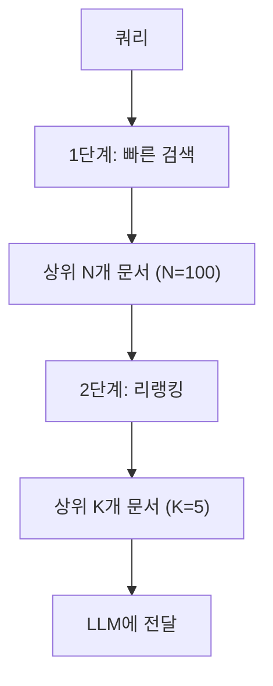

**리랭킹 모델의 종류**:

**Cross-Encoder 모델**: 쿼리와 문서를 함께 입력받아 관련성 점수를 직접 출력합니다.

$$\text{score}_{\text{rerank}}(q, d) = f_{\text{cross-encoder}}([q; d])$$

장점:
- 쿼리와 문서 간 상호작용을 직접 모델링
- 높은 정확도

단점:
- 느린 추론 속도 (각 쿼리-문서 쌍마다 모델 실행 필요)
- 대규모 문서 컬렉션에 직접 적용 불가

**LLM 기반 리랭킹**: GPT나 Claude 같은 LLM을 사용하여 문서의 관련성을 평가합니다.

프롬프트 예시:
```
쿼리: {query}
문서: {document}

이 문서가 쿼리와 얼마나 관련 있는지 0-10점으로 평가하세요.
점수만 출력하세요.
```

장점:
- 복잡한 추론 가능
- 다양한 기준으로 평가 가능

단점:
- 비용이 높음
- 느린 속도

**리랭킹 모델 예시**:
- Cohere Rerank
- bge-reranker-base/large
- ms-marco-MiniLM-L-12-v2

#### 3.2.3. 쿼리 변환

사용자 쿼리는 종종 불완전하거나 모호합니다. 쿼리 변환은 원본 쿼리를 개선하여 더 나은 검색 결과를 얻는 기법입니다.

**쿼리 확장(Query Expansion)**: 원본 쿼리에 관련 용어를 추가합니다.

예시:
- 원본: "Python 성능 향상"
- 확장: "Python 성능 최적화 속도 개선 프로파일링 병렬화"

**쿼리 재작성(Query Rewriting)**: LLM을 사용하여 쿼리를 더 명확하게 재작성합니다.

프롬프트 예시:
```
다음 질문을 검색에 최적화된 형태로 재작성하세요:
원본: {user_query}

재작성된 질문:
```

**멀티 쿼리 생성(Multi-Query Generation)**: 하나의 쿼리에서 여러 변형 쿼리를 생성합니다.

예시:
- 원본: "RAG 시스템의 성능을 어떻게 향상시킬 수 있나요?"
- 변형 1: "RAG 검색 정확도를 높이는 방법"
- 변형 2: "RAG 시스템 최적화 기법"
- 변형 3: "RAG 성능 메트릭과 개선 전략"

각 변형 쿼리로 검색을 수행하고 결과를 통합하여 재현율을 높입니다.

**HyDE** (Hypothetical Document Embeddings): LLM을 사용하여 가상의 이상적인 답변을 생성하고, 그 답변의 임베딩으로 검색합니다.

프로세스:
1. 쿼리를 LLM에 전달하여 가상 답변 생성
2. 가상 답변을 임베딩으로 변환
3. 가상 답변 임베딩으로 검색 수행

이는 "답변처럼 보이는 문서"를 찾는 데 효과적입니다.

#### 3.2.4. 컨텍스트 압축

검색된 문서에는 종종 쿼리와 관련 없는 정보가 많이 포함되어 있습니다. 컨텍스트 압축은 관련 부분만 추출하여 LLM에 전달합니다.

**추출 기반 압축**: 각 문장의 관련성을 평가하여 관련 있는 문장만 선택합니다.

**요약 기반 압축**: LLM을 사용하여 검색된 문서를 요약합니다.

**청크 수준 필터링**: 청크 내에서 가장 관련 있는 부분만 추출합니다.

**이점**:
- 토큰 사용량 감소 (비용 절감)
- LLM의 주의 집중도 향상
- 응답 생성 시간 단축
- 관련 없는 정보로 인한 혼란 방지

압축 비율:

$$\text{Compression Ratio} = \frac{\text{Original Tokens}}{\text{Compressed Tokens}}$$

일반적으로 2-5배의 압축 비율을 달성할 수 있습니다.

---

## 4. RAG 에이전트 (RAG Agents)

### 4.1. 에이전트의 개념

#### 4.1.1. 에이전트와 기본 RAG의 차이

**기본 RAG**는 고정된 파이프라인을 따릅니다:
1. 쿼리 받기
2. 검색 수행
3. 응답 생성
4. 종료

이는 단순하고 효과적이지만, 복잡한 다단계 추론이나 동적 의사결정이 필요한 경우 한계가 있습니다.

**RAG 에이전트**는 자율적으로 의사결정을 내리고 도구를 사용하는 시스템입니다:
1. 문제 분석
2. 행동 계획 수립
3. 도구 선택 및 실행
4. 결과 평가
5. 필요시 2-4 반복
6. 최종 답변 생성

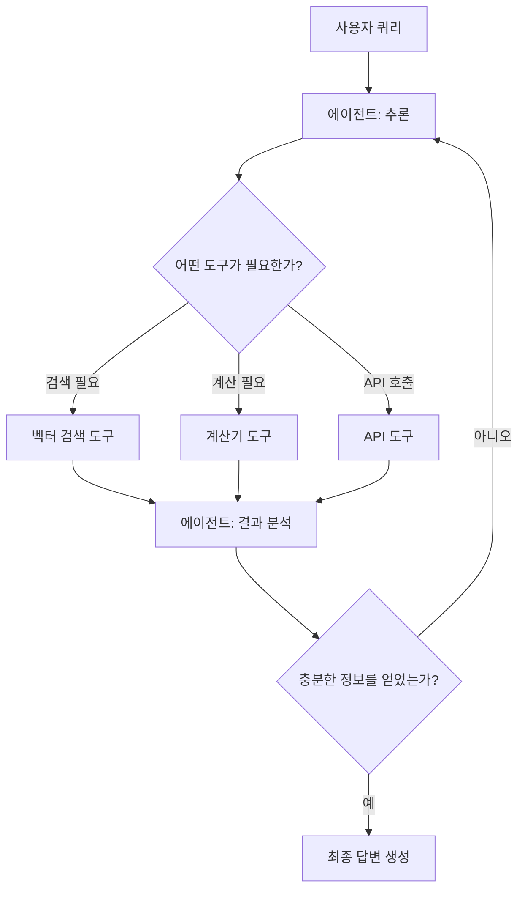

**핵심 차이점**:

| 특성 | 기본 RAG | RAG 에이전트 |
|------|---------|------------|
| 워크플로우 | 고정 | 동적 |
| 의사결정 | 없음 | 자율적 |
| 도구 사용 | 단일 (검색) | 다중 (검색, 계산, API 등) |
| 반복 | 1회 | 다중 (필요시) |
| 복잡도 | 낮음 | 높음 |
| 적합한 작업 | 단순 QA | 복잡한 다단계 작업 |

#### 4.1.2. 에이전트의 추론 과정

에이전트는 **추론-행동 루프**(Reasoning-Action Loop)를 통해 작동합니다:

**1. 관찰(Observation)**: 현재 상태와 사용 가능한 정보를 파악합니다.

**2. 사고(Thought)**: 다음 단계에서 무엇을 해야 하는지 추론합니다.

**3. 행동(Action)**: 선택한 도구를 실행합니다.

**4. 관찰(Observation)**: 도구 실행 결과를 확인합니다.

**5. 반복 또는 종료**: 충분한 정보를 얻었으면 답변을 생성하고, 그렇지 않으면 2-4를 반복합니다.

**예시 시나리오**:

쿼리: "2024년 AI 시장 규모는 얼마이고, 2025년에는 몇 퍼센트 증가할 것으로 예상되나요?"

에이전트의 추론 과정:
```
Thought: 이 질문은 두 가지 정보가 필요합니다:
1. 2024년 AI 시장 규모
2. 2025년 증가율 예측

먼저 2024년 시장 규모를 검색해야겠습니다.

Action: 벡터 검색 ("2024년 AI 시장 규모")

Observation: "2024년 AI 시장은 약 1,845억 달러 규모입니다"

Thought: 첫 번째 정보는 얻었습니다. 이제 2025년 증가율을 찾아야 합니다.

Action: 벡터 검색 ("2025년 AI 시장 성장률 예측")

Observation: "2025년 AI 시장은 전년 대비 37% 성장할 것으로 예상됩니다"

Thought: 이제 두 정보를 모두 얻었으므로 계산해볼 수 있습니다.
2024년 1,845억 달러 × 1.37 = 약 2,528억 달러

Action: 최종 답변 생성

Answer: 2024년 AI 시장 규모는 약 1,845억 달러이며,
2025년에는 37% 증가하여 약 2,528억 달러에 이를 것으로 예상됩니다.
```

### 4.2. 에이전트 아키텍처

#### 4.2.1. ReAct 패턴

**ReAct**(Reasoning and Acting)는 추론과 행동을 교차로 수행하는 에이전트 패턴입니다. 이는 Yao et al. (2023)의 논문에서 제안되었습니다.

**ReAct 프롬프트 구조**:

```
당신은 다음 도구들을 사용할 수 있습니다:

Search: 벡터 데이터베이스에서 정보 검색
Calculator: 수학 계산 수행
WeatherAPI: 날씨 정보 조회

각 단계마다 다음 형식을 따르세요:

Thought: [무엇을 해야 하는지 생각]
Action: [도구 이름]
Action Input: [도구에 전달할 입력]
Observation: [도구 실행 결과]

... (필요한 만큼 반복)

Thought: 이제 최종 답변을 할 수 있습니다
Final Answer: [최종 답변]
```

**ReAct의 장점**:
- 투명한 추론 과정
- 오류 수정 가능 (관찰 결과를 보고 전략 수정)
- 복잡한 다단계 작업 처리
- 중간 과정 추적 가능

**ReAct의 한계**:
- 긴 프롬프트와 토큰 사용
- 무한 루프 가능성
- 도구 선택 오류

#### 4.2.2. 도구(Tools) 시스템

도구는 에이전트가 외부 세계와 상호작용하는 인터페이스입니다. 각 도구는 다음을 정의합니다:

**도구 이름**: 도구를 식별하는 고유한 이름

**도구 설명**: 도구가 무엇을 하는지, 언제 사용해야 하는지 설명

**입력 스키마**: 도구가 받는 입력의 형식과 타입

**실행 함수**: 실제 도구의 로직을 구현하는 함수

**도구의 종류**:

**검색 도구**:
- 벡터 검색: 의미적 유사성 기반 검색
- 키워드 검색: 정확한 용어 매칭
- 웹 검색: 실시간 웹 정보
- SQL 쿼리: 데이터베이스 조회

**계산 도구**:
- 기본 계산기: 사칙연산
- 고급 수학: 통계, 미적분
- 코드 실행: Python, JavaScript 등

**API 도구**:
- 날씨 API
- 금융 데이터 API
- 뉴스 API
- 소셜 미디어 API

**파일 도구**:
- 파일 읽기/쓰기
- 이미지 처리
- PDF 생성

**도구 선택 메커니즘**:

에이전트는 LLM의 추론 능력을 활용하여 적절한 도구를 선택합니다. 각 도구의 설명을 프롬프트에 포함하고, LLM이 상황에 맞는 도구를 선택하도록 합니다.

$$\text{tool}_{\text{selected}} = \arg\max_{\text{tool}} P(\text{tool} | \text{query}, \text{context}, \text{tool\_descriptions})$$

### 4.3. LangChain 에이전트 구현

#### 4.3.1. 에이전트 타입

LangChain은 여러 유형의 에이전트를 제공합니다:

**Zero-shot ReAct Agent**: 가장 일반적인 에이전트로, 도구 설명만으로 작동합니다. 예제 없이도 도구를 사용할 수 있습니다.

**Conversational ReAct Agent**: 대화 메모리를 유지하여 이전 상호작용을 기억합니다. 멀티턴 대화에 적합합니다.

**Self-ask with Search**: 질문을 하위 질문으로 분해하고 각각에 대해 검색을 수행합니다.

**Plan-and-Execute Agent**: 먼저 전체 계획을 수립한 후 단계별로 실행합니다. 복잡한 다단계 작업에 적합합니다.

**OpenAI Functions Agent**: OpenAI의 Function Calling 기능을 활용합니다. 더 안정적이고 구조화된 도구 호출이 가능합니다.

**Structured Chat Agent**: 복잡한 입력을 다루는 데 최적화되어 있습니다.

#### 4.3.2. 커스텀 도구 생성

사용자 정의 도구를 만들 수 있습니다. 도구는 다음을 정의해야 합니다:

**도구 구조**:
- name: 도구 이름
- description: 상세한 설명 (에이전트가 이를 보고 도구 선택)
- func: 실제 실행 함수
- args_schema: 입력 파라미터 스키마 (선택적)

**도구 설명 작성 팁**:
- 도구가 무엇을 하는지 명확히 설명
- 언제 사용해야 하는지 명시
- 입력 형식 예시 제공
- 제약사항이나 한계 언급

예시:
```
name: "company_search"
description: "회사 내부 문서에서 정보를 검색합니다. 
입력: 검색하려는 키워드나 질문
사용 시기: 회사 정책, 프로젝트 정보, 내부 가이드라인이 필요할 때
예시: '휴가 정책', '프로젝트 X 진행 상황'"
```

#### 4.3.3. 에이전트 실행 예제

에이전트 실행 흐름:

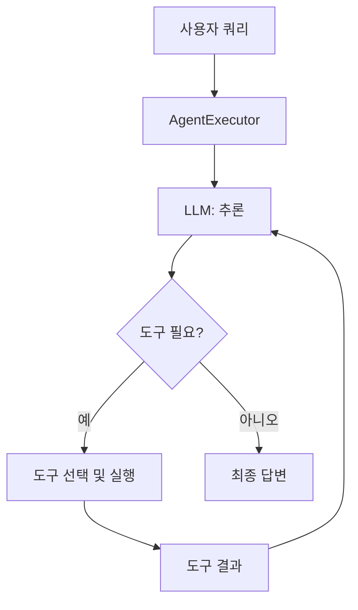

**에이전트 실행 제어**:

**최대 반복 횟수**: 무한 루프를 방지하기 위해 설정합니다. 일반적으로 5-15회로 제한합니다.

**타임아웃**: 전체 실행 시간을 제한합니다.

**조기 중단**: 특정 조건에서 실행을 중단할 수 있습니다.

**중간 단계 로깅**: 에이전트의 추론 과정을 기록하여 디버깅과 개선에 활용합니다.

### 4.4. 실전 에이전트 사례

#### 4.4.1. 멀티 소스 RAG 에이전트

여러 데이터 소스를 선택적으로 검색하는 에이전트입니다.

**시나리오**: 기업 내부에서 여러 부서의 문서를 관리하는 경우

**데이터 소스**:
- HR 문서 (인사 정책, 복지)
- 엔지니어링 문서 (기술 문서, API 문서)
- 마케팅 문서 (캠페인, 브랜드 가이드)
- 재무 문서 (예산, 재무 보고서)

**에이전트 도구**:
```
1. search_hr: HR 관련 정보 검색
2. search_engineering: 기술 문서 검색
3. search_marketing: 마케팅 자료 검색
4. search_finance: 재무 정보 검색
5. search_all: 모든 소스를 통합 검색
```

**실행 예시**:

쿼리: "우리 회사의 연차 정책은 무엇이고, 연차를 신청하는 시스템의 API 문서는 어디서 찾을 수 있나요?"

```
Thought: 이 질문은 두 부분으로 나뉩니다:
1. 연차 정책 (HR 도메인)
2. 연차 신청 시스템 API (엔지니어링 도메인)

먼저 HR 문서를 검색합니다.

Action: search_hr
Action Input: "연차 정책"

Observation: [HR 정책 문서 반환]

Thought: 연차 정책은 찾았습니다. 이제 API 문서를 찾아야 합니다.

Action: search_engineering
Action Input: "연차 신청 시스템 API 문서"

Observation: [API 문서 반환]

Thought: 두 정보를 모두 찾았으므로 답변할 수 있습니다.

Final Answer: 연차 정책에 따르면... [HR 정보]
연차 신청 시스템 API는... [엔지니어링 문서 정보]
```

**장점**:
- 적절한 소스에만 검색하여 효율적
- 도메인 전문성 활용
- 불필요한 정보 노출 방지

#### 4.4.2. 자율적 문서 분석 에이전트

복잡한 문서를 자율적으로 분석하고 인사이트를 추출하는 에이전트입니다.

**시나리오**: 긴 연구 논문이나 보고서를 분석하여 핵심 정보를 추출

**에이전트 능력**:
1. 문서 구조 파악 (목차, 섹션)
2. 중요 섹션 식별
3. 데이터와 통계 추출
4. 결론과 권장사항 요약
5. 참고문헌 분석

**도구**:
```
1. read_section: 특정 섹션 읽기
2. search_document: 문서 내 키워드 검색
3. extract_tables: 표 데이터 추출
4. extract_figures: 그림 및 차트 정보 추출
5. summarize: 텍스트 요약
```

**실행 흐름**:

```
Thought: 먼저 문서의 전체 구조를 파악해야 합니다.

Action: read_section
Action Input: "목차"

Observation: [목차 내용]

Thought: 주요 섹션들을 확인했습니다. 핵심 결과는 
"실험 결과" 섹션에 있을 것 같습니다.

Action: read_section
Action Input: "실험 결과"

Observation: [실험 결과 섹션 내용]

Thought: 실험 결과에 표가 언급되어 있습니다. 표를 추출해야겠습니다.

Action: extract_tables
Action Input: "실험 결과 섹션"

Observation: [표 데이터]

Thought: 이제 결론 섹션도 확인해야 합니다.

Action: read_section
Action Input: "결론"

Observation: [결론 섹션]

Thought: 충분한 정보를 수집했으므로 종합 분석을 제공할 수 있습니다.

Final Answer: [문서의 핵심 내용, 주요 발견사항, 통계 데이터, 
결론을 포함한 종합 분석]
```

**장점**:
- 긴 문서를 효율적으로 처리
- 관련 있는 부분만 집중적으로 분석
- 구조화된 정보 추출
- 시간 절약

---

## 5. RAG 시스템 평가

### 5.1. 평가의 중요성

RAG 시스템의 평가는 시스템의 품질을 측정하고 개선 방향을 찾는 데 필수적입니다. 평가 없이는 다음을 알 수 없습니다:

- 시스템이 얼마나 정확한 답변을 제공하는가?
- 어떤 컴포넌트가 병목인가?
- 변경사항이 실제로 개선을 가져왔는가?
- 프로덕션 환경에서 어떤 성능을 기대할 수 있는가?

**평가의 목적**:

**품질 보증**: 시스템이 요구사항을 만족하는지 확인

**성능 벤치마킹**: 다른 시스템이나 베이스라인과 비교

**최적화 가이드**: 어떤 부분을 개선해야 하는지 식별

**회귀 방지**: 새로운 변경이 기존 기능을 해치지 않는지 확인

**A/B 테스팅**: 여러 설정이나 모델을 객관적으로 비교

### 5.2. 독립 평가 (Component-wise Evaluation)

독립 평가는 RAG 시스템의 각 컴포넌트를 개별적으로 평가하는 방식입니다. 이는 특정 컴포넌트의 성능을 정밀하게 측정하고 개선할 수 있게 합니다.

#### 5.2.1. 검색 성능 평가

검색 컴포넌트는 RAG 시스템의 핵심입니다. 좋은 검색 성능 없이는 LLM이 정확한 답변을 생성할 수 없습니다.

##### 5.2.1.1. Precision, Recall, F1

**Precision (정밀도)**: 검색된 문서 중 실제로 관련 있는 문서의 비율

$$\text{Precision} = \frac{\text{관련 있는 검색 문서 수}}{\text{전체 검색 문서 수}} = \frac{TP}{TP + FP}$$

예시: 10개 문서를 검색했는데 그 중 7개가 관련 있다면 Precision = 0.7

**Recall (재현율)**: 실제 관련 있는 문서 중 검색된 문서의 비율

$$\text{Recall} = \frac{\text{관련 있는 검색 문서 수}}{\text{전체 관련 문서 수}} = \frac{TP}{TP + FN}$$

예시: 총 15개의 관련 문서가 있는데 그 중 7개를 검색했다면 Recall = 7/15 ≈ 0.47

**F1 Score**: Precision과 Recall의 조화 평균

$$F_1 = 2 \cdot \frac{\text{Precision} \cdot \text{Recall}}{\text{Precision} + \text{Recall}} = \frac{2TP}{2TP + FP + FN}$$

F1 Score는 Precision과 Recall 사이의 균형을 제공합니다.

**Precision@K**: 상위 K개 결과에서의 정밀도

$$\text{Precision@K} = \frac{\text{상위 K개 중 관련 문서 수}}{K}$$

일반적으로 K=5 또는 K=10을 사용합니다. 실제 RAG 시스템에서는 소수의 문서만 LLM에 전달하므로 상위 결과의 품질이 중요합니다.

**Recall@K**: 상위 K개 결과가 전체 관련 문서의 몇 퍼센트를 포함하는가

$$\text{Recall@K} = \frac{\text{상위 K개 중 관련 문서 수}}{\text{전체 관련 문서 수}}$$

##### 5.2.1.2. MRR, MAP, NDCG

**MRR** (Mean Reciprocal Rank, 평균 역순위): 첫 번째 관련 문서가 나타나는 위치의 역수 평균

$$\text{MRR} = \frac{1}{|Q|} \sum_{i=1}^{|Q|} \frac{1}{\text{rank}_i}$$

여기서 $\text{rank}_i$는 쿼리 $i$에 대한 첫 번째 관련 문서의 순위입니다.

예시:
- 쿼리 1: 첫 관련 문서가 1위 → 1/1 = 1.0
- 쿼리 2: 첫 관련 문서가 3위 → 1/3 ≈ 0.33
- 쿼리 3: 첫 관련 문서가 2위 → 1/2 = 0.5
- MRR = (1.0 + 0.33 + 0.5) / 3 ≈ 0.61

MRR은 사용자가 첫 번째 좋은 결과를 얼마나 빨리 찾는지를 측정합니다.

**MAP** (Mean Average Precision, 평균 정밀도 평균): 모든 관련 문서 위치에서의 정밀도 평균

$$\text{AP} = \frac{1}{\text{관련 문서 수}} \sum_{k=1}^{n} \text{Precision}(k) \cdot \text{rel}(k)$$

$$\text{MAP} = \frac{1}{|Q|} \sum_{q=1}^{|Q|} \text{AP}(q)$$

여기서 $\text{rel}(k)$는 순위 k의 문서가 관련 있으면 1, 아니면 0입니다.

MAP은 전체 순위에서 관련 문서들의 위치를 고려합니다.

**NDCG** (Normalized Discounted Cumulative Gain): 순위와 관련성 등급을 모두 고려한 메트릭

$$\text{DCG}@K = \sum_{i=1}^{K} \frac{2^{\text{rel}_i} - 1}{\log_2(i + 1)}$$

$$\text{NDCG}@K = \frac{\text{DCG}@K}{\text{IDCG}@K}$$

여기서:
- $\text{rel}_i$: 순위 $i$의 문서의 관련성 등급 (예: 0=무관, 1=약간 관련, 2=관련, 3=매우 관련)
- $\text{IDCG}$: 이상적인 순위에서의 DCG (정규화를 위한 최대값)

NDCG는 다단계 관련성을 고려하며, 상위 순위에 더 높은 가중치를 부여합니다.

**메트릭 선택 가이드**:
- **Precision@K**: 상위 결과의 품질만 중요한 경우
- **Recall@K**: 가능한 많은 관련 문서를 찾아야 하는 경우
- **MRR**: 첫 번째 좋은 결과가 중요한 경우 (예: 단일 답변 검색)
- **MAP**: 모든 관련 결과의 순위가 중요한 경우
- **NDCG**: 관련성이 등급으로 나뉘는 경우

#### 5.2.2. 생성 품질 평가

LLM이 생성한 답변의 품질을 평가하는 메트릭들입니다.

##### 5.2.2.1. BLEU, ROUGE

**BLEU** (Bilingual Evaluation Understudy): N-gram 겹침을 기반으로 생성 텍스트와 참조 텍스트의 유사도를 측정합니다. 원래는 기계 번역 평가를 위해 개발되었습니다.

$$\text{BLEU} = BP \cdot \exp\left(\sum_{n=1}^{N} w_n \log p_n\right)$$

여기서:
- $p_n$: n-gram 정밀도
- $w_n$: 가중치 (일반적으로 균등)
- $BP$: 간결함 페널티 (짧은 생성을 방지)

$$BP = \begin{cases}
1 & \text{if } c > r \\
e^{(1-r/c)} & \text{if } c \leq r
\end{cases}$$

여기서 $c$는 생성 텍스트 길이, $r$은 참조 텍스트 길이입니다.

**ROUGE** (Recall-Oriented Understudy for Gisting Evaluation): 요약 평가를 위해 개발되었으며, recall 중심입니다.

**ROUGE-N**: N-gram 기반 재현율

$$\text{ROUGE-N} = \frac{\sum_{S \in \text{References}} \sum_{\text{gram}_n \in S} \text{Count}_{\text{match}}(\text{gram}_n)}{\sum_{S \in \text{References}} \sum_{\text{gram}_n \in S} \text{Count}(\text{gram}_n)}$$

**ROUGE-L**: 최장 공통 부분수열(LCS) 기반

$$\text{ROUGE-L} = \frac{(1 + \beta^2) R_{\text{lcs}} P_{\text{lcs}}}{R_{\text{lcs}} + \beta^2 P_{\text{lcs}}}$$

여기서 $R_{\text{lcs}}$는 LCS 기반 재현율, $P_{\text{lcs}}$는 LCS 기반 정밀도입니다.

**한계점**:
- 의미적 유사성을 포착하지 못함 (단어 매칭만 고려)
- 동의어나 의역을 평가하지 못함
- 참조 답변이 필요함 (생성 비용 高)

##### 5.2.2.2. BERTScore

**BERTScore**는 BERT 임베딩을 사용하여 의미적 유사성을 측정하는 메트릭입니다. 단순한 단어 매칭을 넘어 의미적 유사성을 포착할 수 있습니다.

각 토큰을 BERT로 임베딩하고, 코사인 유사도를 계산합니다:

$$\text{Precision} = \frac{1}{|\hat{x}|} \sum_{\hat{x}_i \in \hat{x}} \max_{x_j \in x} \vec{\hat{x}}_i^T \vec{x}_j$$

$$\text{Recall} = \frac{1}{|x|} \sum_{x_j \in x} \max_{\hat{x}_i \in \hat{x}} \vec{\hat{x}}_i^T \vec{x}_j$$

$$\text{F1} = 2 \cdot \frac{\text{Precision} \cdot \text{Recall}}{\text{Precision} + \text{Recall}}$$

여기서:
- $x$: 참조 텍스트의 토큰들
- $\hat{x}$: 생성 텍스트의 토큰들
- $\vec{x}_j$, $\vec{\hat{x}}_i$: 토큰의 BERT 임베딩

**장점**:
- 의미적 유사성 포착
- 동의어와 의역 인식
- 다양한 언어 지원

**단점**:
- 계산 비용이 높음
- 모델 의존적 (BERT 버전에 따라 점수 변동)
- 여전히 참조 답변 필요

### 5.3. 종단간 평가 (End-to-End Evaluation)

종단간 평가는 전체 RAG 시스템의 최종 출력을 평가합니다. 실제 사용자 경험을 반영하는 가장 중요한 평가 방식입니다.

#### 5.3.1. 충실성 (Faithfulness)

충실성은 생성된 답변이 검색된 컨텍스트에 기반하고 있는지, 즉 환각(hallucination)이 없는지를 측정합니다.

**정의**: 답변의 각 주장이 컨텍스트에서 유추되거나 직접 지원되는가?

**측정 방법**:

1. 답변을 개별 주장(claim)으로 분해
2. 각 주장이 컨텍스트에서 지원되는지 확인
3. 지원되는 주장의 비율 계산

$$\text{Faithfulness} = \frac{\text{컨텍스트에서 지원되는 주장 수}}{\text{전체 주장 수}}$$

**LLM 기반 평가**:

프롬프트 예시:
```
다음 컨텍스트가 주어졌을 때:
[검색된 문서들]

다음 주장이 컨텍스트에서 지원되는지 판단하세요:
주장: [개별 주장]

답변: 예/아니오
이유: [근거]
```

**중요성**: 충실성이 낮으면 사용자가 잘못된 정보를 받을 수 있으며, 이는 RAG 시스템의 신뢰성을 크게 해칩니다.

#### 5.3.2. 답변 관련성 (Answer Relevance)

답변 관련성은 생성된 답변이 사용자 질문에 얼마나 적절하게 답하는지를 측정합니다.

**정의**: 답변이 질문의 모든 측면을 다루고 있으며, 불필요한 정보를 포함하지 않는가?

**측정 방법**:

**역질문 생성(Reverse Question Generation)**: 
1. 생성된 답변으로부터 질문을 역으로 생성
2. 원본 질문과 생성된 질문의 유사도 측정

$$\text{Answer Relevance} = \text{similarity}(q_{\text{original}}, q_{\text{generated}})$$

논리: 좋은 답변은 원본 질문을 잘 재구성할 수 있어야 합니다.

**직접 평가**: LLM에게 답변이 질문에 적절한지 직접 평가하도록 요청

프롬프트:
```
질문: {question}
답변: {answer}

이 답변이 질문에 적절하게 답하는지 1-5점으로 평가하세요:
1: 전혀 관련 없음
2: 약간 관련됨
3: 보통
4: 대부분 관련됨
5: 완벽하게 관련됨

점수와 이유를 제시하세요.
```

**평가 기준**:
- 질문의 모든 부분에 답했는가?
- 불필요한 정보가 포함되어 있지 않은가?
- 답변이 명확하고 이해하기 쉬운가?

#### 5.3.3. 컨텍스트 관련성 (Context Relevance)

컨텍스트 관련성은 검색된 문서가 질문에 얼마나 관련 있는지를 측정합니다.

**정의**: 검색된 문서가 질문에 답하는 데 필요한 정보를 포함하고 있는가?

**측정 방법**:

$$\text{Context Relevance} = \frac{\text{관련 있는 문장/청크 수}}{\text{전체 검색된 문장/청크 수}}$$

**LLM 기반 평가**:

프롬프트:
```
질문: {question}

다음 컨텍스트가 이 질문에 답하는 데 관련 있는지 평가하세요:
컨텍스트: {context}

관련성: [1-5점]
이유: [설명]
```

**중요성**: 
- 높은 컨텍스트 관련성은 LLM이 정확한 답변을 생성하는 데 필요
- 낮은 컨텍스트 관련성은 검색 컴포넌트의 문제를 나타냄
- 관련 없는 컨텍스트는 LLM을 혼란스럽게 하고 토큰을 낭비

**개선 방향**:
- 임베딩 모델 변경
- 검색 알고리즘 조정
- 쿼리 변환 적용
- 리랭킹 추가

### 5.4. 평가 프레임워크

#### 5.4.1. RAGAS

**RAGAS**(Retrieval Augmented Generation Assessment)는 RAG 시스템을 위한 포괄적인 평가 프레임워크입니다.

**주요 메트릭**:

**Faithfulness**: 앞서 설명한 충실성 측정

**Answer Relevancy**: LLM을 사용한 답변 관련성 평가

**Context Precision**: 관련 있는 컨텍스트가 상위에 랭크되었는지 측정

$$\text{Context Precision@K} = \frac{\sum_{k=1}^{K} (\text{Precision@k} \times v_k)}{\text{총 관련 문서 수}}$$

여기서 $v_k$는 순위 $k$의 문서가 관련 있으면 1, 아니면 0입니다.

**Context Recall**: 관련 정보가 검색된 컨텍스트에 얼마나 포함되어 있는지

$$\text{Context Recall} = \frac{\text{검색된 컨텍스트에서 지원되는 GT 주장 수}}{\text{GT 주장 총 수}}$$

여기서 GT(Ground Truth)는 참조 답변입니다.

**RAGAS의 장점**:
- 참조 답변 없이도 평가 가능 (Faithfulness, Answer Relevancy)
- LLM 기반 자동 평가
- 각 컴포넌트를 독립적으로 평가
- Python 라이브러리로 쉽게 사용

**사용 시나리오**:
- 개발 단계에서 빠른 반복 평가
- 프로덕션 모니터링
- A/B 테스트

#### 5.4.2. TruLens

**TruLens**는 LLM 애플리케이션의 평가와 추적을 위한 오픈소스 라이브러리입니다.

**핵심 기능**:

**추적(Tracing)**: 전체 RAG 파이프라인의 각 단계를 기록합니다.
- 쿼리
- 검색된 문서
- 프롬프트
- LLM 응답
- 실행 시간

**피드백 함수(Feedback Functions)**: 다양한 평가 메트릭을 정의하고 자동으로 계산합니다.
- Groundedness (충실성)
- Answer Relevance
- Context Relevance
- Toxicity (독성)
- 언어 일치도

**대시보드**: 시각적 인터페이스를 통해 평가 결과를 확인합니다.
- 메트릭 추이 그래프
- 개별 실행 검사
- 비교 분석

**TruLens의 장점**:
- 실시간 모니터링
- 상세한 추적 정보
- 커스텀 평가 함수 지원
- 프로덕션 환경 적합

#### 5.4.3. LangSmith

**LangSmith**는 LangChain의 공식 관찰성 및 평가 플랫폼입니다.

**핵심 기능**:

**추적**: LangChain 체인의 모든 단계를 자동으로 로깅합니다.

**데이터셋 관리**: 평가용 질문-답변 쌍을 관리합니다.

**평가 실행**: 여러 실행을 비교하고 A/B 테스트를 수행합니다.

**협업**: 팀 간 평가 결과 공유와 주석 작업이 가능합니다.

**프로덕션 모니터링**: 실제 사용자 쿼리와 응답을 모니터링합니다.

**LangSmith의 장점**:
- LangChain과 완벽한 통합
- 사용하기 쉬운 UI
- 팀 협업 기능
- 프롬프트 버전 관리

**사용 시나리오**:
- 개발 중 디버깅
- 프롬프트 최적화
- 프로덕션 성능 모니터링
- 팀 협업

### 5.5. 독립 평가 vs 종단간 평가

#### 5.5.1. 각 접근법의 장단점

**독립 평가 (Component-wise Evaluation)**

**장점**:
- **정밀한 진단**: 특정 컴포넌트의 문제를 정확히 식별
- **빠른 반복**: 각 컴포넌트를 독립적으로 개선 가능
- **명확한 메트릭**: 수치적으로 명확한 목표 설정 가능
- **비용 효율적**: 전체 시스템을 실행하지 않아도 됨
- **재현성**: 동일한 조건에서 반복 평가 가능

**단점**:
- **실제 성능 보장 안 됨**: 각 컴포넌트가 좋아도 전체 시스템이 나쁠 수 있음
- **컴포넌트 간 상호작용 무시**: 한 컴포넌트의 출력이 다른 컴포넌트에 미치는 영향을 고려하지 않음
- **참조 데이터 필요**: 대부분의 메트릭이 ground truth 필요
- **실제 사용자 경험과 괴리**: 메트릭이 좋아도 사용자 만족도가 낮을 수 있음

**종단간 평가 (End-to-End Evaluation)**

**장점**:
- **실제 성능 반영**: 사용자가 경험하는 최종 결과 평가
- **전체적 관점**: 모든 컴포넌트의 상호작용 고려
- **비즈니스 목표 연계**: 실제 사용 사례에 맞는 평가
- **사용자 중심**: 사용자 만족도와 직접 연관

**단점**:
- **문제 진단 어려움**: 성능이 나쁠 때 어느 컴포넌트 때문인지 알기 어려움
- **시간과 비용**: 전체 시스템 실행 필요, LLM 비용 발생
- **변동성**: 같은 입력에도 LLM 출력이 달라질 수 있음
- **주관적 평가**: 많은 메트릭이 LLM 판단에 의존

#### 5.5.2. 언제 어떤 평가를 사용할 것인가

**개발 초기 단계**:
- **독립 평가 중심**
- 각 컴포넌트의 기본 성능 확인
- 빠른 반복과 실험
- 메트릭: Precision@K, Recall@K, MRR

**개발 중기 단계**:
- **독립 평가 + 종단간 평가 병행**
- 컴포넌트 최적화: 독립 평가
- 전체 시스템 검증: 종단간 평가
- 메트릭: NDCG (독립) + Faithfulness, Answer Relevance (종단간)

**프로덕션 준비 단계**:
- **종단간 평가 중심**
- 실제 사용 사례 시뮬레이션
- 사용자 연구 및 피드백
- 메트릭: 종단간 메트릭 전체 + 사용자 만족도

**프로덕션 운영**:
- **종단간 평가 + 모니터링**
- 실시간 성능 추적
- 이상 탐지
- 메트릭: Faithfulness, Answer Relevance, 응답 시간, 사용자 피드백

**문제 해결 시**:
- **독립 평가**
- 특정 컴포넌트에 문제가 있을 때 집중 분석
- 근본 원인 식별
- 메트릭: 문제 컴포넌트에 해당하는 메트릭

**비교표**:

| 상황 | 독립 평가 | 종단간 평가 | 추천 비율 |
|------|----------|-----------|----------|
| 초기 개발 | 필수 | 선택 | 80:20 |
| 중기 개발 | 필수 | 필수 | 50:50 |
| 프로덕션 준비 | 선택 | 필수 | 20:80 |
| 프로덕션 운영 | 선택 | 필수 | 10:90 |
| 디버깅 | 필수 | 선택 | 70:30 |

**실전 팁**:

1. **계층적 평가**: 독립 평가로 베이스라인을 설정하고, 종단간 평가로 검증

2. **자동화**: 두 평가 모두 CI/CD 파이프라인에 통합하여 자동 실행

3. **균형**: 개발 속도와 품질 사이의 균형 찾기

4. **지속적 개선**: 정기적으로 평가 실행하고 트렌드 분석

5. **사용자 피드백**: 정량적 메트릭과 정성적 피드백 병행

---

## 6. RAG 최적화 및 모범 사례

### 6.1. 성능 최적화

#### 6.1.1. 검색 성능 향상

**임베딩 모델 선택**: 도메인에 맞는 임베딩 모델을 선택하거나 파인튜닝합니다. 일반 도메인 모델보다 전문 도메인 모델이 더 나은 성능을 보일 수 있습니다.

**청크 크기 조정**: 실험을 통해 최적의 청크 크기를 찾습니다. 일반적으로 200-1000 토큰 범위에서 시작하여 조정합니다.

청크 크기 실험:
- 100, 200, 500, 1000 토큰으로 각각 테스트
- Precision@5와 Answer Quality 측정
- 최적 지점 찾기

**하이브리드 검색**: 벡터 검색과 키워드 검색(BM25)을 결합합니다. 의미적 검색과 정확한 용어 매칭의 장점을 모두 활용할 수 있습니다.

**리랭킹 적용**: 초기 검색 결과를 cross-encoder로 재평가하여 순위를 개선합니다. 검색 재현율은 유지하면서 정밀도를 높일 수 있습니다.

**메타데이터 필터링**: 날짜, 카테고리, 작성자 등 메타데이터를 활용하여 검색 범위를 좁힙니다.

**쿼리 최적화**:
- 쿼리 확장으로 재현율 향상
- 쿼리 재작성으로 명확성 개선
- 멀티 쿼리로 다양한 관점 탐색

#### 6.1.2. 생성 품질 향상

**프롬프트 엔지니어링**: 효과적인 프롬프트 템플릿을 작성합니다.

체계적 프롬프트 구조:
```
[역할 정의]
당신은 전문적인 AI 어시스턴트입니다.

[지시사항]
- 제공된 컨텍스트만 사용하세요
- 확실하지 않으면 "모르겠습니다"라고 답하세요
- 출처를 명시하세요

[컨텍스트]
{retrieved_documents}

[질문]
{user_query}

[답변 형식]
1. 요약 (2-3문장)
2. 상세 설명
3. 출처
```

**Few-shot 예제**: 프롬프트에 좋은 예제를 포함하여 원하는 답변 스타일을 보여줍니다.

**체인 오브 쏘트**: LLM이 단계적으로 추론하도록 유도합니다.

```
단계적으로 생각하며 답변하세요:
1. 컨텍스트에서 관련 정보 찾기
2. 정보 검증하기
3. 답변 구성하기
```

**온도 조정**: 사실 기반 QA는 낮은 온도(0.0-0.3), 창의적 작업은 높은 온도(0.7-1.0)

**컨텍스트 압축**: 관련 없는 부분을 제거하여 LLM의 집중도를 높입니다.

**출력 구조화**: JSON 스키마나 Pydantic 모델을 사용하여 구조화된 출력을 생성합니다.

#### 6.1.3. 응답 시간 최적화

**캐싱 전략**:
- 임베딩 캐싱: 동일한 쿼리에 대해 재계산 방지
- 검색 결과 캐싱: 인기 있는 쿼리의 결과 저장
- LLM 응답 캐싱: 동일하거나 유사한 쿼리의 응답 재사용

**배치 처리**: 여러 쿼리를 배치로 처리하여 효율성 향상

**병렬 처리**: 독립적인 작업을 병렬로 실행
- 여러 소스에서 동시에 검색
- 멀티 쿼리 병렬 실행
- 리랭킹 병렬 처리

**모델 선택**: 작업에 맞는 모델 크기 선택
- 간단한 쿼리: 작고 빠른 모델
- 복잡한 추론: 크고 강력한 모델

**인덱스 최적화**: 벡터 데이터베이스 인덱스 최적화
- HNSW 파라미터 조정 (M, ef_construction)
- IVF 클러스터 수 조정
- 정기적인 인덱스 재구축

**스트리밍**: LLM 응답을 스트리밍하여 체감 속도 향상

### 6.2. 비용 최적화

#### 6.2.1. 임베딩 비용 절감

**로컬 임베딩 모델**: OpenAI 대신 HuggingFace 모델을 로컬에서 실행하여 API 비용 제거

**차원 축소**: 필요에 따라 임베딩 차원을 줄여 저장 공간과 계산 비용 감소

**배치 임베딩**: 단일 요청이 아닌 배치로 임베딩 생성

**임베딩 재사용**: 한 번 생성한 임베딩을 여러 용도로 재사용

#### 6.2.2. LLM 비용 절감

**모델 선택**: 작업에 맞는 크기의 모델 사용
- 간단한 QA: GPT-3.5, Claude Haiku
- 복잡한 추론: GPT-4, Claude Opus

**컨텍스트 압축**: LLM에 전달하는 토큰 수 최소화

**프롬프트 최적화**: 불필요한 지시사항 제거하여 프롬프트 길이 단축

**캐싱**: 동일한 쿼리의 응답 캐싱으로 중복 호출 방지

**오픈소스 모델**: 민감하지 않은 작업에 오픈소스 모델 사용 (Llama, Mistral 등)

**토큰 제한**: max_tokens 파라미터로 응답 길이 제한

#### 6.2.3. 인프라 비용 절감

**벡터 DB 선택**: 규모에 맞는 벡터 데이터베이스 선택
- 소규모: 로컬 Chroma, FAISS (무료)
- 중대규모: Qdrant (오픈소스 + 클라우드 옵션)
- 대규모: Pinecone, Weaviate (관리형)

**데이터 압축**: Product Quantization으로 벡터 크기 감소

**계층적 저장**: 
- 자주 사용: 메모리 (빠름, 비쌈)
- 가끔 사용: 디스크 (느림, 저렴)

**스케일링 전략**: 수요에 따라 자동 스케일링 설정

### 6.3. 일반적인 문제와 해결책

#### 6.3.1. 환각(Hallucination) 문제

**증상**: LLM이 컨텍스트에 없는 정보를 창작하여 답변

**원인**:
- 컨텍스트에 답이 없음
- 프롬프트가 불명확
- LLM 온도가 높음
- 컨텍스트와 질문의 불일치

**해결책**:
- **명시적 지시**: "컨텍스트에 없으면 '모르겠습니다'라고 답하세요"
- **충실성 체크**: 생성 후 충실성 검증 단계 추가
- **온도 낮추기**: 0.0-0.3으로 설정
- **컨텍스트 품질 개선**: 더 관련 있는 문서 검색
- **출처 인용 강제**: 각 주장에 출처 표시 요구

#### 6.3.2. 검색 실패

**증상**: 관련 문서를 찾지 못함

**원인**:
- 임베딩 모델이 도메인에 적합하지 않음
- 청크 크기가 부적절
- 쿼리와 문서의 표현 불일치
- 메타데이터 필터가 너무 엄격

**해결책**:
- **하이브리드 검색**: 벡터 + 키워드 결합
- **쿼리 변환**: 쿼리 확장, 재작성
- **임베딩 모델 변경**: 도메인 특화 모델 사용
- **청크 전략 조정**: 다양한 크기 실험
- **파인튜닝**: 자체 데이터로 임베딩 모델 파인튜닝

#### 6.3.3. 느린 응답 시간

**증상**: 사용자가 답변을 받기까지 시간이 오래 걸림

**원인**:
- 대규모 벡터 검색
- 비효율적인 LLM 호출
- 네트워크 지연
- 비최적화된 인덱스

**해결책**:
- **인덱스 최적화**: HNSW, IVF 파라미터 튜닝
- **캐싱**: 인기 쿼리 결과 캐싱
- **병렬 처리**: 독립적 작업 병렬화
- **스트리밍**: 응답 스트리밍으로 체감 속도 향상
- **더 빠른 모델**: GPT-3.5, Claude Haiku 등

#### 6.3.4. 답변 품질 불일치

**증상**: 같은 질문에 대해 답변 품질이 들쑥날쑥

**원인**:
- LLM의 비결정성 (높은 온도)
- 검색 결과 변동
- 프롬프트 모호성

**해결책**:
- **온도 낮추기**: 일관된 결과를 위해 0.0-0.1
- **시드 고정**: 가능한 경우 random seed 설정
- **명확한 프롬프트**: 모호성 제거
- **평가 자동화**: 일관성 메트릭 추적
- **앙상블**: 여러 응답 생성 후 최선 선택

#### 6.3.5. 컨텍스트 윈도우 초과

**증상**: LLM이 너무 많은 컨텍스트를 처리할 수 없음

**원인**:
- 너무 많은 문서 검색 (k값이 큼)
- 청크 크기가 너무 큼
- 긴 프롬프트 템플릿

**해결책**:
- **검색 수 제한**: k=3-5로 제한
- **컨텍스트 압축**: 관련 부분만 추출
- **문서 요약**: 긴 문서를 요약하여 전달
- **맵-리듀스**: 각 문서를 개별 처리 후 통합
- **큰 윈도우 모델**: GPT-4 Turbo (128K), Claude (200K) 사용

---

## 7. 실습 프로젝트 가이드라인

### 7.1. 기본 RAG 시스템 구축

#### 7.1.1. 프로젝트 개요

**목표**: 회사 내부 문서를 검색하는 기본 RAG 시스템 구축

**데이터**: 회사 정책, 매뉴얼, FAQ 문서 (PDF, Word, Markdown)

**기능**:
- 다양한 형식의 문서 로드
- 효과적인 청크 분할
- 벡터 검색
- 자연어 답변 생성

#### 7.1.2. 단계별 구현 가이드

**1단계: 환경 설정**
- Python 가상환경 생성
- 필요한 라이브러리 설치 (langchain, chromadb, openai 등)
- API 키 설정

**2단계: 문서 수집 및 로딩**
- 문서를 데이터 디렉토리에 저장
- 적절한 문서 로더 선택 (PDFLoader, UnstructuredWordDocumentLoader 등)
- 모든 문서를 Document 객체로 변환

**3단계: 텍스트 분할**
- RecursiveCharacterTextSplitter 사용
- 청크 크기: 500-1000 토큰
- 오버랩: 100-200 토큰
- 메타데이터 보존

**4단계: 임베딩 및 인덱싱**
- 임베딩 모델 선택 (OpenAI 또는 HuggingFace)
- 벡터 스토어 선택 (Chroma 추천)
- 모든 청크를 임베딩하고 저장
- 영구 저장 설정

**5단계: 리트리버 구성**
- 벡터 스토어로부터 리트리버 생성
- 검색 파라미터 설정 (k=5)
- 검색 알고리즘 선택 (유사도 검색)

**6단계: 프롬프트 템플릿 작성**
- 시스템 메시지 정의
- 컨텍스트와 질문 구조화
- 답변 형식 지정
- 출처 인용 요구

**7단계: 체인 구성**
- 리트리버, 프롬프트, LLM 연결
- LCEL을 사용한 체인 구성
- 입출력 파서 추가

**8단계: 테스트 및 반복**
- 샘플 질문으로 테스트
- 응답 품질 평가
- 파라미터 조정
- 성능 개선

#### 7.1.3. 평가 및 개선

**평가 질문 세트 작성**:
- 다양한 난이도의 질문 준비
- 예상 답변 작성
- 정성적 평가 기준 정의

**반복 개선**:
- 청크 크기 실험
- 검색 파라미터 조정
- 프롬프트 개선
- 다른 임베딩 모델 시도

### 7.2. 평가 파이프라인 구현

#### 7.2.1. 평가 데이터셋 구축

**질문-답변 쌍 수집**:
- 실제 사용자 질문 수집
- 전문가 답변 작성
- 관련 문서 표시
- 최소 50-100개 준비

**데이터셋 구조**:
```
{
  "question": "질문",
  "ground_truth": "참조 답변",
  "contexts": ["관련 문서 1", "관련 문서 2"],
  "metadata": {
    "category": "카테고리",
    "difficulty": "난이도"
  }
}
```

#### 7.2.2. 자동 평가 구현

**RAGAS를 사용한 평가**:
- 평가 데이터셋 로드
- RAG 시스템으로 답변 생성
- RAGAS 메트릭 계산
  - Faithfulness
  - Answer Relevancy
  - Context Precision
  - Context Recall
- 결과 분석 및 시각화

**커스텀 평가 함수**:
- 도메인 특화 메트릭 정의
- 규칙 기반 검증 추가
- 자동화된 테스트 suite 구축

#### 7.2.3. 지속적 평가

**CI/CD 통합**:
- 코드 변경 시 자동 평가
- 성능 회귀 탐지
- 임계값 기반 빌드 통과/실패

**모니터링 대시보드**:
- 메트릭 추이 시각화
- 이상 탐지 알림
- 정기 보고서 생성

### 7.3. 에이전트 기반 RAG 시스템

#### 7.3.1. 멀티 소스 에이전트 구축

**도구 정의**:
- 각 데이터 소스별 검색 도구 생성
- 도구 설명을 명확하게 작성
- 입력 스키마 정의

**에이전트 구성**:
- Zero-shot ReAct 에이전트 사용
- 도구 목록 제공
- 최대 반복 횟수 설정
- 메모리 추가 (대화형인 경우)

**테스트 시나리오**:
- 단일 소스 질문
- 다중 소스 질문
- 순차적 추론 필요한 질문
- 오류 케이스

#### 7.3.2. 복잡한 추론 작업

**계획-실행 에이전트**:
- 복잡한 질문을 하위 작업으로 분해
- 각 작업에 적절한 도구 할당
- 중간 결과를 다음 단계에 전달
- 최종 결과 통합

**실전 예시**:
```
질문: "지난 분기 우리 회사의 매출은 얼마였고, 
경쟁사와 비교했을 때 어떤가요?"

계획:
1. 내부 재무 문서에서 지난 분기 매출 검색
2. 웹에서 경쟁사 매출 정보 검색
3. 두 데이터 비교 분석
4. 인사이트 생성

실행:
- 도구 1: search_finance("지난 분기 매출")
- 도구 2: web_search("경쟁사 A 분기 매출")
- 도구 3: calculator(비교 계산)
- 최종 답변 생성
```

#### 7.3.3. 평가 및 디버깅

**에이전트 실행 추적**:
- 각 단계의 추론 과정 로깅
- 도구 호출과 결과 기록
- 실행 시간 측정

**일반적인 문제**:
- 무한 루프: 최대 반복 제한으로 방지
- 잘못된 도구 선택: 도구 설명 개선
- 실행 실패: 오류 처리 및 재시도 로직

---

## 8. 용어 목록 (Glossary)

| 용어 | 영문 | 설명 |
|------|------|------|
| 가중치 | Weight | 신경망에서 각 연결의 강도를 나타내는 학습 가능한 파라미터 |
| 검색 | Retrieval | 쿼리와 관련된 정보를 데이터베이스나 문서 컬렉션에서 찾는 과정 |
| 검색 증강 생성 | Retrieval-Augmented Generation (RAG) | 외부 지식을 검색하여 LLM의 생성 과정을 향상시키는 기술 |
| 계층적 탐색 가능한 소세계 | Hierarchical Navigable Small World (HNSW) | 효율적인 근사 최근접 이웃 검색을 위한 그래프 기반 알고리즘 |
| 교차 인코더 | Cross-Encoder | 쿼리와 문서를 함께 입력받아 관련성 점수를 직접 계산하는 모델 |
| 근사 최근접 이웃 | Approximate Nearest Neighbor (ANN) | 정확한 최근접 이웃 대신 근사값을 빠르게 찾는 알고리즘 |
| 기본 모델 | Foundation Model | 대규모 데이터로 사전 학습된 범용 AI 모델 |
| 다중 쿼리 검색 | Multi-Query Retrieval | 하나의 쿼리에서 여러 변형을 생성하여 검색 재현율을 높이는 기법 |
| 답변 관련성 | Answer Relevance | 생성된 답변이 질문에 얼마나 적절한지를 측정하는 메트릭 |
| 대규모 언어 모델 | Large Language Model (LLM) | 방대한 텍스트 데이터로 학습된 대규모 신경망 언어 모델 |
| 독립 평가 | Component-wise Evaluation | RAG 시스템의 각 컴포넌트를 개별적으로 평가하는 방식 |
| 리랭킹 | Re-ranking | 초기 검색 결과의 순위를 더 정교한 모델로 재조정하는 과정 |
| 리트리버 | Retriever | 쿼리에 대해 관련 문서를 검색하는 컴포넌트 |
| 메타데이터 | Metadata | 데이터에 대한 데이터, 문서의 속성 정보 (날짜, 저자, 카테고리 등) |
| 문서 로더 | Document Loader | 다양한 형식의 파일에서 텍스트를 추출하는 컴포넌트 |
| 벡터 스토어 | Vector Store | 임베딩 벡터를 저장하고 검색하는 특수 데이터베이스 |
| 벡터 임베딩 | Vector Embedding | 텍스트를 고차원 숫자 벡터로 변환한 것 |
| 병렬 처리 | Parallel Processing | 여러 작업을 동시에 수행하여 실행 시간을 단축하는 기법 |
| 부모 문서 검색 | Parent Document Retriever | 작은 청크로 검색하지만 더 큰 부모 문서를 반환하는 기법 |
| 분할 | Splitting/Chunking | 긴 문서를 작은 단위로 나누는 과정 |
| 사전 학습 | Pre-training | 대규모 데이터로 모델을 먼저 학습시키는 단계 |
| 생성 | Generation | LLM이 텍스트를 생성하는 과정 |
| 시맨틱 검색 | Semantic Search | 키워드가 아닌 의미를 기반으로 검색하는 방법 |
| 온도 | Temperature | LLM 생성의 무작위성을 조절하는 파라미터 (0=결정적, 1=창의적) |
| 의미론적 청킹 | Semantic Chunking | 의미적으로 유사한 문장들을 함께 묶는 분할 방식 |
| 임베딩 모델 | Embedding Model | 텍스트를 벡터로 변환하는 신경망 모델 |
| 재현율 | Recall | 전체 관련 문서 중 검색된 문서의 비율 |
| 전이 학습 | Transfer Learning | 한 작업에서 학습한 지식을 다른 작업에 적용하는 기법 |
| 정밀도 | Precision | 검색된 문서 중 실제로 관련 있는 문서의 비율 |
| 정규화 | Normalization | 데이터를 특정 범위나 분포로 변환하는 과정 |
| 종단간 평가 | End-to-End Evaluation | 전체 시스템의 최종 출력을 평가하는 방식 |
| 지식 그래프 | Knowledge Graph | 개체와 관계를 그래프 구조로 표현한 지식 베이스 |
| 지식 컷오프 | Knowledge Cutoff | 모델이 학습한 데이터의 시점적 한계 |
| 체인 | Chain | 여러 컴포넌트를 순차적으로 연결한 처리 파이프라인 |
| 체인 오브 쏘트 | Chain-of-Thought | LLM이 단계적으로 추론하도록 유도하는 프롬프팅 기법 |
| 최대 한계 관련성 | Maximal Marginal Relevance (MMR) | 관련성과 다양성을 모두 고려하는 검색 알고리즘 |
| 최적화 | Optimization | 모델이나 시스템의 성능을 개선하는 과정 |
| 추론 | Inference | 학습된 모델을 사용하여 예측하는 과정 |
| 충실성 | Faithfulness | 생성된 답변이 제공된 컨텍스트에 기반하는 정도 |
| 캐싱 | Caching | 계산 결과를 저장하여 재사용함으로써 성능을 향상시키는 기법 |
| 컨텍스트 | Context | LLM에 제공되는 배경 정보나 관련 문서 |
| 컨텍스트 관련성 | Context Relevance | 검색된 컨텍스트가 질문에 얼마나 관련 있는지 측정하는 메트릭 |
| 컨텍스트 압축 | Contextual Compression | 검색된 문서에서 관련 부분만 추출하는 기법 |
| 컨텍스트 윈도우 | Context Window | LLM이 한 번에 처리할 수 있는 최대 토큰 수 |
| 코사인 유사도 | Cosine Similarity | 두 벡터 사이의 각도로 유사도를 측정하는 방법 |
| 토큰 | Token | 텍스트를 구성하는 기본 단위 (단어, 서브워드, 또는 문자) |
| 토큰화 | Tokenization | 텍스트를 토큰으로 분할하는 과정 |
| 트랜스포머 | Transformer | 어텐션 메커니즘을 기반으로 한 신경망 아키텍처 |
| 파라미터 | Parameter | 모델이 학습을 통해 조정하는 값 (가중치와 편향) |
| 파인튜닝 | Fine-tuning | 사전 학습된 모델을 특정 작업에 맞게 재학습시키는 과정 |
| 프롬프트 | Prompt | LLM에 제공하는 입력 텍스트나 지시사항 |
| 프롬프트 엔지니어링 | Prompt Engineering | 효과적인 프롬프트를 설계하는 기술 |
| 프롬프트 템플릿 | Prompt Template | 재사용 가능한 프롬프트 구조 |
| 하이브리드 검색 | Hybrid Search | 벡터 검색과 키워드 검색을 결합한 방법 |
| 하이퍼파라미터 | Hyperparameter | 학습 과정을 제어하는 설정 값 (학습률, 배치 크기 등) |
| 환각 | Hallucination | LLM이 사실이 아닌 정보를 그럴듯하게 생성하는 현상 |
| Agent | Agent | 도구를 사용하고 자율적으로 의사결정하는 AI 시스템 |
| API | Application Programming Interface | 소프트웨어 간 상호작용을 위한 인터페이스 |
| BAAI | Beijing Academy of Artificial Intelligence | 중국의 AI 연구 기관, bge 임베딩 모델 개발 |
| BERTScore | BERTScore | BERT 임베딩을 사용한 텍스트 유사도 메트릭 |
| BLEU | Bilingual Evaluation Understudy | 기계 번역 평가를 위한 메트릭 |
| BM25 | Best Matching 25 | 확률론적 정보 검색 함수 |
| Chroma | Chroma | 오픈소스 벡터 데이터베이스 |
| DCG | Discounted Cumulative Gain | 순위 기반 검색 평가 메트릭 |
| Embedding | Embedding | 텍스트를 벡터로 변환하는 과정 또는 그 결과 |
| F1 Score | F1 Score | Precision과 Recall의 조화 평균 |
| FAISS | Facebook AI Similarity Search | 메타에서 개발한 고속 벡터 검색 라이브러리 |
| Few-shot Learning | Few-shot Learning | 소수의 예제로 학습하는 방법 |
| GPT | Generative Pre-trained Transformer | OpenAI의 생성형 언어 모델 시리즈 |
| Ground Truth | Ground Truth | 실제 정답 또는 참조 답변 |
| HyDE | Hypothetical Document Embeddings | 가상 문서를 생성하여 검색하는 기법 |
| IDF | Inverse Document Frequency | 용어의 희귀성을 나타내는 가중치 |
| IVF | Inverted File Index | 클러스터 기반 벡터 인덱싱 방법 |
| JSON | JavaScript Object Notation | 구조화된 데이터 형식 |
| LangChain | LangChain | LLM 애플리케이션 개발을 위한 프레임워크 |
| LangSmith | LangSmith | LangChain의 관찰성 및 평가 플랫폼 |
| LCEL | LangChain Expression Language | LangChain의 선언적 체인 구성 문법 |
| LCS | Longest Common Subsequence | 최장 공통 부분수열 |
| LSH | Locality Sensitive Hashing | 유사 항목을 같은 버킷에 해싱하는 기법 |
| MAP | Mean Average Precision | 평균 정밀도의 평균 |
| Milvus | Milvus | 오픈소스 벡터 데이터베이스 |
| MMR | Maximal Marginal Relevance | 관련성과 다양성을 균형잡는 검색 알고리즘 |
| MRR | Mean Reciprocal Rank | 첫 번째 관련 결과의 역순위 평균 |
| MTEB | Massive Text Embedding Benchmark | 임베딩 모델 평가 벤치마크 |
| NDCG | Normalized Discounted Cumulative Gain | 정규화된 순위 기반 메트릭 |
| OpenAI | OpenAI | GPT 시리즈를 개발한 AI 연구 기관 |
| Pinecone | Pinecone | 관리형 벡터 데이터베이스 서비스 |
| PQ | Product Quantization | 벡터 압축 기법 |
| Qdrant | Qdrant | 고성능 벡터 검색 엔진 |
| RAGAS | Retrieval Augmented Generation Assessment | RAG 시스템 평가 프레임워크 |
| ReAct | Reasoning and Acting | 추론과 행동을 교차하는 에이전트 패턴 |
| ROUGE | Recall-Oriented Understudy for Gisting Evaluation | 요약 평가 메트릭 |
| SQL | Structured Query Language | 관계형 데이터베이스 쿼리 언어 |
| TF-IDF | Term Frequency-Inverse Document Frequency | 문서 내 단어 중요도 측정 방법 |
| Tool | Tool | 에이전트가 사용할 수 있는 외부 기능이나 API |
| TruLens | TruLens | LLM 애플리케이션 평가 및 추적 라이브러리 |
| Weaviate | Weaviate | 벡터 검색 엔진 및 데이터베이스 |
| Zero-shot Learning | Zero-shot Learning | 예제 없이 작업을 수행하는 능력 |

---

## 참고 자료

### 논문
- Lewis et al. (2020). "Retrieval-Augmented Generation for Knowledge-Intensive NLP Tasks"
- Yao et al. (2023). "ReAct: Synergizing Reasoning and Acting in Language Models"
- Gao et al. (2023). "Retrieval-Augmented Generation for Large Language Models: A Survey"

### 공식 문서
- LangChain Documentation: https://python.langchain.com/
- OpenAI API Documentation: https://platform.openai.com/docs
- HuggingFace Transformers: https://huggingface.co/docs/transformers

### 프레임워크 및 도구
- RAGAS: https://docs.ragas.io/
- TruLens: https://www.trulens.org/
- LangSmith: https://smith.langchain.com/

### 벡터 데이터베이스
- Chroma: https://www.trychroma.com/
- Pinecone: https://www.pinecone.io/
- Weaviate: https://weaviate.io/
- Qdrant: https://qdrant.tech/
- Milvus: https://milvus.io/
