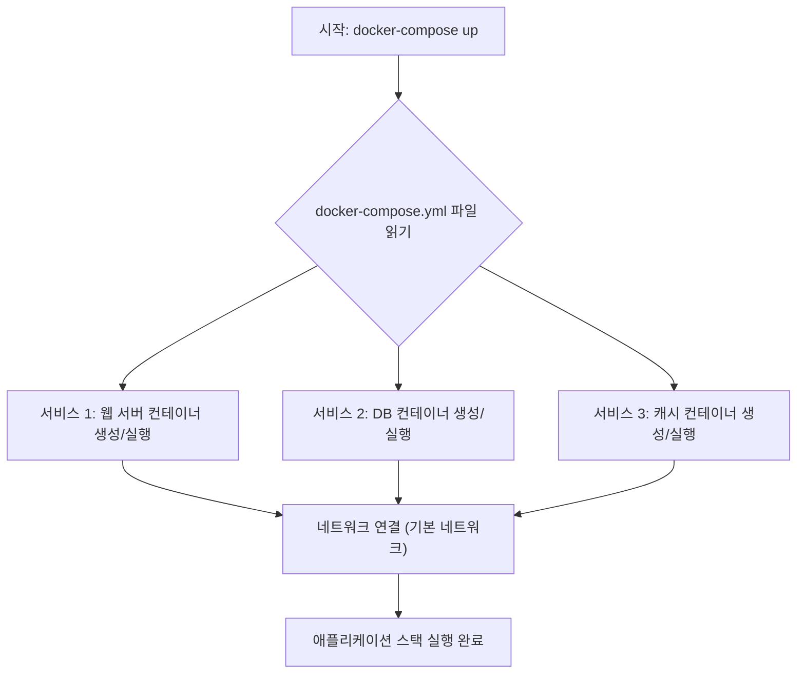
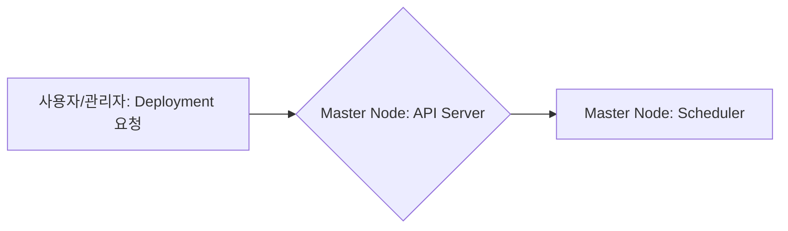
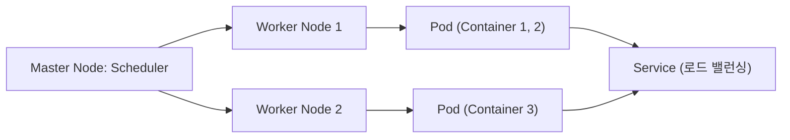

## Docker, Docker Compose, 그리고 Kubernetes

-----

### 1\. Docker 이미지와 컨테이너의 이해

Docker는 애플리케이션과 그 종속성을 컨테이너라는 격리된 환경에서 패키징하고 실행할 수 있게 해주는 **컨테이너화(Containerization)** 기술입니다. Docker 환경에서 가장 기본이 되는 개념은 \*\*이미지(Image)\*\*와 \*\*컨테이너(Container)\*\*입니다.

#### 1.1. Docker 이미지 (Image)

Docker \*\*이미지(Image)\*\*는 애플리케이션을 실행하는 데 필요한 모든 것을 포함하는 **읽기 전용(Read-Only)** 템플릿입니다.

  * **1.1.1. 정의 및 구성 요소**
      * 이미지는 애플리케이션 코드, 라이브러리, 런타임 환경, 시스템 도구, 종속성 및 컨테이너가 실행할 명령을 정의하는 \*\*메타데이터(Metadata)\*\*를 포함합니다.
      * 이는 **레이어(Layer)** 단위로 구성되어 있습니다. 각 레이어는 이미지의 파일 시스템에 대한 변경 사항을 나타내며, 이미지 빌드 시 Dockerfile의 각 명령(예: `RUN`, `COPY`)이 새로운 레이어를 생성합니다. 이 레이어 구조는 이미지의 효율적인 저장, 공유 및 빌드를 가능하게 합니다.
      * 이미지는 컨테이너를 생성하기 위한 **청사진(Blueprint)** 또는 \*\*클래스(Class)\*\*와 같습니다.

#### 1.2. Docker 컨테이너 (Container)

Docker \*\*컨테이너(Container)\*\*는 Docker \*\*이미지(Image)\*\*를 기반으로 실행되는 애플리케이션의 **실행 가능한(Runnable)** 인스턴스입니다.

  * **1.2.1. 정의 및 특징**
      * 컨테이너는 이미지의 읽기 전용 레이어 위에 **쓰기 가능한(Writable)** 레이어를 추가하여 생성됩니다. 이 쓰기 가능 레이어 덕분에 컨테이너는 상태를 가질 수 있고, 실행 중에 변경된 파일 시스템 내용을 저장할 수 있습니다.
      * 컨테이너는 호스트 OS의 커널을 공유하지만, 프로세스, 네트워크 인터페이스, 파일 시스템 등이 \*\*격리(Isolated)\*\*되어 실행됩니다.
      * 이는 이미지라는 클래스에서 생성된 **객체(Object)** 또는 프로그램의 \*\*프로세스(Process)\*\*와 같습니다. 한 이미지에서 여러 개의 컨테이너를 동시에 실행할 수 있습니다.

#### 1.3. 이미지와 컨테이너의 차이 요약

| 특징 | Docker 이미지 (Image) | Docker 컨테이너 (Container) |
| :--- | :--- | :--- |
| **속성** | 읽기 전용 (Read-Only) | 읽기/쓰기 가능 (Read/Writable) |
| **역할** | 컨테이너 생성을 위한 템플릿/청사진 | 이미지 기반으로 실행되는 인스턴스/프로세스 |
| **상태** | 상태 없음 (Stateless) | 상태 가질 수 있음 (Stateful) |
| **비유** | 프로그램의 클래스 (Class) | 실행 중인 프로세스 또는 객체 (Object) |

-----

### 2\. Docker Compose의 역할 및 Dockerfile과의 차이점

#### 2.1. Docker Compose의 유용성

\*\*Docker Compose (도커 컴포즈)\*\*는 **다중 컨테이너(Multi-Container)** Docker 애플리케이션을 정의하고 실행하기 위한 도구입니다. **YAML** 파일을 사용하여 애플리케이션의 서비스 구성을 설정합니다.

  * **2.1.1. 유용한 상황**
      * **다중 서비스 애플리케이션 (Multi-Service Application)**: 웹 애플리케이션 서버, 데이터베이스, 캐시 서버 등 여러 컴포넌트(서비스)로 구성된 복잡한 애플리케이션을 단일 명령으로 관리해야 할 때 매우 유용합니다.
          * *예시:* 딥러닝 웹 서비스에서 Flask/Django(웹 앱), Redis(캐시), PostgreSQL/MongoDB(DB)가 각각 컨테이너로 실행되어야 할 때.
      * **개발 및 테스트 환경 구성 (Development and Testing Environment Setup)**: 팀원 간에 동일한 개발 환경을 쉽게 복제하고 공유할 수 있게 하여 "내 컴퓨터에서는 되는데..." 문제를 방지합니다.
      * **배포 간소화 (Deployment Simplification)**: 여러 컨테이너를 개별적으로 `docker run` 명령어로 실행하는 대신, `docker-compose up` 명령 하나로 전체 스택(Stack)을 시작, 중지, 빌드할 수 있습니다.

#### 2.2. Docker Compose의 기본 작동 방식 (Mermaid Diagram)

Docker Compose는 `docker-compose.yml` 파일에 정의된 서비스들을 기반으로 실행됩니다.

#### 2.3. Docker Compose와 Dockerfile의 차이

\*\*Dockerfile (도커파일)\*\*과 **Docker Compose**는 서로 다른 목적으로 사용됩니다.

  * **2.3.1. Dockerfile (단일 컨테이너 정의)**

      * **목적**: **단일** Docker \*\*이미지(Image)\*\*를 빌드하는 방법을 정의합니다.
      * **내용**: 이미지에 포함될 기본 이미지, 파일 복사, 환경 설정, 실행할 명령어 등 이미지 빌드 단계를 순차적으로 나열합니다.
      * **결과**: 하나의 애플리케이션 또는 서비스에 대한 **이미지**가 생성됩니다.

  * **2.3.2. Docker Compose (다중 컨테이너 오케스트레이션)**

      * **목적**: 여러 개의 \*\*컨테이너(Container)\*\*로 구성된 애플리케이션 스택을 정의하고 관리합니다.
      * **내용**: 애플리케이션을 구성하는 **서비스(Service)** 목록, 각 서비스가 사용할 이미지(Dockerfile로 빌드하거나, Registry에서 가져옴), 환경 변수, 포트 매핑, 볼륨, 네트워크 등을 정의합니다.
      * **결과**: 정의된 서비스들을 한 번에 실행, 관리할 수 있는 **멀티 컨테이너 환경**이 구축됩니다.

-----

### 3\. Kubernetes의 기본 개념과 Docker와의 관계

#### 3.1. Kubernetes (쿠버네티스)의 기본 개념

\*\*Kubernetes (K8s)\*\*는 컨테이너화된 워크로드와 서비스를 **자동으로 배포(Automated Deployment)**, **스케일링(Scaling)** 및 \*\*관리(Management)\*\*하기 위한 **오픈 소스 시스템**입니다. 이는 컨테이너 **오케스트레이션(Orchestration)** 분야의 사실상 표준입니다.

  * **3.1.1. 핵심 구성 요소**

      * **Cluster (클러스터)**: 쿠버네티스의 기본 단위로, \*\*Master Node (마스터 노드)\*\*와 하나 이상의 \*\*Worker Node (워커 노드)\*\*로 구성됩니다.
      * **Master Node (제어 플레인)**: 클러스터의 상태를 관리하고, 스케줄링 등의 결정을 내리는 컨트롤러 역할을 합니다.
      * **Worker Node (작업 노드)**: 컨테이너화된 애플리케이션이 실제로 실행되는 물리적 또는 가상 머신입니다. 각 노드에는 Kubelet(노드 관리 에이전트)과 컨테이너 런타임(예: Docker)이 설치되어 있습니다.
      * **Pod (파드)**: 쿠버네티스에서 생성하고 관리하는 가장 작은 **배포 단위**입니다. 하나 이상의 컨테이너(보통 밀접하게 관련된 컨테이너들)와 공유된 스토리지, 네트워크 리소스를 캡슐화합니다.
      * **Deployment (디플로이먼트)**: **ReplicaSet**을 관리하여 파드의 상태를 유지하고, 애플리케이션의 \*\*선언적 업데이트(Declarative Update)\*\*를 수행합니다. 이를 통해 원하는 상태(Desired State)와 현재 상태(Current State)를 일치시킵니다.
      * **Service (서비스)**: 파드 집합에 대한 **안정적인 네트워크 엔드포인트**를 정의합니다. 파드가 재시작되거나 재생성되어 IP 주소가 바뀌어도, 서비스는 이 파드들에 대한 일관된 접근을 제공합니다.

  * **3.1.2. Kubernetes 작동 원리 (Mermaid Diagram)**

<!-- end list -->

#### 3.2. Docker와 Kubernetes의 관계

Docker와 Kubernetes는 컨테이너 환경에서 \*\*상호 보완적(Complementary)\*\*인 역할을 수행합니다.

  * **3.2.1. 역할 구분 (What vs. How)**

      * **Docker (무엇을)**: 애플리케이션을 \*\*컨테이너화(Containerize)\*\*하고 **단일 컨테이너**를 실행하는 기술(컨테이너 **런타임**, Container Runtime)입니다. Docker는 애플리케이션을 이식 가능하고 독립적인 단위인 **이미지**로 패키징하는 도구입니다.
      * **Kubernetes (어떻게)**: 수많은 컨테이너를 \*\*대규모(at scale)\*\*로 \*\*오케스트레이션(Orchestrate)\*\*하고 관리하는 시스템입니다. 수십/수백 개의 Docker 컨테이너를 다양한 서버(노드)에 걸쳐 배포, 모니터링, 자동 복구, 스케일링하는 작업을 담당합니다.

  * **3.2.2. 연관성**

      * Kubernetes는 내부적으로 \*\*컨테이너 런타임(Container Runtime)\*\*을 사용하여 컨테이너를 실행합니다. 전통적으로 Docker가 가장 널리 사용되는 런타임이었습니다.
      * Kubernetes 클러스터는 Docker로 빌드된 **이미지**를 가져와 **파드(Pod)** 내에서 실행합니다. 즉, Docker는 컨테이너를 만드는 도구이고, Kubernetes는 그 컨테이너들을 관리하는 플랫폼입니다.

-----

### 4\. 핵심 수식: 스케일링 및 가용성 개념

Kubernetes의 핵심 목표 중 하나는 애플리케이션의 \*\*고가용성(High Availability)\*\*과 \*\*스케일링(Scaling)\*\*입니다. Deployment를 통해 원하는 복제본 수(Desired Replicas)를 설정합니다.

  * **4.1. 파드 수 (Replica Count)**

Deployment에서 관리하는 \*\*파드 복제본 수($N$)\*\*는 애플리케이션의 처리량($T$)과 단일 파드의 처리 능력($P$)에 따라 결정됩니다. (이상적인 상황 가정)

$$
N = \lceil \frac{T}{P} \rceil
$$

여기서 $\lceil x \rceil$는 올림(Ceiling) 함수로, 필요한 파드 수를 항상 정수로 보장합니다.

  * **4.2. 가용성 (Availability)**

가용성($A$)은 시스템이 의도한 성능 수준에서 작동하는 시간의 백분율로 정의될 수 있습니다. (MTBF: Mean Time Between Failures, 평균 고장 간격; MTTR: Mean Time To Repair, 평균 수리 시간)

$$
A = \frac{MTBF}{MTBF + MTTR} \times 100\%
$$

Kubernetes는 파드 실패 시 자동 복구(Self-healing) 기능을 통해 **MTTR**을 최소화하고, 여러 복제본을 유지하여 **MTBF**를 높임으로써 **가용성**을 향상시킵니다.
