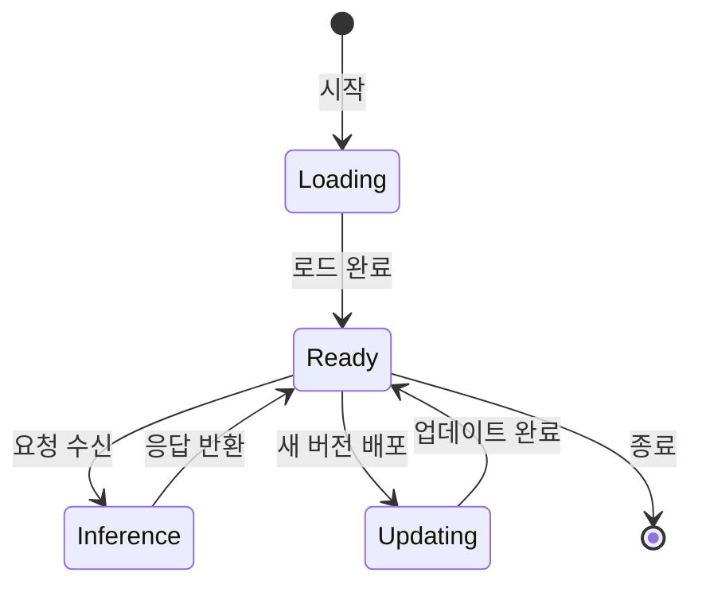
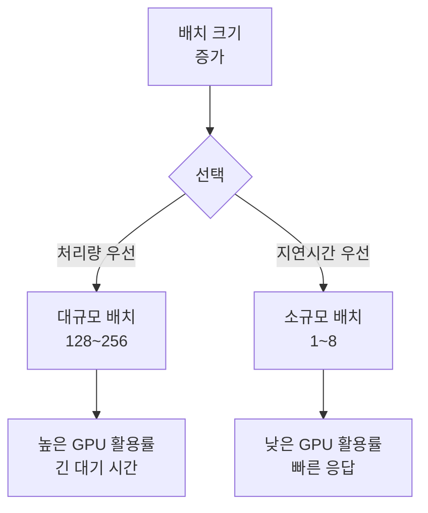
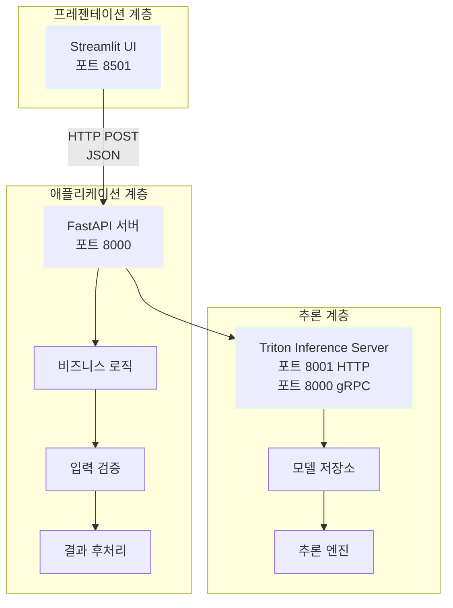
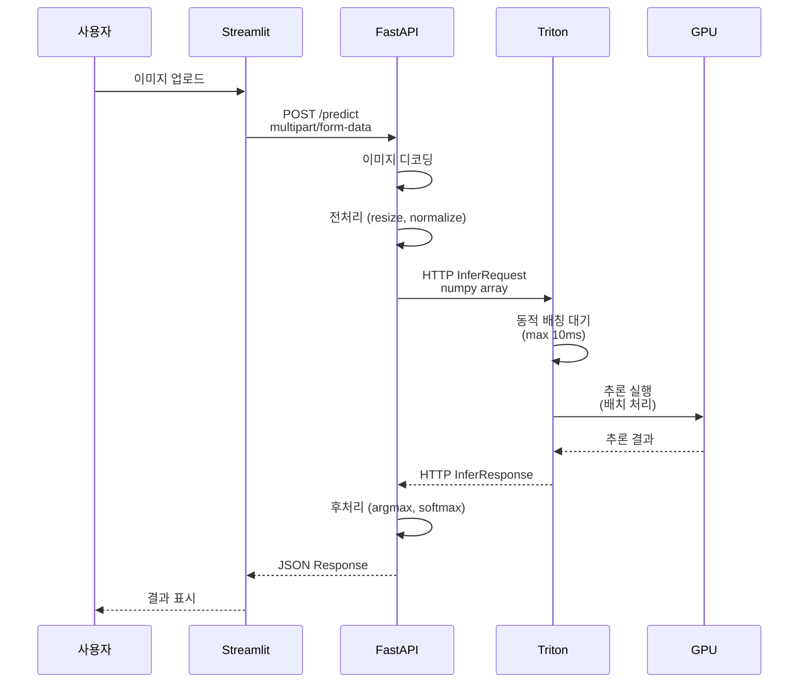

# 모델 서빙(Model Serving)

## 목차
1. 모델 서빙 개요<br/>
   1.1. 정의와 필요성<br/>
   1.2. 학습과 서빙의 차이<br/>
2. 서빙 프레임워크의 역할<br/>
   2.1. 핵심 기능<br/>
   2.2. 성능 최적화 요소<br/>
3. 서빙 아키텍처 설계<br/>
   3.1. Streamlit + FastAPI + Triton 통합 구조<br/>
   3.2. 각 계층의 책임과 역할<br/>
   3.3. 통신 프로토콜과 데이터 흐름<br/>
4. 실전 구현 가이드<br/>
   4.1. Triton Inference Server 설정<br/>
   4.2. FastAPI 백엔드 구현<br/>
   4.3. Streamlit 프론트엔드 연결<br/>

---

## 1. 모델 서빙 개요

### 1.1. 정의와 필요성

**모델 서빙(Model Serving)**은 학습된 머신러닝 모델을 실제 프로덕션 환경에 배포하여 실시간 또는 배치 추론(inference) 요청을 처리하는 프로세스입니다.

#### 1.1.1. 왜 필요한가?

학습 환경과 서비스 환경은 근본적으로 다른 요구사항을 갖습니다:

**학습 단계 (Training Phase)**
- 목표: 모델 성능 최적화
- 실행 방식: 배치 처리, 오프라인
- 리소스: GPU 집약적, 장시간 실행
- 재현성: 체크포인트, 시드 고정

**서빙 단계 (Serving Phase)**
- 목표: 낮은 지연시간(latency), 높은 처리량(throughput)
- 실행 방식: 온라인 요청-응답, 실시간
- 리소스: CPU/GPU 효율 최적화, 메모리 관리
- 안정성: 장애 복구, 로드 밸런싱, 모니터링


#### 1.1.2. 서빙 없이 직접 추론하면 안 되나?

**직접 추론의 문제점**:

```python
# 안티패턴: 매 요청마다 모델 로드
def predict(input_data):
    model = torch.load('model.pt')  # 매번 로드 (수 초 소요)
    model.eval()
    result = model(input_data)
    return result
```

- 모델 로드 오버헤드: 매 요청마다 수십 MB~GB 메모리 로드
- 배치 처리 불가: 단일 요청만 처리, GPU 활용률 저하
- 버전 관리 부재: A/B 테스트, 롤백 불가
- 확장성 한계: 트래픽 증가 시 수평 확장 어려움

### 1.2. 학습과 서빙의 차이

| 항목 | 학습 (Training) | 서빙 (Serving) |
|------|----------------|----------------|
| **지연시간** | 수 시간~수 일 허용 | 밀리초~초 단위 요구 |
| **처리량** | 대규모 배치 (256~1024) | 소규모 배치 (1~32) |
| **리소스** | 다중 GPU, 분산 학습 | 단일 GPU 또는 CPU |
| **메모리** | 그래디언트, 옵티마이저 상태 | 추론 전용 가중치만 |
| **정확도** | FP32, Mixed Precision | INT8, FP16 양자화 가능 |

---

## 2. 서빙 프레임워크의 역할

### 2.1. 핵심 기능

서빙 프레임워크는 다음 기능을 통합 제공합니다:

#### 2.1.1. 모델 라이프사이클 관리



**주요 작업**:
- 모델 로드: 시작 시 메모리에 적재, 워밍업(warmup) 수행
- 버전 관리: 다중 버전 동시 서빙, 카나리(canary) 배포
- 핫 스왑: 무중단 모델 업데이트

#### 2.1.2. 요청 처리 최적화

**동적 배칭(Dynamic Batching)**:

$$
\text{Latency}_{\text{batch}} \ll \sum_{i=1}^{n} \text{Latency}_{\text{individual}}
$$

```python
# 개념적 예시
class DynamicBatcher:
    def __init__(self, max_batch_size=32, max_wait_ms=10):
        self.queue = []
        self.max_batch_size = max_batch_size
        self.max_wait_ms = max_wait_ms
    
    async def add_request(self, request):
        self.queue.append(request)
        if len(self.queue) >= self.max_batch_size:
            return await self.process_batch()
        # 타임아웃 대기
        await asyncio.sleep(self.max_wait_ms / 1000)
        return await self.process_batch()
```

**처리량 비교**:
- 개별 처리: 10 req/sec × 100ms = 1초당 10개
- 배치 처리: 32 req × 150ms = 1초당 ~213개 (21배 향상)

#### 2.1.3. 하드웨어 가속

**추론 최적화 기법**:

1. **모델 양자화(Quantization)**:
   - FP32 → INT8: 모델 크기 4배 감소, 속도 2~4배 향상
   - 정확도 손실: 일반적으로 1% 이내

$$
Q(x) = \text{round}\left(\frac{x - z}{s}\right), \quad s = \frac{x_{\max} - x_{\min}}{2^b - 1}
$$

2. **그래프 최적화(Graph Optimization)**:
   - Operator Fusion: Conv + BatchNorm + ReLU → 단일 커널
   - Constant Folding: 컴파일 타임 상수 계산

3. **텐서 병렬화(Tensor Parallelism)**:
   - 대형 모델을 다중 GPU에 분산
   - 파이프라인 병렬화와 결합

### 2.2. 성능 최적화 요소

#### 2.2.1. 지연시간 분해


**총 지연시간(End-to-End Latency)**:

$$
T_{\text{total}} = T_{\text{network}} + T_{\text{preprocess}} + T_{\text{inference}} + T_{\text{postprocess}} + T_{\text{network}}
$$

**최적화 전략**:
- $T_{\text{network}}$: gRPC, HTTP/2, 압축
- $T_{\text{preprocess}}$: 벡터화, JIT 컴파일
- $T_{\text{inference}}$: TensorRT, ONNX Runtime
- $T_{\text{postprocess}}$: 비동기 처리

#### 2.2.2. 처리량 vs 지연시간 트레이드오프



**배치 크기 결정 공식**:

$$
\text{Batch Size} = \min\left(\frac{\text{GPU Memory}}{\text{Model Size}}, \frac{\text{Target Latency}}{\text{Unit Inference Time}}\right)
$$

---

## 3. 서빙 아키텍처 설계

### 3.1. Streamlit + FastAPI + Triton 통합 구조

#### 3.1.1. 3계층 아키텍처



#### 3.1.2. 책임 분리 원칙

**Streamlit (프론트엔드)**:
- 사용자 인터페이스 렌더링
- 파일 업로드, 폼 처리
- 시각화 및 결과 표시
- FastAPI에 HTTP 요청

**FastAPI (백엔드 API)**:
- RESTful API 엔드포인트 제공
- 요청 검증 (Pydantic 모델)
- 비즈니스 로직 (전처리, 후처리)
- Triton 클라이언트 관리
- 로깅, 모니터링

**Triton Inference Server (추론 엔진)**:
- 모델 로드 및 관리
- 동적 배칭
- GPU 스케줄링
- 멀티 프레임워크 지원 (PyTorch, TensorFlow, ONNX)

### 3.2. 각 계층의 책임과 역할

#### 3.2.1. Streamlit 계층

```python
# streamlit_app.py
import streamlit as st
import requests
from typing import Dict, Any

FASTAPI_URL = "http://localhost:8000"

def main():
    st.title("이미지 분류 서비스")
    
    uploaded_file = st.file_uploader("이미지 선택", type=["jpg", "png"])
    
    if uploaded_file and st.button("분류 실행"):
        # FastAPI로 전송
        files = {"file": uploaded_file.getvalue()}
        response = requests.post(f"{FASTAPI_URL}/predict", files=files)
        
        if response.status_code == 200:
            result: Dict[str, Any] = response.json()
            st.success(f"예측 클래스: {result['class']}")
            st.metric("확률", f"{result['confidence']:.2%}")
        else:
            st.error(f"오류: {response.text}")

if __name__ == "__main__":
    main()
```

**핵심 역할**:
- 사용자 경험(UX) 최적화
- 입력 데이터 수집
- API 응답 시각화
- 에러 핸들링 (사용자 친화적 메시지)

#### 3.2.2. FastAPI 계층

```python
# fastapi_server.py
from fastapi import FastAPI, File, UploadFile, HTTPException
from pydantic import BaseModel
import tritonclient.http as httpclient
import numpy as np
from PIL import Image
import io
from typing import Dict

app = FastAPI()

class PredictionResponse(BaseModel):
    class_name: str
    confidence: float
    latency_ms: float

class TritonClient:
    def __init__(self, url: str = "localhost:8000"):
        self.client = httpclient.InferenceServerClient(url=url)
        self.model_name = "image_classifier"
        
    def preprocess(self, image: Image.Image) -> np.ndarray:
        """이미지 전처리"""
        img = image.resize((224, 224))
        img_array = np.array(img).astype(np.float32)
        img_array = (img_array / 255.0 - 0.5) / 0.5  # 정규화
        return np.expand_dims(img_array.transpose(2, 0, 1), axis=0)
    
    def infer(self, input_data: np.ndarray) -> np.ndarray:
        """Triton 추론 요청"""
        inputs = [
            httpclient.InferInput("INPUT", input_data.shape, "FP32")
        ]
        inputs[0].set_data_from_numpy(input_data)
        
        outputs = [httpclient.InferRequestedOutput("OUTPUT")]
        
        response = self.client.infer(
            model_name=self.model_name,
            inputs=inputs,
            outputs=outputs
        )
        
        return response.as_numpy("OUTPUT")

triton_client = TritonClient()

@app.post("/predict", response_model=PredictionResponse)
async def predict(file: UploadFile = File(...)) -> Dict:
    """이미지 분류 API"""
    import time
    start_time = time.time()
    
    # 입력 검증
    if not file.content_type.startswith("image/"):
        raise HTTPException(400, "이미지 파일만 허용됩니다")
    
    # 이미지 로드
    image_bytes = await file.read()
    image = Image.open(io.BytesIO(image_bytes)).convert("RGB")
    
    # 전처리
    input_data = triton_client.preprocess(image)
    
    # 추론
    output = triton_client.infer(input_data)
    
    # 후처리
    class_idx = np.argmax(output)
    confidence = float(output[0, class_idx])
    
    latency = (time.time() - start_time) * 1000
    
    return {
        "class_name": f"class_{class_idx}",
        "confidence": confidence,
        "latency_ms": latency
    }

@app.get("/health")
async def health_check():
    """헬스 체크"""
    if triton_client.client.is_server_live():
        return {"status": "healthy", "triton": "live"}
    return {"status": "unhealthy"}
```

**핵심 역할**:
- API 계약 정의 (Pydantic)
- 입력 검증 및 에러 처리
- Triton 클라이언트 관리
- 전처리/후처리 로직
- 메트릭 수집

#### 3.2.3. Triton 계층

**모델 저장소 구조**:

```
model_repository/
└── image_classifier/
    ├── config.pbtxt          # 모델 설정
    ├── 1/                    # 버전 1
    │   └── model.onnx
    └── 2/                    # 버전 2 (카나리)
        └── model.onnx
```

**config.pbtxt 예시**:

```protobuf
name: "image_classifier"
platform: "onnxruntime_onnx"
max_batch_size: 32

input [
  {
    name: "INPUT"
    data_type: TYPE_FP32
    dims: [ 3, 224, 224 ]
  }
]

output [
  {
    name: "OUTPUT"
    data_type: TYPE_FP32
    dims: [ 1000 ]
  }
]

dynamic_batching {
  max_queue_delay_microseconds: 100
}

instance_group [
  {
    count: 2
    kind: KIND_GPU
  }
]
```

**핵심 설정**:
- `max_batch_size`: 최대 배치 크기
- `dynamic_batching`: 동적 배칭 활성화
- `instance_group`: GPU 인스턴스 개수

### 3.3. 통신 프로토콜과 데이터 흐름

#### 3.3.1. 전체 데이터 흐름



#### 3.3.2. Triton 통신 프로토콜

**HTTP vs gRPC 비교**:

| 항목 | HTTP (포트 8000) | gRPC (포트 8001) |
|------|------------------|------------------|
| **지연시간** | ~5ms | ~2ms |
| **처리량** | 중간 | 높음 |
| **디버깅** | 쉬움 (curl, Postman) | 어려움 |
| **스트리밍** | 제한적 | 양방향 지원 |
| **사용 사례** | 개발, 간단한 서비스 | 프로덕션, 고성능 |

**gRPC 사용 예시**:

```python
import tritonclient.grpc as grpcclient

# gRPC 클라이언트 (더 빠름)
client = grpcclient.InferenceServerClient(url="localhost:8001")

inputs = [grpcclient.InferInput("INPUT", [1, 3, 224, 224], "FP32")]
inputs[0].set_data_from_numpy(input_data)

outputs = [grpcclient.InferRequestedOutput("OUTPUT")]

response = client.infer(
    model_name="image_classifier",
    inputs=inputs,
    outputs=outputs
)
```

---

## 4. 실전 구현 가이드

### 4.1. Triton Inference Server 설정

#### 4.1.1. Docker 기반 설치

```bash
# Triton 서버 실행
docker run --gpus all --rm \
  -p 8000:8000 \
  -p 8001:8001 \
  -p 8002:8002 \
  -v $(pwd)/model_repository:/models \
  nvcr.io/nvidia/tritonserver:24.01-py3 \
  tritonserver --model-repository=/models \
               --log-verbose=1
```

**포트 설명**:
- 8000: HTTP 추론
- 8001: gRPC 추론
- 8002: 메트릭 (Prometheus)

#### 4.1.2. PyTorch 모델을 ONNX로 변환

```python
# convert_to_onnx.py
import torch
import torch.onnx
from torchvision.models import resnet50

def convert_model():
    # 모델 로드
    model = resnet50(pretrained=True)
    model.eval()
    
    # 더미 입력
    dummy_input = torch.randn(1, 3, 224, 224)
    
    # ONNX 변환
    torch.onnx.export(
        model,
        dummy_input,
        "model_repository/image_classifier/1/model.onnx",
        export_params=True,
        opset_version=17,
        input_names=["INPUT"],
        output_names=["OUTPUT"],
        dynamic_axes={
            "INPUT": {0: "batch_size"},
            "OUTPUT": {0: "batch_size"}
        }
    )
    
    print("ONNX 변환 완료")

if __name__ == "__main__":
    convert_model()
```

**동적 축(dynamic_axes) 설정 이유**:
- 배치 크기를 런타임에 결정
- 동적 배칭 활성화 가능

#### 4.1.3. 모델 성능 벤치마크

```bash
# Triton SDK 설치
pip install tritonclient[all]

# 성능 측정
perf_analyzer -m image_classifier \
  --percentile=95 \
  --concurrency-range 1:8:2 \
  -u localhost:8000
```

**결과 해석**:
```
Concurrency: 4
  Throughput: 1250 infer/sec
  p50 latency: 3.2 ms
  p95 latency: 4.8 ms
  p99 latency: 6.1 ms
```

### 4.2. FastAPI 백엔드 구현

#### 4.2.1. 프로젝트 구조

```
backend/
├── app/
│   ├── __init__.py
│   ├── main.py              # FastAPI 앱
│   ├── models.py            # Pydantic 모델
│   ├── triton_client.py     # Triton 클라이언트
│   └── preprocessing.py     # 전처리 로직
├── tests/
│   └── test_api.py
├── requirements.txt
└── Dockerfile
```

#### 4.2.2. 전처리 모듈

```python
# app/preprocessing.py
import numpy as np
from PIL import Image
from typing import Tuple

class ImagePreprocessor:
    """이미지 전처리 파이프라인"""
    
    def __init__(
        self,
        input_size: Tuple[int, int] = (224, 224),
        mean: Tuple[float, float, float] = (0.485, 0.456, 0.406),
        std: Tuple[float, float, float] = (0.229, 0.224, 0.225)
    ):
        self.input_size = input_size
        self.mean = np.array(mean).reshape(1, 3, 1, 1).astype(np.float32)
        self.std = np.array(std).reshape(1, 3, 1, 1).astype(np.float32)
    
    def __call__(self, image: Image.Image) -> np.ndarray:
        """
        이미지를 모델 입력 형식으로 변환
        
        Args:
            image: PIL Image (RGB)
        
        Returns:
            numpy array (1, 3, H, W), FP32
        """
        # Resize
        img_resized = image.resize(self.input_size, Image.BILINEAR)
        
        # To numpy
        img_array = np.array(img_resized).astype(np.float32)
        
        # HWC -> CHW
        img_array = img_array.transpose(2, 0, 1)
        
        # Add batch dimension
        img_array = np.expand_dims(img_array, axis=0)
        
        # Normalize [0, 255] -> [0, 1]
        img_array /= 255.0
        
        # Standardize
        img_array = (img_array - self.mean) / self.std
        
        return img_array
```

#### 4.2.3. Triton 클라이언트 래퍼

```python
# app/triton_client.py
import tritonclient.http as httpclient
import numpy as np
from typing import Dict, List
import logging

logger = logging.getLogger(__name__)

class TritonInferenceClient:
    """Triton Inference Server 클라이언트"""
    
    def __init__(
        self,
        url: str = "localhost:8000",
        model_name: str = "image_classifier",
        model_version: str = "1"
    ):
        self.url = url
        self.model_name = model_name
        self.model_version = model_version
        self.client = httpclient.InferenceServerClient(url=url)
        
        # 서버 상태 확인
        if not self.client.is_server_live():
            raise ConnectionError(f"Triton 서버 연결 실패: {url}")
        
        logger.info(f"Triton 클라이언트 초기화 완료: {url}")
    
    def infer(self, input_data: np.ndarray) -> np.ndarray:
        """
        추론 실행
        
        Args:
            input_data: numpy array (B, C, H, W)
        
        Returns:
            추론 결과 numpy array (B, num_classes)
        """
        # 입력 텐서 생성
        inputs = [
            httpclient.InferInput(
                "INPUT",
                input_data.shape,
                datatype="FP32"
            )
        ]
        inputs[0].set_data_from_numpy(input_data)
        
        # 출력 텐서 지정
        outputs = [httpclient.InferRequestedOutput("OUTPUT")]
        
        # 추론 요청
        response = self.client.infer(
            model_name=self.model_name,
            model_version=self.model_version,
            inputs=inputs,
            outputs=outputs
        )
        
        # 결과 추출
        output_data = response.as_numpy("OUTPUT")
        return output_data
    
    def get_model_metadata(self) -> Dict:
        """모델 메타데이터 조회"""
        return self.client.get_model_metadata(
            model_name=self.model_name,
            model_version=self.model_version
        )
```

#### 4.2.4. FastAPI 메인 앱

```python
# app/main.py
from fastapi import FastAPI, File, UploadFile, HTTPException
from fastapi.middleware.cors import CORSMiddleware
from pydantic import BaseModel, Field
from PIL import Image
import io
import numpy as np
from typing import List, Dict
import time
import logging

from .triton_client import TritonInferenceClient
from .preprocessing import ImagePreprocessor

# 로깅 설정
logging.basicConfig(level=logging.INFO)
logger = logging.getLogger(__name__)

app = FastAPI(title="이미지 분류 API")

# CORS 설정 (Streamlit 연동)
app.add_middleware(
    CORSMiddleware,
    allow_origins=["http://localhost:8501"],
    allow_credentials=True,
    allow_methods=["*"],
    allow_headers=["*"],
)

# 전역 클라이언트 (앱 시작 시 초기화)
triton_client = None
preprocessor = None

class PredictionResult(BaseModel):
    """예측 결과 응답 모델"""
    class_id: int = Field(..., description="예측된 클래스 ID")
    class_name: str = Field(..., description="클래스 이름")
    confidence: float = Field(..., ge=0.0, le=1.0, description="확률")
    latency_ms: float = Field(..., description="추론 지연시간 (ms)")

@app.on_event("startup")
async def startup_event():
    """앱 시작 시 초기화"""
    global triton_client, preprocessor
    
    triton_client = TritonInferenceClient(
        url="localhost:8000",
        model_name="image_classifier"
    )
    preprocessor = ImagePreprocessor()
    
    logger.info("서버 초기화 완료")

@app.post("/predict", response_model=PredictionResult)
async def predict(file: UploadFile = File(...)) -> Dict:
    """
    이미지 분류 API
    
    Args:
        file: 이미지 파일 (JPG, PNG)
    
    Returns:
        예측 결과
    """
    start_time = time.time()
    
    # 1. 입력 검증
    if not file.content_type.startswith("image/"):
        raise HTTPException(
            status_code=400,
            detail="이미지 파일만 허용됩니다"
        )
    
    # 2. 이미지 로드
    image_bytes = await file.read()
    image = Image.open(io.BytesIO(image_bytes)).convert("RGB")
    
    logger.info(f"이미지 로드 완료: {image.size}")
    
    # 3. 전처리
    input_data = preprocessor(image)
    
    # 4. 추론
    output = triton_client.infer(input_data)
    
    # 5. 후처리
    probabilities = np.exp(output) / np.sum(np.exp(output), axis=1, keepdims=True)
    class_id = int(np.argmax(probabilities))
    confidence = float(probabilities[0, class_id])
    
    latency = (time.time() - start_time) * 1000
    
    logger.info(
        f"예측 완료 - 클래스: {class_id}, "
        f"확률: {confidence:.4f}, "
        f"지연시간: {latency:.2f}ms"
    )
    
    return {
        "class_id": class_id,
        "class_name": f"class_{class_id}",
        "confidence": confidence,
        "latency_ms": latency
    }

@app.get("/health")
async def health_check():
    """헬스 체크 엔드포인트"""
    if triton_client.client.is_server_live():
        return {
            "status": "healthy",
            "triton": "live",
            "model": triton_client.model_name
        }
    return {"status": "unhealthy"}

@app.get("/metrics")
async def get_metrics():
    """메트릭 조회"""
    metadata = triton_client.get_model_metadata()
    return {
        "model_name": metadata["name"],
        "model_version": metadata["versions"],
        "platform": metadata["platform"]
    }
```

### 4.3. Streamlit 프론트엔드 연결

```python
# streamlit_app.py
import streamlit as st
import requests
from PIL import Image
import io
from typing import Dict, Optional

# 설정
FASTAPI_URL = "http://localhost:8000"

st.set_page_config(
    page_title="이미지 분류 서비스",
    page_icon="🖼️",
    layout="wide"
)

def check_api_health() -> bool:
    """API 헬스 체크"""
    response = requests.get(f"{FASTAPI_URL}/health")
    return response.status_code == 200

def predict_image(image_bytes: bytes) -> Optional[Dict]:
    """이미지 분류 요청"""
    files = {"file": ("image.jpg", image_bytes, "image/jpeg")}
    response = requests.post(f"{FASTAPI_URL}/predict", files=files)
    
    if response.status_code == 200:
        return response.json()
    return None

def main():
    st.title("🖼️ 이미지 분류 서비스")
    st.markdown("Triton + FastAPI 기반 추론 시스템")
    
    # 사이드바
    with st.sidebar:
        st.header("⚙️ 설정")
        
        # API 상태 확인
        if check_api_health():
            st.success("✅ API 서버 정상")
        else:
            st.error("❌ API 서버 연결 실패")
            st.stop()
    
    # 메인 컨텐츠
    col1, col2 = st.columns(2)
    
    with col1:
        st.header("입력")
        uploaded_file = st.file_uploader(
            "이미지 선택",
            type=["jpg", "jpeg", "png"],
            help="JPG 또는 PNG 형식만 지원"
        )
        
        if uploaded_file:
            image = Image.open(uploaded_file)
            st.image(image, caption="업로드된 이미지", use_container_width=True)
    
    with col2:
        st.header("결과")
        
        if uploaded_file and st.button("🚀 분류 실행", type="primary"):
            with st.spinner("추론 중..."):
                # API 호출
                result = predict_image(uploaded_file.getvalue())
                
                if result:
                    st.success("✅ 분류 완료")
                    
                    # 결과 표시
                    st.metric("예측 클래스", result["class_name"])
                    st.metric("확률", f"{result['confidence']:.2%}")
                    st.metric("지연시간", f"{result['latency_ms']:.1f} ms")
                    
                    # 상세 정보
                    with st.expander("상세 정보"):
                        st.json(result)
                else:
                    st.error("❌ 분류 실패")

if __name__ == "__main__":
    main()
```

---

## 정리 및 핵심 요약

### 모델 서빙의 핵심 가치

$$
\text{서빙 시스템} = \frac{\text{고성능 추론} + \text{안정성} + \text{확장성}}{\text{운영 복잡도}}
$$

**3계층 아키텍처 장점**:
1. **관심사 분리**: 각 계층이 독립적 책임
2. **확장성**: 각 계층을 독립적으로 스케일링
3. **유지보수**: 계층별 수정이 다른 계층에 영향 최소화

**Triton의 핵심 이점**:
- 다중 프레임워크 지원 (PyTorch, TensorFlow, ONNX)
- 동적 배칭으로 처리량 향상
- 모델 버전 관리 및 A/B 테스트

이 구조로 프로덕션 수준의 ML 서비스를 구축할 수 있습니다.
