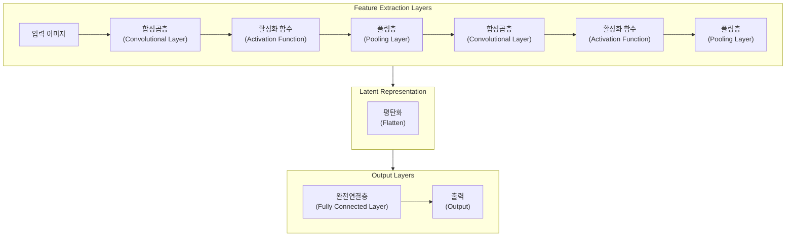
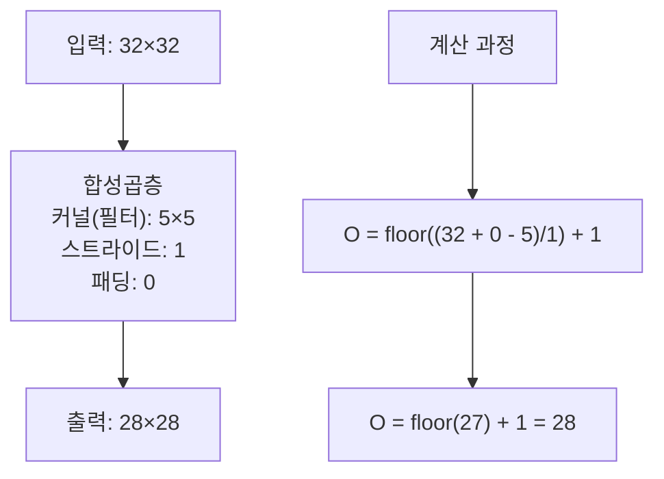
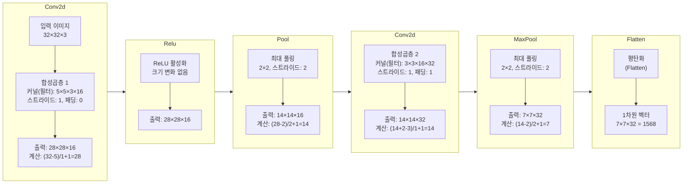
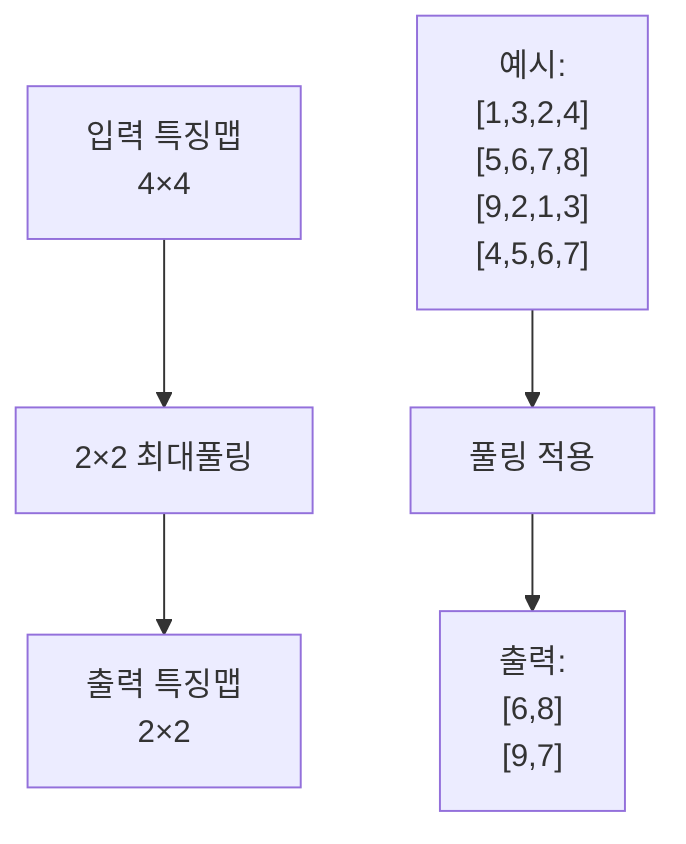
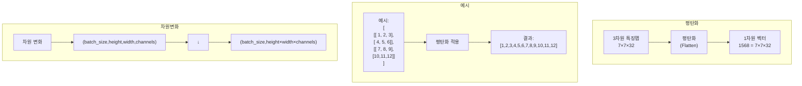
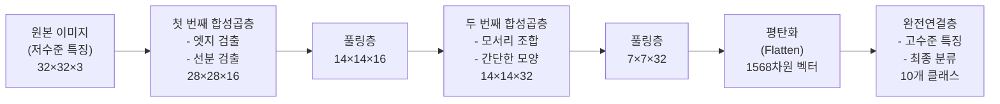
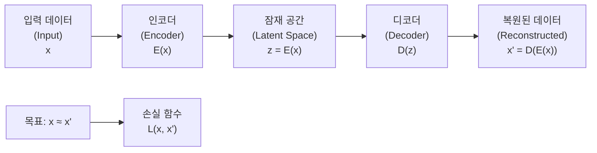
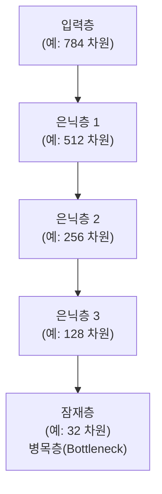
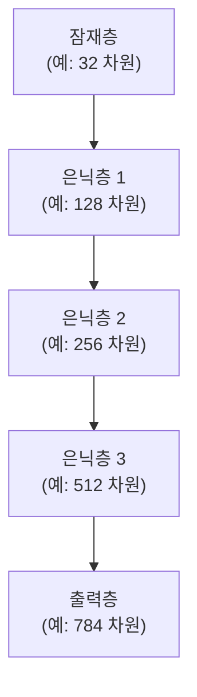
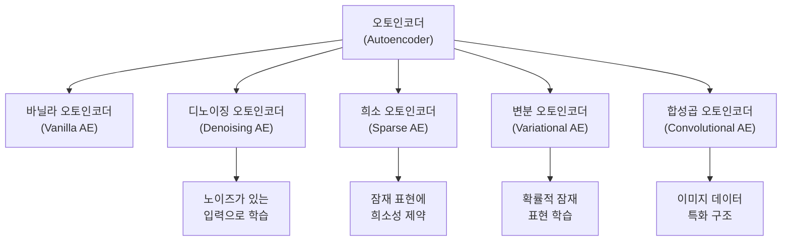

# 위클리페이퍼 #6: CNN과 오토인코더

---

## 문서 정보

| 항목 | 내용 |
|------|------|
| **작성자** | 김명환 |
| **작성일** | 2025년 8월 16일 |
| **과정** | AI엔지니어 딥러닝 과정 |
| **주제** | CNN과 오토인코더 |
---

## 📋 목차
- [1. CNN (Convolutional Neural Network)](#1-cnn-convolutional-neural-network)
 - [1.1 CNN이란?](#11-cnn이란)
 - [1.2 CNN의 전체 구조](#12-cnn의-전체-구조)
 - [1.3 합성곱층 (Convolutional Layer)](#13-합성곱층-convolutional-layer)
 - [1.4 CNN 레이어 출력 크기 계산](#14-cnn-레이어-출력-크기-계산)
   - [합성곱층 출력 크기 공식](#합성곱층-출력-크기-공식)
   - [계산 예제 1: 기본 합성곱](#계산-예제-1-기본-합성곱)
   - [계산 예제 2: 패딩 적용](#계산-예제-2-패딩-적용)
   - [계산 예제 3: 스트라이드 적용](#계산-예제-3-스트라이드-적용)
   - [풀링층 출력 크기 공식](#풀링층-출력-크기-공식)
 - [CNN 전체 흐름 계산 예제](#cnn-전체-흐름-계산-예제)
   - [매개변수 개수 계산](#매개변수-개수-계산)
 - [1.5 활성화 함수 (Activation Function)](#15-활성화-함수-activation-function)
 - [1.6 풀링층 (Pooling Layer)](#16-풀링층-pooling-layer)
 - [1.7 평탄화 (Flatten)](#17-평탄화-flatten)
 - [1.8 완전연결층 (Fully Connected Layer)](#18-완전연결층-fully-connected-layer)
 - [1.9 CNN 전체 데이터 흐름](#19-cnn-전체-데이터-흐름)
- [2. 오토인코더 (Autoencoder)](#2-오토인코더-autoencoder)
 - [2.1 오토인코더란?](#21-오토인코더란)
 - [2.2 오토인코더의 전체 구조](#22-오토인코더의-전체-구조)
 - [2.3 오토인코더가 적용되기 적합한 상황](#23-오토인코더가-적용되기-적합한-상황)
   - [1. 차원 축소 (Dimensionality Reduction)](#1-차원-축소-dimensionality-reduction)
   - [2. 이상 탐지 (Anomaly Detection)](#2-이상-탐지-anomaly-detection)
   - [3. 데이터 전처리 및 특징 추출](#3-데이터-전처리-및-특징-추출)
   - [4. 생성 모델링](#4-생성-모델링)
   - [5. 이미지 복원 및 인페인팅](#5-이미지-복원-및-인페인팅)
 - [2.4 인코더 (Encoder)](#24-인코더-encoder)
 - [2.5 디코더 (Decoder)](#25-디코더-decoder)
 - [2.6 인코더와 디코더의 주요 차이점](#26-인코더와-디코더의-주요-차이점)
 - [2.7 오토인코더의 손실 함수](#27-오토인코더의-손실-함수)
 - [2.8 오토인코더의 종류](#28-오토인코더의-종류)
 - [2.9 실제 응용 예시](#29-실제-응용-예시)
   - [1. 이미지 압축](#1-이미지-압축)
   - [2. 추천 시스템](#2-추천-시스템)
   - [3. 자연어 처리](#3-자연어-처리)
- [3. 용어 정리](#3-용어-정리)

---

## 1. CNN (Convolutional Neural Network)

### 1.1 CNN이란?
CNN은 **합성곱 신경망(Convolutional Neural Network)**으로, 주로 이미지 처리와 컴퓨터 비전 작업에 특화된 딥러닝 모델입니다. 인간의 시각 피질(Visual Cortex) 구조에서 영감을 받아 설계되었습니다.

### 1.2 CNN의 전체 구조


- [합성곱층 (Convolutional Layer)](#13-합성곱층-convolutional-layer) : 입력 데이터에서 특징(Feature)을 추출하는 핵심 레이어
- [활성화 함수 (Activation Function)](#15-활성화-함수-activation-function) : 비선형성을 도입하여 복잡한 패턴을 학습할 수 있게 함
- [풀링층 (Pooling Layer)](#16-풀링층-pooling-layer) : 특징 맵의 크기를 줄여 계산량을 감소시키고 과적합을 방지
- [평탄화 (Flatten)](#17-평탄화-flatten) : 다차원 특징 맵을 1차원 벡터로 변환하여 완전연결층에 입력할 수 있도록 준비
- [완전연결층 (Fully Connected Layer)](#18-완전연결층-fully-connected-layer) : 추출된 특징들을 조합하여 최종 분류나 예측을 수행

### 1.3 합성곱층 (Convolutional Layer)

**역할**: 입력 데이터에서 특징(Feature)을 추출하는 핵심 레이어

**동작 원리**:
- **필터(Filter)** 또는 **커널(Kernel)**이라는 작은 행렬이 입력 이미지 위를 슬라이딩하면서 합성곱 연산을 수행
- 각 커널은 특정한 패턴(선, 모서리, 텍스처 등)을 감지

**수식**:
$$S(i,j) = (I * K)(i,j) = \sum_{m}\sum_{n} I(i+m, j+n)K(m,n)$$

  - $S$: 출력 특징 맵(Feature Map)
  - $I$: 입력 이미지
  - $K$: 커널(필터)
  - $*$: 합성곱 연산자

**주요 매개변수**:
- **스트라이드(Stride)**: 커널이 이동하는 간격
- **패딩(Padding)**: 입력 이미지 가장자리에 추가하는 픽셀
- **커널 크기(Kernel Size)**: 일반적으로 3×3, 5×5, 7×7

### 1.4 CNN 레이어 출력 크기 계산

#### 합성곱층 출력 크기 공식

**기본 공식**: <br/>

<div style="border-top: 1px dotted #888; margin: 20px 0;"></div>

$\Large{O = \lfloor \frac{I + 2 \times P - (K - 1) - 1}{S} \rfloor + 1}$ <p>

$\Large{O = \lfloor \frac{I + 2 \times P - K}{S} \rfloor + 1}$

<div style="border-top: 1px dotted #888; margin: 20px 0;"></div>

$출력크기 = \lfloor \frac{입력크기 + 2 \times 패딩크기 - 커널크기}{스트라이드크기} \rfloor + 1$

- $O$: 출력 크기 (Output Size)
- $I$: 입력 크기 (Input Size)
- $P$: 패딩 크기 (Padding)
- $K$: 커널(필터) 크기 (Kernel Size)
- $S$: 스트라이드 크기 (Stride)
- $\lfloor . \rfloor$: 바닥 (작거나 같은 정수)

#### 계산 예제 1: 기본 합성곱

**조건**:
- 입력 이미지: 32×32
- 커널(필터) 크기: 5×5
- 스트라이드: 1
- 패딩: 0

**계산**:
$\Large{O = \frac{32 + 2 \times 0 - 5}{1} + 1 = \frac{32 - 5}{1} + 1 = 27 + 1 = 28}$

**결과**: 28×28 출력



#### 계산 예제 2: 패딩 적용

**조건**:
- 입력 이미지: 32×32
- 커널(필터) 크기: 5×5
- 스트라이드: 1
- 패딩: 2 (Same Padding)

**계산**:
$\Large{O = \frac{32 + 2 \times 2 - 5}{1} + 1 = \frac{32 + 4 - 5}{1} + 1 = 31 + 1 = 32}$

**결과**: 32×32 출력 (입력과 동일한 크기 유지)

#### 계산 예제 3: 스트라이드 적용

**조건**:
- 입력 이미지: 64×64
- 커널(필터) 크기: 3×3
- 스트라이드: 2
- 패딩: 1

**계산**:
$\Large{O = \frac{64 + 2 \times 1 - 3}{2} + 1 = \frac{64 + 2 - 3}{2} + 1 = \frac{63}{2} + 1 = 31.5 + 1 = 32.5}$

**주의**: 결과가 정수가 아닌 경우 내림하여 **32**

#### 풀링층 출력 크기 공식

**풀링층 공식**:
$\Large{O = \frac{I - K}{S} + 1}$

  - 풀링은 일반적으로 패딩을 사용하지 않음

**계산 예제**: 2×2 최대 풀링
- 입력: 28×28
- 풀링 크기: 2×2
- 스트라이드: 2

**계산**:
$\Large{O = \frac{28 - 2}{2} + 1 = \frac{26}{2} + 1 = 13 + 1 = 14}$

**결과**: 14×14 출력

### CNN 전체 흐름 계산 예제



#### 매개변수 개수 계산

**합성곱층 매개변수**:
$\text{Parameters} = (K_h \times K_w \times C_{in} + 1) \times C_{out}$

  - $K_h, K_w$: 커널의 높이와 너비
  - $C_{in}$: 입력 채널 수
  - $C_{out}$: 출력 채널 수
  - +1: 편향(bias) 항

**예제**: 5×5×3×16 합성곱층
$\text{Parameters} = (5 \times 5 \times 3 + 1) \times 16 = (75 + 1) \times 16 = 76 \times 16 = 1,216$

### 1.5 활성화 함수 (Activation Function)

**역할**: 비선형성을 도입하여 복잡한 패턴을 학습할 수 있게 함

**주요 활성화 함수**:

**ReLU (Rectified Linear Unit) - 렐루**:
$$f(x) = \max(0, x)$$

- 가장 널리 사용되는 활성화 함수
- 계산이 빠르고 기울기 소실 문제를 완화

**Leaky ReLU - 리키 렐루**:
$$f(x) = \begin{cases} 
x & \text{if } x > 0 \\
\alpha x & \text{if } x \leq 0
\end{cases}$$

### 1.6 풀링층 (Pooling Layer)

**역할**: 특징 맵의 크기를 줄여 계산량을 감소시키고 과적합을 방지

**종류**:

**최대 풀링(Max Pooling)**:
- 지정된 영역에서 최대값을 선택
- 가장 강한 특징을 보존

**평균 풀링(Average Pooling)**:
- 지정된 영역의 평균값을 계산
- 전체적인 정보를 부드럽게 요약



### 1.7 평탄화 (Flatten)
- 잠재 벡터 (Latent Vector) / 잠재 코드 (Latent Code) / 잠재 표현 (Latent Representation)
**역할**: 다차원 특징 맵을 1차원 벡터로 변환하여 완전연결층에 입력할 수 있도록 준비
  - Latent Representation (잠재 표현): 플래튼 레이어를 통해 얻은 1차원 벡터가 원본 데이터의 압축되고 의미 있는 특징을 담고 있을 때 사용됩니다. 이는 데이터의 "잠재된" 구조나 패턴을 나타내기 때문입니다.
  - Latent Code (잠재 코드): 오토인코더와 같은 모델에서 입력 데이터를 압축하여 얻는 벡터를 "코드"라고 부르기도 합니다. 이는 데이터를 인코딩하여 얻은 압축된 형태를 의미합니다.
  - Latent Feature Vector (잠재 특징 벡터): 플래튼 레이어의 출력이 단순히 펼쳐진 픽셀 값의 나열이 아니라, 모델이 학습을 통해 데이터에서 추출한 저차원의 "잠재된" 특징들을 담고 있는 벡터임을 강조할 때 사용될 수 있습니다

**개념**: 
- 합성곱층과 풀링층에서 나온 3차원 특징 맵(높이 × 너비 × 채널)을 1차원 배열로 펼치는 과정
- 데이터의 공간적 구조는 잃지만, 모든 특징 정보는 보존

**변환 과정**:


**수식 표현**:
특징 맵의 크기가 $H \times W \times C$일 때: $\text{Flatten 출력 크기} = H \times W \times C$

- H (Height - 높이): 특징 맵의 수직 방향 픽셀(또는 특징) 수를 나타냅니다. 이미지의 높이와 유사합니다.
- W (Width - 너비): 특징 맵의 수평 방향 픽셀(또는 특징) 수를 나타냅니다. 이미지의 너비와 유사합니다.
- C (Channel - 채널): 특징 맵의 깊이를 나타냅니다. 이는 합성곱 신경망(CNN)에서 필터(커널)를 통해 추출된 특징의 종류 또는 수를 의미합니다.

**예제**:
- 입력: 7×7×32 특징 맵
- 출력: 1568차원 벡터 (7 × 7 × 32 = 1568)

**주요 특징**:
- **정보 손실 없음**: 모든 값이 그대로 보존됨
- **순서 중요**: 일반적으로 채널별로 행 우선(row-major) 순서로 펼침
- **역변환 가능**: Reshape을 통해 원래 형태로 복원 가능

**코드 예시 (개념적)**:
```python
# TensorFlow/Keras
model.add(Flatten())

# PyTorch
torch.flatten(x, start_dim=1)  # 배치 차원 제외하고 평탄화
```

### 1.8 완전연결층 (Fully Connected Layer)

**역할**: 추출된 특징들을 조합하여 최종 분류나 예측을 수행

- 평탄화된 1차원 벡터를 입력으로 받음
- 이전 층의 모든 뉴런과 연결
- 전통적인 신경망과 동일한 구조
- 보통 CNN의 마지막 부분에 위치

**입력**: 평탄화된 특징 벡터 (예: 1568차원)
**출력**: 클래스 개수만큼의 뉴런 (예: 10개 클래스 → 10차원)

### 1.9 CNN 전체 데이터 흐름



---

## 2. 오토인코더 (Autoencoder)

### 2.1 오토인코더란?
오토인코더는 **입력 데이터를 압축했다가 다시 복원하는 비지도 학습 모델**입니다. 입력과 출력이 동일하도록 학습하면서, 중간 과정에서 데이터의 핵심 특징을 추출합니다.

### 2.2 오토인코더의 전체 구조



### 2.3 오토인코더가 적용되기 적합한 상황

#### 1. 차원 축소 (Dimensionality Reduction)
- **PCA의 비선형 버전**으로 활용
- 고차원 데이터를 저차원으로 압축하면서 중요한 정보 보존

#### 2. 이상 탐지 (Anomaly Detection)
- 정상 데이터로만 학습
- 복원 오차가 큰 데이터를 이상치로 판단

#### 3. 데이터 전처리 및 특징 추출
- 노이즈 제거
- 데이터 압축 및 특징 학습

#### 4. 생성 모델링
- **변분 오토인코더(VAE, Variational Autoencoder)**로 확장
- 새로운 데이터 생성

#### 5. 이미지 복원 및 인페인팅
- 손상된 이미지 복원
- 누락된 부분 채우기

### 2.4 인코더 (Encoder)

**개념**: 입력 데이터를 저차원의 잠재 표현(Latent Representation)으로 압축하는 부분

**역할**:
- **특징 추출**: 입력에서 가장 중요한 정보만 선별
- **차원 축소**: 고차원 → 저차원으로 변환
- **노이즈 제거**: 불필요한 정보 필터링

**수식**:
$$z = f_{\theta}(x)$$

  - $z$: 잠재 벡터 (Latent Vector)
  - $x$: 입력 데이터
  - $f_{\theta}$: 인코더 함수 (매개변수 θ)

**네트워크 구조**:


### 2.5 디코더 (Decoder)

**개념**: 압축된 잠재 표현을 원본 데이터와 유사한 형태로 복원하는 부분

**역할**:
- **데이터 복원**: 잠재 벡터에서 원본 형태로 재구성
- **차원 확장**: 저차원 → 고차원으로 변환
- **패턴 재생성**: 학습된 패턴을 바탕으로 데이터 생성

**수식**:
$$x' = g_{\phi}(z)$$

  - $x'$: 복원된 데이터
  - $z$: 잠재 벡터
  - $g_{\phi}$: 디코더 함수 (매개변수 φ)

**네트워크 구조**:


### 2.6 인코더와 디코더의 주요 차이점

| 구분 | 인코더 (Encoder) | 디코더 (Decoder) |
|------|------------------|------------------|
| **방향** | 입력 → 잠재공간 | 잠재공간 → 출력 |
| **차원 변화** | 고차원 → 저차원 (압축) | 저차원 → 고차원 (확장) |
| **주요 기능** | 특징 추출 및 압축 | 데이터 복원 및 생성 |
| **활성화 함수** | 주로 ReLU, tanh | 출력층은 sigmoid, tanh 등 |
| **학습 목표** | 중요한 정보 보존 | 원본과 유사한 복원 |

### 2.7 오토인코더의 손실 함수

**평균 제곱 오차(MSE, Mean Squared Error)**:
$$L(x, x') = \frac{1}{n}\sum_{i=1}^{n}(x_i - x'_i)^2$$

**교차 엔트로피(Cross-Entropy)** (이진 데이터의 경우):
$$L(x, x') = -\sum_{i=1}^{n}[x_i \log(x'_i) + (1-x_i)\log(1-x'_i)]$$

### 2.8 오토인코더의 종류



### 2.9 실제 응용 예시

#### 1. 이미지 압축
- JPEG보다 효율적인 압축 가능
- 학습된 특징을 활용한 손실 압축

#### 2. 추천 시스템
- 사용자-아이템 행렬의 잠재 요인 학습
- 협업 필터링의 차원 축소

#### 3. 자연어 처리
- 문서 임베딩 및 주제 모델링
- 문장의 의미 표현 학습

---

## 3. 용어 정리

**CNN 관련 용어**:
- **Convolutional**: 컨볼루셔널 - 합성곱의
- **Feature Map**: 피처 맵 - 특징 지도
- **Kernel**: 커널 - 핵심, 알맹이 (합성곱 필터)
- **Filter**: 필터 - 여과기 (커널과 같은 의미)
- **Pooling**: 풀링 - 집약, 병합
- **Stride**: 스트라이드 - 보폭, 간격
- **Padding**: 패딩 - 채우기, 덧대기
- **Flatten**: 플래튼 - 평탄화, 펼치기
- **Activation**: 액티베이션 - 활성화
- **ReLU**: 렐루 - Rectified Linear Unit
- **Leaky ReLU**: 리키 렐루 - 누수 정류 선형 유닛

**오토인코더 관련 용어**:
- **Autoencoder**: 오토인코더 - 자동 부호화기
- **Encoder**: 인코더 - 부호화기
- **Decoder**: 디코더 - 복호화기
- **Latent**: 레이턴트 - 잠재의, 숨겨진
- **Latent Representation** 레이턴트 리프리젠테이션 - 잠재 표현
- **Latent Code** 레이턴트 코드 - 잠재 코드
- **Latent Feature Vector** 레이턴트 피처 벡터 - 잠재 특징 벡터
- **Latent Space** 레이턴트 스페이스 - 잠재 공간
- **Bottleneck**: 보틀넥 - 병목, 가장 좁은 부분
- **Reconstruction**: 리컨스트럭션 - 재구성, 복원
- **Variational**: 배리에이셔널 - 변분의
- **Denoising**: 디노이징 - 잡음 제거

**수학 및 기술 용어**:
- **Dimensionality**: 디멘셔널리티 - 차원성
- **Anomaly**: 어노멀리 - 이상, 변칙
- **Floor Function**: 플로어 펑션 - 바닥 함수, 내림 함수
- **Supervised**: 수퍼바이즈드 - 지도 학습
- **Unsupervised**: 언수퍼바이즈드 - 비지도 학습
- **Loss Function**: 로스 펑션 - 손실 함수
- **Gradient**: 그래디언트 - 기울기
- **Overfitting**: 오버피팅 - 과적합
- **Hyperparameter**: 하이퍼파라미터 - 초매개변수
- **Epoch**: 에포크 - 전체 데이터셋 1회 학습 단위
- **Batch**: 배치 - 한 번에 처리하는 데이터 묶음
- **Backpropagation**: 백프로파게이션 - 역전파

---
