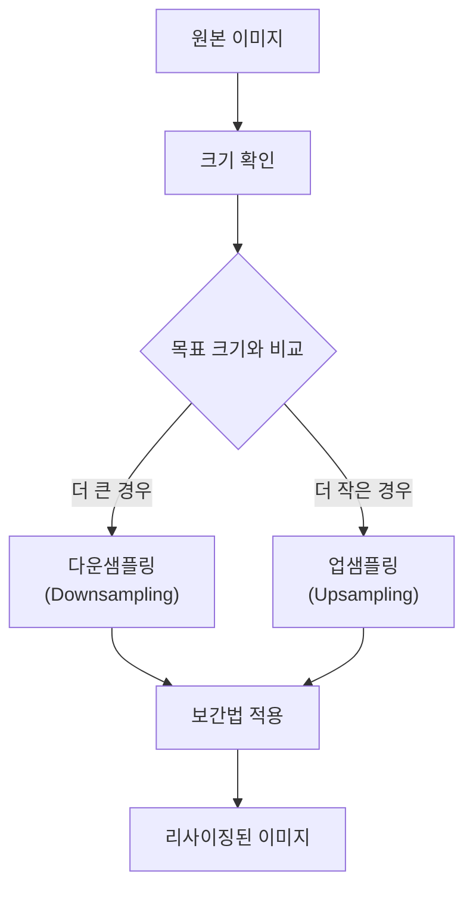
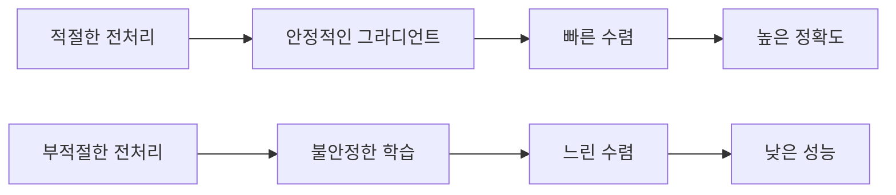
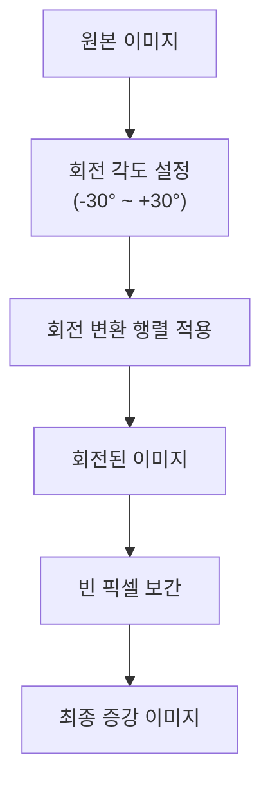
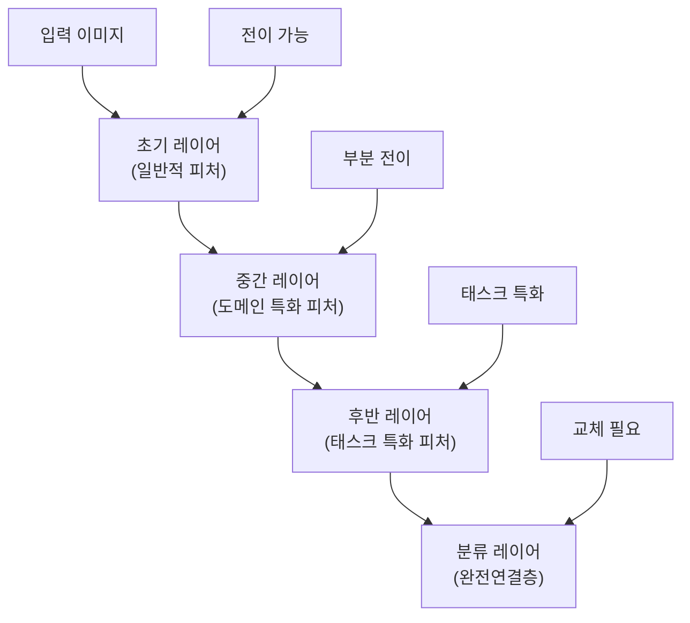
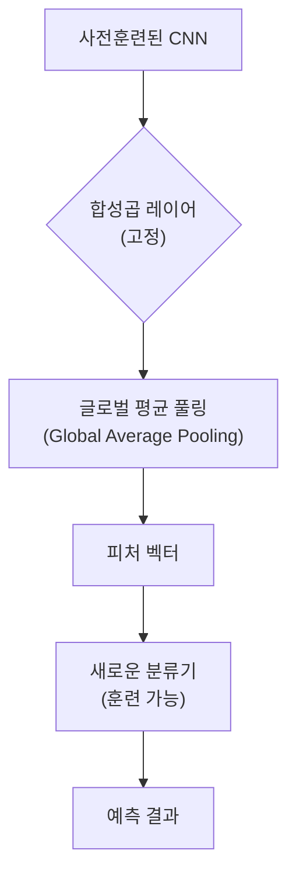
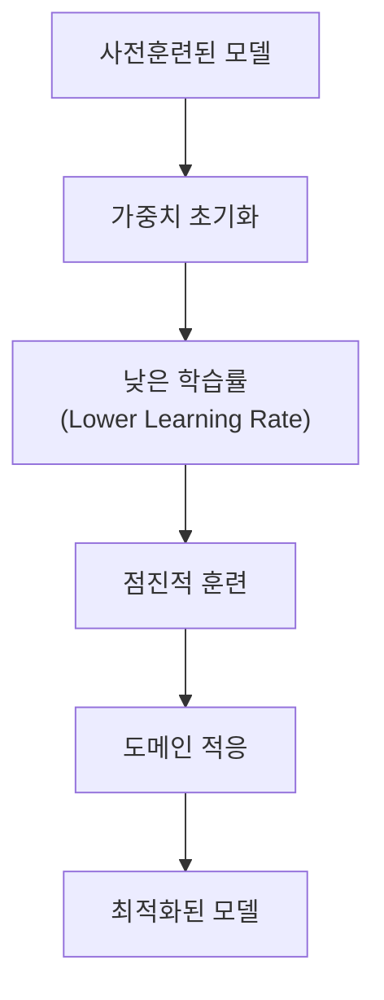
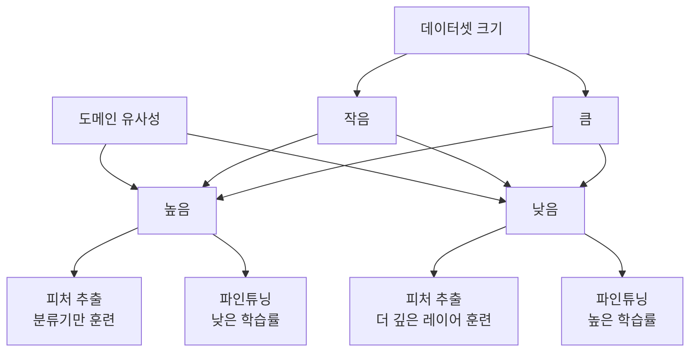
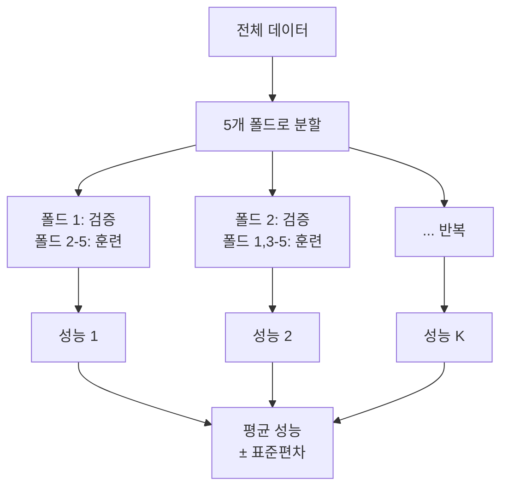
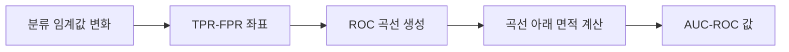
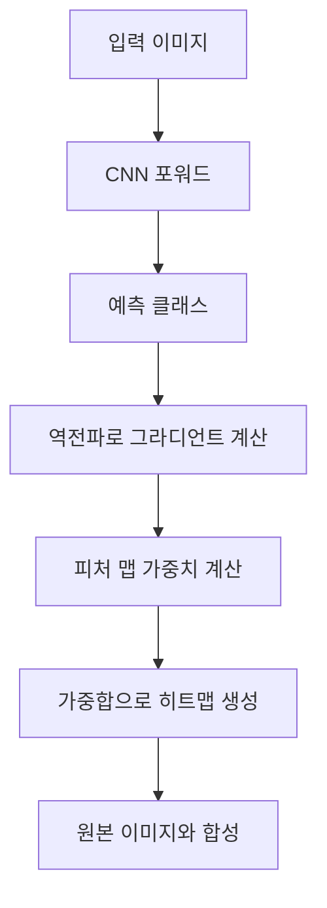

# 위클리페이퍼 #7: 이미지 전처리, 전이학습,

# 이미지 전처리와 전이학습
## 딥러닝을 위한 이미지 데이터 준비 및 학습 최적화

---

## 목차

1. [이미지 전처리의 필요성](#1-이미지-전처리의-필요성) 
   1.1. [리사이징(Resizing)](#11-리사이징resizing) 
   1.2. [정규화(Normalization)](#12-정규화normalization) 
   1.3. [전처리가 모델 성능에 미치는 영향](#13-전처리가-모델-성능에-미치는-영향) 

2. [데이터 증강(Data Augmentation)](#2-데이터-증강data-augmentation) 
   2.1. [데이터 증강의 개념과 필요성](#21-데이터-증강의-개념과-필요성) 
   2.2. [기하학적 변환 기법](#22-기하학적-변환-기법) 
   2.3. [색상 및 밝기 변환 기법](#23-색상-및-밝기-변환-기법) 
   2.4. [고급 증강 기법](#24-고급-증강-기법) 

3. [전이학습(Transfer Learning)](#3-전이학습transfer-learning) 
   3.1. [전이학습의 개념](#31-전이학습의-개념) 
   3.2. [전이학습의 동작 원리](#32-전이학습의-동작-원리) 
   3.3. [이미지 분류에서의 활용 방법](#33-이미지-분류에서의-활용-방법) 
   3.4. [전이학습 전략](#34-전이학습-전략) 

4. [용어 목록](#4-용어-목록)

---

## 1. 이미지 전처리의 필요성

이미지 데이터를 딥러닝 모델에 입력하기 전에 반드시 거쳐야 하는 과정이 **전처리(preprocessing)**입니다. 원시 이미지 데이터는 크기, 해상도(resolution), 픽셀 값의 범위가 제각각이기 때문에 모델이 효과적으로 학습할 수 있도록 표준화된 형태로 변환해야 합니다.

### 1.1. 리사이징(Resizing)

**리사이징**은 이미지의 크기를 통일하는 과정입니다.

#### 1.1.1. 리사이징이 필요한 이유

**배치 처리(Batch Processing) 요구사항**
- 딥러닝 모델은 여러 이미지를 한 번에 처리하는 배치 단위로 학습
- 텐서(tensor) 연산을 위해 모든 입력 데이터의 차원(dimension)이 동일해야 함
- 예: 224×224×3 크기로 통일

**메모리 효율성**
- 고해상도 이미지는 많은 메모리 사용
- 4K 이미지(3840×2160)를 그대로 사용하면 GPU 메모리 부족 발생 가능
- 적절한 크기로 조정하여 메모리 사용량 최적화

#### 1.1.2. 리사이징 방법

**주요 보간법(Interpolation Methods)**
- **최근접 이웃(Nearest Neighbor)**: 가장 빠르지만 품질 저하
- **이중선형(Bilinear)**: 속도와 품질의 균형
- **바이큐빅(Bicubic)**: 고품질이지만 연산 시간 증가

### 1.2. 정규화(Normalization)

**정규화**는 픽셀 값의 범위를 조정하여 모델 학습을 안정화하는 과정입니다.

#### 1.2.1. 정규화가 필요한 이유

**그라디언트 폭발/소실 방지**
- 원시 픽셀 값: 0~255 (8비트 이미지)
- 큰 입력 값은 그라디언트(gradient) 폭발을 야기
- 작은 그라디언트는 바니싱 그라디언트(vanishing gradient) 문제 발생

**학습 속도 향상**
- 정규화된 데이터는 옵티마이저(optimizer)가 더 효율적으로 동작
- 각 피처(feature)의 스케일이 유사해져 학습 안정성 증대

#### 1.2.2. 정규화 방법

**민-맥스 정규화(Min-Max Normalization)**
- $X_{normalized} = \frac{X - X_{min}}{X_{max} - X_{min}}$
- 결과: [0, 1] 범위
- 이미지의 경우: 픽셀값을 255로 나누기

**Z-스코어 정규화(Z-score Normalization)**
- $X_{normalized} = \frac{X - \mu}{\sigma}$
여기서 μ는 평균(mean), σ는 표준편차(standard deviation)

**ImageNet 통계 기반 정규화**
- 평균: [0.485, 0.456, 0.406] (RGB 채널별)
- 표준편차: [0.229, 0.224, 0.225] (RGB 채널별)
- 사전훈련된 모델 사용 시 필수

### 1.3. 전처리가 모델 성능에 미치는 영향

---

## 2. 데이터 증강(Data Augmentation)

### 2.1. 데이터 증강의 개념과 필요성

**데이터 증강**은 기존 훈련 데이터에 다양한 변환을 적용하여 데이터셋의 크기와 다양성을 인위적으로 늘리는 기법입니다.

#### 2.1.1. 데이터 증강이 필요한 이유

**오버피팅(Overfitting) 방지**
- 제한된 훈련 데이터로 인한 과적합 문제 해결
- 모델의 일반화(generalization) 성능 향상
- 테스트 데이터에 대한 강건성(robustness) 증대

**데이터 부족 문제 해결**
- 의료 이미지, 위성 이미지 등 수집이 어려운 도메인
- 라벨링(labeling) 비용이 높은 경우
- 클래스 불균형(class imbalance) 문제 완화

**모델의 불변성(Invariance) 학습**
- 회전, 이동, 크기 변화에 대한 강건성
- 조명 변화, 노이즈에 대한 내성

### 2.2. 기하학적 변환 기법

#### 2.2.1. 회전(Rotation)

- **적용 범위**: 일반적으로 ±15° ~ ±45°
- **주의사항**: 과도한 회전은 객체의 의미 왜곡 가능
- **활용 분야**: 자연 이미지, 의료 영상

#### 2.2.2. 수평/수직 뒤집기(Flip)

**수평 뒤집기(Horizontal Flip)**
- 거울상 생성
- 좌우 대칭성이 중요하지 않은 객체에 효과적
- 예: 동물, 자동차 (단, 텍스트 이미지에는 부적합)

**수직 뒤집기(Vertical Flip)**
- 상하 반전
- 특정 도메인에서만 의미가 있음
- 예: 위성 이미지, 현미경 이미지

#### 2.2.3. 이동(Translation)

- **랜덤 크롭(Random Crop)**: 이미지의 일부분을 무작위로 잘라내기
- **패딩과 크롭(Padding and Crop)**: 여백 추가 후 원본 크기로 자르기
- **효과**: 객체의 위치 변화에 대한 강건성

#### 2.2.4. 크기 조정(Scaling)

**랜덤 리사이즈(Random Resize)**
- 이미지를 다양한 크기로 조정
- 멀티스케일(multi-scale) 학습 효과
- 객체 크기 변화에 대한 적응력 향상

### 2.3. 색상 및 밝기 변환 기법

#### 2.3.1. 밝기 조정(Brightness Adjustment)

- $I_{bright} = I_{original} + \beta$

여기서 β는 밝기 조정 값 (-50 ~ +50)

- **목적**: 다양한 조명 조건 시뮬레이션
- **효과**: 그림자, 역광 상황에 대한 강건성

#### 2.3.2. 대비 조정(Contrast Adjustment)

- $I_{contrast} = \alpha \times I_{original}$

여기서 α는 대비 조정 계수 (0.5 ~ 2.0)

- **목적**: 이미지 선명도 변화 시뮬레이션
- **효과**: 흐릿한 이미지에 대한 인식 성능 향상

#### 2.3.3. 색조/채도 조정(Hue/Saturation Adjustment)

**색조(Hue) 변경**
- HSV 색공간에서 H 채널 조정
- 색상 변화에 대한 불변성 학습

**채도(Saturation) 변경**
- 색의 선명도 조정
- 흑백에 가까운 이미지부터 과채도 이미지까지

### 2.4. 고급 증강 기법

#### 2.4.1. 노이즈 추가(Noise Injection)

**가우시안 노이즈(Gaussian Noise)**
- $I_{noisy} = I_{original} + N(0, \sigma^2)$

- **목적**: 센서 노이즈, 압축 아티팩트(artifact) 시뮬레이션
- **효과**: 실제 환경의 불완전한 이미지에 대한 강건성

#### 2.4.2. 컷아웃(Cutout)

- 이미지의 일부 영역을 마스킹(masking)
- 모델이 전체 이미지를 활용한 인식 능력 향상
- 부분 가림(occlusion) 상황에 대한 대응력 증대

#### 2.4.3. 믹스업(Mixup)

- $\tilde{x} = \lambda x_i + (1-\lambda) x_j$
- $\tilde{y} = \lambda y_i + (1-\lambda) y_j$

- 두 이미지를 선형 결합
- 라벨도 같은 비율로 혼합
- 결정 경계(decision boundary) 부드럽게 만들기

---

## 3. 전이학습(Transfer Learning)

### 3.1. 전이학습의 개념

**전이학습**은 한 도메인(source domain)에서 학습된 지식을 다른 도메인(target domain)에 적용하는 머신러닝 기법입니다. 딥러닝에서는 사전훈련된 모델(pre-trained model)을 새로운 작업에 재활용하는 방식으로 구현됩니다.

#### 3.1.1. 전이학습의 핵심 아이디어

**지식의 전이(Knowledge Transfer)**
- 저수준 피처(Low-level features): 엣지, 코너, 텍스처 등
- 중간수준 피처(Mid-level features): 패턴, 형태 등
- 고수준 피처(High-level features): 객체의 부분, 개념 등

### 3.2. 전이학습의 동작 원리

#### 3.2.1. 합성곱 신경망의 계층적 구조

#### 3.2.2. 피처의 재사용성

**일반적 피처(Generic Features)**
- 네트워크의 초기 레이어에서 학습
- 모든 이미지에 공통적으로 나타나는 특징
- 다양한 도메인에서 재사용 가능

**특화된 피처(Specialized Features)**
- 네트워크의 후반 레이어에서 학습
- 특정 태스크나 도메인에 특화된 특징
- 새로운 태스크에 맞게 조정 필요

### 3.3. 이미지 분류에서의 활용 방법

#### 3.3.1. 피처 추출(Feature Extraction) 접근법

**특징**
- 사전훈련된 가중치(weight)를 고정(freeze)
- 새로운 분류 레이어만 훈련
- 빠른 훈련 속도
- 적은 데이터로도 효과적

**적합한 상황**
- 타겟 데이터셋이 작을 때
- 소스와 타겟 도메인이 유사할 때
- 계산 자원이 제한적일 때

#### 3.3.2. 파인튜닝(Fine-tuning) 접근법

**단계별 파인튜닝**
1. **가중치 복사**: 사전훈련된 가중치로 초기화
2. **분류기 교체**: 마지막 레이어를 새로운 클래스 수에 맞게 변경
3. **차등 학습률**: 초기 레이어는 낮은 학습률, 후반 레이어는 높은 학습률
4. **점진적 해동**: 레이어를 단계적으로 훈련 가능하게 설정

#### 3.3.3. 하이브리드 접근법

**점진적 해동(Gradual Unfreezing)**
1. 분류기만 훈련 (에포크 1-5)
2. 마지막 블록 해동 (에포크 6-10)
3. 전체 네트워크 파인튜닝 (에포크 11-20)

### 3.4. 전이학습 전략

#### 3.4.1. 데이터셋 크기와 유사성에 따른 전략

#### 3.4.2. 학습률 설정 전략

**차등 학습률(Differential Learning Rates)**
- 초기 레이어: 1e-5 (사전학습된 지식 보존)
- 중간 레이어: 1e-4 (점진적 적응)
- 후반 레이어: 1e-3 (적극적 학습)

**학습률 스케줄링**
- 코사인 어닐링(Cosine Annealing)
- 스텝 감쇠(Step Decay)
- 사이클릭 학습률(Cyclic Learning Rate)

#### 3.4.3. 정규화 기법

**드롭아웃(Dropout)**
- 오버피팅 방지
- 일반화 성능 향상

**가중치 감쇠(Weight Decay)**
- L2 정규화
- 모델 복잡도 제어

**배치 정규화(Batch Normalization)**
- 내부 공변량 이동(Internal Covariate Shift) 해결
- 훈련 안정성 향상

#### 3.4.4. 성능 평가 및 검증

**교차 검증(Cross-Validation)**

**K-폴드 교차 검증(K-Fold Cross-Validation)**
- 데이터를 K개의 동일한 크기 그룹으로 분할
- 각 폴드를 한 번씩 검증 세트로 사용하고 나머지는 훈련 세트로 활용
- K번의 훈련/검증을 통해 모델 성능의 평균과 분산을 측정
- 일반적으로 K=5 또는 K=10을 사용

**계층화 샘플링(Stratified Sampling)**
- 각 클래스의 비율을 훈련/검증 세트에서 동일하게 유지
- 클래스 불균형이 있는 데이터셋에서 필수적
- 희소한 클래스가 특정 폴드에서 누락되는 것을 방지

**성능 지표(Metrics)**

**정확도(Accuracy)**
$Accuracy = \frac{TP + TN}{TP + TN + FP + FN}$
- 전체 예측 중 올바른 예측의 비율
- 클래스 불균형 시 오해의 소지 있음

**정밀도(Precision)와 재현율(Recall)**
$Precision = \frac{TP}{TP + FP}$
$Recall = \frac{TP}{TP + FN}$
- Precision: 양성으로 예측한 것 중 실제 양성인 비율
- Recall: 실제 양성 중 올바르게 예측한 비율

**F1 스코어(F1-Score)**
$F1 = 2 \times \frac{Precision \times Recall}{Precision + Recall}$
- 정밀도와 재현율의 조화평균(harmonic mean)
- 클래스 불균형 상황에서 유용한 단일 지표
- 0과 1 사이의 값, 높을수록 좋음
- 정밀도와 재현율이 균형잡힐 때 높은 값

**AUC-ROC (Area Under the ROC Curve)**
- ROC 곡선 아래 면적
- ROC 곡선: True Positive Rate(민감도) vs False Positive Rate
- 0.5~1.0 사이 값, 0.5는 무작위 수준
- 임계값에 무관한 모델 성능 평가
- 이진 분류에서 주로 사용, 다중 클래스에서는 One-vs-Rest 방식

*AUC-ROC 값의 의미:*
- **1.0**: 완벽한 분류기 (이상적)
- **0.9~1.0**: 매우 우수한 성능
- **0.8~0.9**: 좋은 성능
- **0.7~0.8**: 보통 성능
- **0.6~0.7**: 낮은 성능
- **0.5**: 무작위 추측 수준 (의미 없음)
- **0.5 미만**: 분류기가 역으로 작동 (실제로는 1-AUC가 진짜 성능)

*AUC-ROC로 파악하는 핵심 정보:*
1. **분리 능력(Separability)**: 두 클래스를 얼마나 잘 구분하는가?
2. **임계값 독립성**: 특정 임계값에 의존하지 않는 전체적 성능
3. **랭킹 품질**: 양성 샘플을 음성 샘플보다 높은 확률로 예측하는 능력
4. **모델 비교**: 서로 다른 모델의 본질적 분류 능력 비교

*실무적 활용:*
- 의료 진단: 질병 유무 판별 성능 평가
- 스팸 필터링: 스팸 메일 탐지 정확도 측정  
- 이상 탐지: 정상/비정상 구분 능력 평가

**모델 해석(Model Interpretation)**

**그라드-CAM(Gradient-weighted Class Activation Mapping)**
- 모델이 예측을 위해 주목하는 이미지 영역을 시각화
- 마지막 합성곱 레이어의 피처 맵과 그라디언트 활용
- 클래스별 중요도를 히트맵으로 표현

*동작 원리:*
1. 목표 클래스에 대한 그라디언트 계산
2. 각 피처 맵의 중요도 가중치 산출
3. 가중 평균으로 클래스 활성화 맵 생성
4. 원본 이미지 크기로 업샘플링하여 오버레이

**피처 맵 시각화(Feature Map Visualization)**
- 각 합성곱 레이어에서 학습된 필터의 출력 시각화
- 초기 레이어: 엣지, 코너 같은 저수준 패턴
- 중간 레이어: 텍스처, 형태 같은 중간 수준 패턴  
- 후반 레이어: 객체 부분, 복잡한 패턴

*분석 방법:*
- 각 채널별 활성화 강도 확인
- 레이어별 추상화 수준 관찰
- 필터의 수용 영역(receptive field) 이해

**어텐션 맵(Attention Map)**
- 트랜스포머나 어텐션 메커니즘이 집중하는 영역 표시
- 셀프 어텐션: 입력의 각 부분이 다른 부분과의 관련성
- 크로스 어텐션: 서로 다른 모달리티 간 상호작용

*Vision Transformer에서:*
- 패치(patch) 간 어텐션 가중치 시각화
- 다중 헤드별 서로 다른 패턴 학습 확인
- 전역적 맥락(global context) 이해 능력 분석

---

## 4. 용어 목록

**전처리(Preprocessing 프리프로세싱)**: 모델 입력 전 데이터를 준비하는 과정

**리사이징(Resizing)**: 이미지 크기를 조정하는 작업

**정규화(Normalization 노멀라이제이션)**: 데이터의 범위나 분포를 표준화하는 과정

**보간법(Interpolation 인터폴레이션)**: 픽셀 사이 값을 추정하는 방법

**그라디언트(Gradient 그래디언트)**: 가중치 업데이트를 위한 기울기

**바니싱 그라디언트(Vanishing Gradient 배니싱 그래디언트)**: 기울기가 소실되는 현상

**데이터 증강(Data Augmentation 데이터 어그멘테이션)**: 데이터의 다양성을 인위적으로 늘리는 기법

**오버피팅(Overfitting)**: 훈련 데이터에 과도하게 적합되는 현상

**일반화(Generalization 제너럴라이제이션)**: 새로운 데이터에 대한 예측 성능

**강건성(Robustness 로버스트니스)**: 노이즈나 변화에 대한 내성

**불변성(Invariance 인베리언스)**: 특정 변환에 대해 출력이 변하지 않는 성질

**전이학습(Transfer Learning 트랜스퍼 러닝)**: 사전학습된 지식을 새로운 작업에 적용

**사전훈련(Pre-training 프리트레이닝)**: 대용량 데이터로 미리 훈련하는 과정

**파인튜닝(Fine-tuning 파인튜닝)**: 사전훈련된 모델을 새로운 작업에 맞게 조정

**피처 추출(Feature Extraction 피처 익스트랙션)**: 데이터에서 유용한 특징을 뽑아내는 과정

**어텐션(Attention 어텐션)**: 중요한 부분에 집중하는 메커니즘

**배치 정규화(Batch Normalization 배치 노멀라이제이션)**: 미니배치 단위로 정규화하는 기법

**드롭아웃(Dropout 드롭아웃)**: 뉴런을 무작위로 제거하여 정규화하는 기법

**하이퍼파라미터(Hyperparameter 하이퍼파라미터)**: 학습 과정을 제어하는 설정값

**옵티마이저(Optimizer 옵티마이저)**: 가중치 업데이트 알고리즘

**학습률(Learning Rate 러닝 레이트)**: 가중치 업데이트의 크기를 결정하는 값