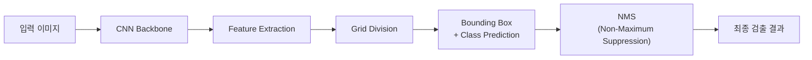
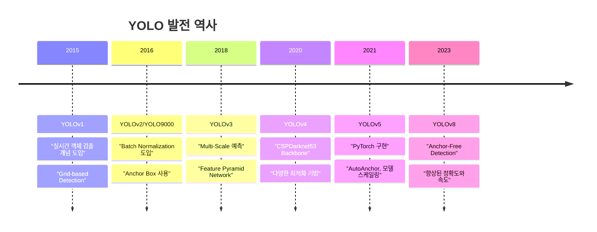
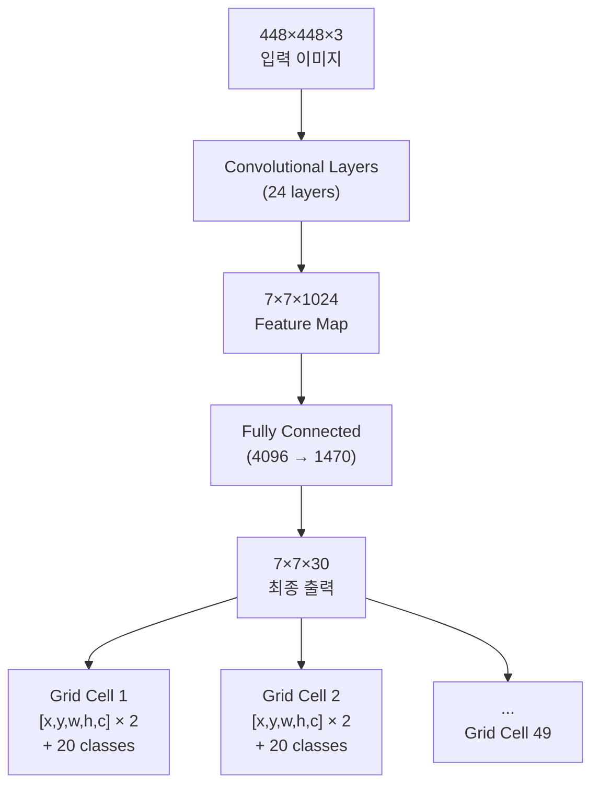
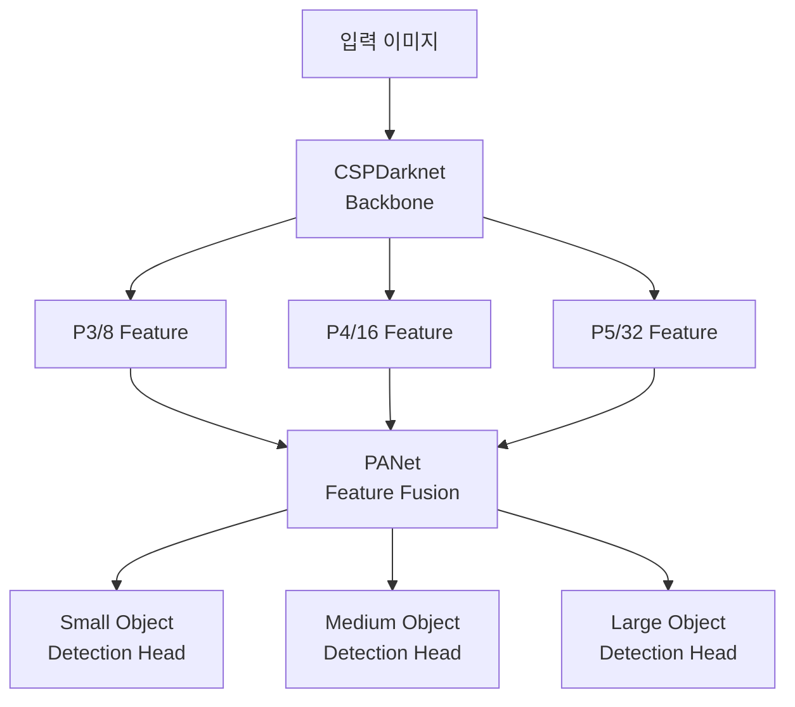
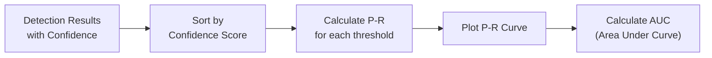
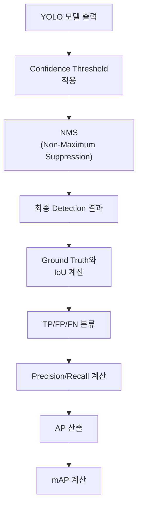

# YOLO 모델과 mAP 성능 평가 가이드

## 목차
1. [YOLO (You Only Look Once) 모델](#1-yolo-you-only-look-once-모델)<br/>
   - 1.1. [YOLO의 핵심 개념과 동작 원리](#11-yolo의-핵심-개념과-동작-원리)<br/>
   - 1.2. [주요 특징 및 장점](#12-주요-특징-및-장점)<br/>
   - 1.3. [YOLO 버전별 발전사](#13-yolo-버전별-발전사)<br/>
   - 1.4. [네트워크 아키텍처](#14-네트워크-아키텍처)<br/>
2. [mAP (mean Average Precision)](#2-map-mean-average-precision)<br/>
   - 2.1. [Precision과 Recall 개념](#21-precision과-recall-개념)<br/>
   - 2.2. [AP (Average Precision) 계산 방법](#22-ap-average-precision-계산-방법)<br/>
   - 2.3. [mAP 산출 과정](#23-map-산출-과정)<br/>
   - 2.4. [IoU 임계값과 mAP 변형](#24-iou-임계값과-map-변형)<br/>
3. [YOLO에서의 mAP 활용](#3-yolo에서의-map-활용)<br/>
   - 3.1. [성능 평가 지표로서의 역할](#31-성능-평가-지표로서의-역할)<br/>
   - 3.2. [다른 객체 검출 모델과의 비교](#32-다른-객체-검출-모델과의-비교)<br/>
   - 3.3. [COCO 데이터셋과의 비교](#33-coco-데이터셋과의-비교)<br/>
4. [용어 목록](#4-용어-목록)<br/>

---

## 1. YOLO (You Only Look Once) 모델

### 1.1. YOLO의 핵심 개념과 동작 원리

YOLO(You Only Look Once)는 실시간 객체 검출을 위한 딥러닝 모델로, 2015년 Joseph Redmon이 제안했습니다. 기존의 2-stage 검출 방식과 달리 **단일 신경망**을 통해 한 번의 forward pass로 객체의 위치와 클래스를 동시에 예측합니다.



YOLO의 핵심 아이디어는 다음과 같습니다:

1. **Grid-based Detection**: 입력 이미지를 S×S 격자로 분할
2. **Unified Detection**: 각 격자 셀에서 B개의 바운딩 박스와 C개의 클래스 확률을 동시 예측
3. **End-to-End Learning**: 전체 파이프라인을 단일 네트워크로 학습

수식으로 표현하면, 각 격자 셀은 다음을 예측합니다:

$$\text{Output} = [x, y, w, h, \text{confidence}, C_1, C_2, ..., C_n]$$

여기서:
- $(x, y)$: 바운딩 박스 중심좌표
- $(w, h)$: 바운딩 박스 너비와 높이
- $\text{confidence}$: 객체 존재 확률 × IoU
- $C_i$: 각 클래스별 확률

### 1.2. 주요 특징 및 장점

#### 1.2.1. 실시간 처리 속도
YOLO의 가장 큰 장점은 **실시간 처리 능력**입니다. 단일 네트워크 구조로 인해:
- YOLOv1: 45 FPS (Frames Per Second)
- YOLOv8: 100+ FPS (GPU 환경)

#### 1.2.2. 전역적 컨텍스트 이해
전체 이미지를 한 번에 처리하므로:
- 배경 오류 (Background Error) 감소
- 객체 간 관계 파악 향상
- 전역적 특징 활용

#### 1.2.3. 일반화 성능
- 자연 이미지에서 예술 작품으로의 도메인 전이 성능 우수
- 다양한 해상도와 종횡비에 robust한 성능

#### 1.2.4. 단순한 아키텍처
- End-to-End 학습 가능
- 복잡한 파이프라인 불필요
- 배포와 최적화 용이

### 1.3. YOLO 버전별 발전사



각 버전의 주요 개선사항:

| 버전 | 주요 특징 | mAP@0.5 (COCO) | 속도 (FPS) |
|------|-----------|-----------------|------------|
| YOLOv1 | Grid-based detection | - | 45 |
| YOLOv2 | Anchor boxes, Batch norm | 48.1% | 67 |
| YOLOv3 | Multi-scale, FPN | 55.3% | 35 |
| YOLOv4 | CSPDarknet, Optimizations | 65.7% | 41 |
| YOLOv5 | PyTorch, AutoAnchor | 56.8% | 140 |
| YOLOv8 | Anchor-free, C2f blocks | 53.9% | 280 |

### 1.4. 네트워크 아키텍처

#### 1.4.1. YOLOv1 아키텍처
YOLOv1은 GoogleNet에서 영감을 받은 24개의 convolutional layer와 2개의 fully connected layer로 구성됩니다.



#### 1.4.2. 현대적 YOLO 아키텍처 (YOLOv8 기준)


## 2. mAP (mean Average Precision)

### 2.1. Precision과 Recall 개념

객체 검출의 성능을 평가하기 위해서는 먼저 **Precision**과 **Recall**을 이해해야 합니다.

#### 2.1.1. 혼동 행렬 (Confusion Matrix)
객체 검출에서의 예측 결과는 다음과 같이 분류됩니다:

| 실제 \ 예측 | Positive | Negative |
|-------------|----------|----------|
| **True** | TP (True Positive) | FN (False Negative) |
| **False** | FP (False Positive) | TN (True Negative) |

#### 2.1.2. Precision과 Recall 정의

**Precision (정밀도)**:
$$\text{Precision} = \frac{\text{TP}}{\text{TP} + \text{FP}}$$

예측한 positive 중에서 실제로 positive인 비율

**Recall (재현율)**:
$$\text{Recall} = \frac{\text{TP}}{\text{TP} + \text{FN}}$$

실제 positive 중에서 올바르게 예측한 비율

#### 2.1.3. IoU (Intersection over Union)
객체 검출에서 TP/FP를 결정하는 기준:

$$\text{IoU} = \frac{\text{Area of Intersection}}{\text{Area of Union}}$$

일반적으로 IoU > 0.5이면 TP, 그렇지 않으면 FP로 판정합니다.

### 2.2. AP (Average Precision) 계산 방법

#### 2.2.1. Precision-Recall 곡선
AP는 Precision-Recall 곡선 아래의 면적으로 계산됩니다.



#### 2.2.2. AP 계산 공식

**PASCAL VOC 방식** (11-point interpolation):
$$\text{AP} = \frac{1}{11} \sum_{r \in \{0, 0.1, ..., 1.0\}} P_{\text{interp}}(r)$$

여기서:
$$P_{\text{interp}}(r) = \max_{\tilde{r} \geq r} P(\tilde{r})$$

**COCO 방식** (모든 점 사용):
$$\text{AP} = \sum_{k=1}^{n} (r_k - r_{k-1}) P_{\text{interp}}(r_k)$$

### 2.3. mAP 산출 과정

#### 2.3.1. 단계별 계산 과정

1. **각 클래스별 AP 계산**
   - 클래스별로 Precision-Recall 곡선 생성
   - 곡선 아래 면적 계산하여 AP 도출

2. **전체 클래스에 대한 평균 계산**
   $$\text{mAP} = \frac{1}{N} \sum_{i=1}^{N} \text{AP}_i$$
   
   여기서 N은 총 클래스 수

#### 2.3.2. 예시 계산

```python
# mAP 계산 예시 (의사코드)
def calculate_mAP(predictions, ground_truths, iou_threshold=0.5):
    aps = []
    for class_id in range(num_classes):
        # 클래스별 예측과 정답 필터링
        class_preds = filter_by_class(predictions, class_id)
        class_gts = filter_by_class(ground_truths, class_id)
        
        # AP 계산
        ap = calculate_AP(class_preds, class_gts, iou_threshold)
        aps.append(ap)
    
    return sum(aps) / len(aps)
```

### 2.4. IoU 임계값과 mAP 변형

#### 2.4.1. mAP@IoU 표기법
- **mAP@0.5**: IoU 임계값 0.5에서의 mAP
- **mAP@0.75**: IoU 임계값 0.75에서의 mAP  
- **mAP@0.5:0.95**: IoU 0.5부터 0.95까지 0.05 간격으로 평균한 mAP

#### 2.4.2. COCO 평가 지표
COCO 데이터셋에서 사용하는 다양한 mAP 지표:

| 지표 | 설명 | 임계값 |
|------|------|--------|
| mAP | 전체 평균 | IoU 0.5:0.95 |
| mAP@0.5 | 느슨한 기준 | IoU 0.5 |
| mAP@0.75 | 엄격한 기준 | IoU 0.75 |
| mAP_S | 작은 객체 | Area < 32² |
| mAP_M | 중간 객체 | 32² < Area < 96² |
| mAP_L | 큰 객체 | Area > 96² |

## 3. YOLO에서의 mAP 활용

### 3.1. 성능 평가 지표로서의 역할

#### 3.1.1. 모델 성능 비교
mAP는 YOLO 모델의 정확도를 정량적으로 평가하는 핵심 지표입니다:



#### 3.1.2. 하이퍼파라미터 튜닝
mAP를 활용한 모델 최적화:
- **Confidence Threshold**: 일반적으로 0.25
- **NMS Threshold**: 일반적으로 0.45
- **Learning Rate**: mAP 개선을 위한 스케줄링

### 3.2. 다른 객체 검출 모델과의 비교

#### 3.2.1. YOLO vs R-CNN 계열

| 모델 | Type | mAP@0.5 (COCO) | 속도 (FPS) | 특징 |
|------|------|-----------------|------------|------|
| Faster R-CNN | Two-Stage | 59.9% | 7 | 높은 정확도 |
| SSD | One-Stage | 54.1% | 46 | 균형잡힌 성능 |
| YOLOv3 | One-Stage | 55.3% | 35 | 실시간 처리 |
| YOLOv5 | One-Stage | 56.8% | 140 | 속도-정확도 절충 |
| EfficientDet | One-Stage | 55.1% | 27 | 효율적인 아키텍처 |

#### 3.2.2. Speed-Accuracy Trade-off

```mermaid
scatter-chart
    title "객체 검출 모델 성능 비교"
    x-axis "속도 (FPS)" 0 --> 150
    y-axis "mAP@0.5 (%)" 50 --> 65
    
    "Faster R-CNN" : [7, 59.9]
    "SSD300" : [46, 54.1]
    "YOLOv3" : [35, 55.3]
    "YOLOv5s" : [140, 56.8]
    "EfficientDet" : [27, 55.1]
```

### 3.3. COCO 데이터셋과의 비교

#### 3.3.1. COCO 데이터셋 특징
- **80개 클래스**: person, bicycle, car, motorcycle 등
- **330K 이미지**: 200K+ labeled images
- **1.5M 객체**: 평균 7.7개 객체/이미지
- **다양한 크기**: 작은 객체부터 큰 객체까지

#### 3.3.2. YOLO 모델별 COCO 성능

```python
# YOLO 버전별 COCO mAP 성능 (참고용)
yolo_performance = {
    'YOLOv3': {'mAP': 55.3, 'mAP_S': 34.4, 'mAP_M': 58.2, 'mAP_L': 70.4},
    'YOLOv4': {'mAP': 65.7, 'mAP_S': 46.1, 'mAP_M': 69.0, 'mAP_L': 81.2},
    'YOLOv5': {'mAP': 56.8, 'mAP_S': 39.9, 'mAP_M': 64.1, 'mAP_L': 73.0},
    'YOLOv8': {'mAP': 53.9, 'mAP_S': 36.6, 'mAP_M': 59.4, 'mAP_L': 70.6}
}
```

#### 3.3.3. Bounding Box vs Segmentation
COCO에서는 두 가지 주요 태스크를 지원합니다:

**Object Detection (Bbox)**:
- 직사각형 바운딩 박스로 객체 위치 표현
- YOLO의 기본 출력 형태
- 빠른 처리 속도

**Instance Segmentation**:
- 픽셀 단위 정확한 객체 경계
- Mask R-CNN, YOLOv8-seg 등에서 지원
- 더 정확하지만 계산 비용 증가

## 4. 용어 목록

| 용어 | 영문 | 설명 |
|------|------|------|
| 평균 정밀도 | Average Precision (AP) | 단일 클래스에 대한 Precision-Recall 곡선 아래 면적 |
| 평균 평균 정밀도 | mean Average Precision (mAP) | 모든 클래스의 AP 평균값 |
| 바운딩 박스 | Bounding Box | 객체를 감싸는 직사각형 형태의 영역 |
| 신뢰도 점수 | Confidence Score | 객체 존재 확률과 바운딩 박스 정확도의 곱 |
| 합성곱 신경망 | Convolutional Neural Network (CNN) | 이미지 처리에 특화된 딥러닝 모델 |
| 크로스 스테이지 부분 네트워크 | Cross Stage Partial Network (CSPNet) | 그래디언트 경로를 분할하여 효율성을 높인 네트워크 구조 |
| 특징 피라미드 네트워크 | Feature Pyramid Network (FPN) | 다양한 크기의 객체를 검출하기 위한 멀티스케일 특징 추출 구조 |
| 초당 프레임 수 | Frames Per Second (FPS) | 모델이 1초에 처리할 수 있는 이미지 수 |
| 그래디언트 | Gradient | 손실 함수의 기울기, 역전파 학습에 사용 |
| 교집합 대 합집합 비율 | Intersection over Union (IoU) | 예측 바운딩 박스와 실제 바운딩 박스의 겹치는 정도 |
| 손실 함수 | Loss Function | 모델의 예측과 실제 값의 차이를 측정하는 함수 |
| 비최대 억제 | Non-Maximum Suppression (NMS) | 중복된 검출 결과를 제거하는 후처리 기법 |
| 객체 검출 | Object Detection | 이미지에서 객체의 위치와 클래스를 동시에 예측하는 태스크 |
| 정밀도 | Precision | 예측한 양성 중에서 실제 양성인 비율 |
| 재현율 | Recall | 실제 양성 중에서 올바르게 예측한 비율 |
| 영역 제안 | Region Proposal | 객체가 있을 것으로 예상되는 영역을 제안하는 방법 |
| 단일 샷 검출기 | Single Shot Detector (SSD) | 한 번의 순전파로 객체를 검출하는 방법 |
| 임계값 | Threshold | 이진 분류를 위한 기준값 |
| 2단계 검출기 | Two-Stage Detector | 영역 제안과 분류를 별도로 수행하는 객체 검출 방법 |

---
