## 1. Semantic Segmentation: 픽셀 단위 이미지 이해

### 1.1. 이미지를 픽셀별로 분류하는 이유

**Semantic Segmentation**(세맨틱 세그멘테이션)은 **이미지 생성의 기초**가 되는 중요한 기술입니다. 단순히 "이 사진에는 개가 있다"를 아는 것을 넘어서, **"개가 정확히 어느 위치에 어떤 모양으로 있는가"**를 픽셀 단위로 파악합니다.

**이미지 생성에서 왜 중요한가요?**

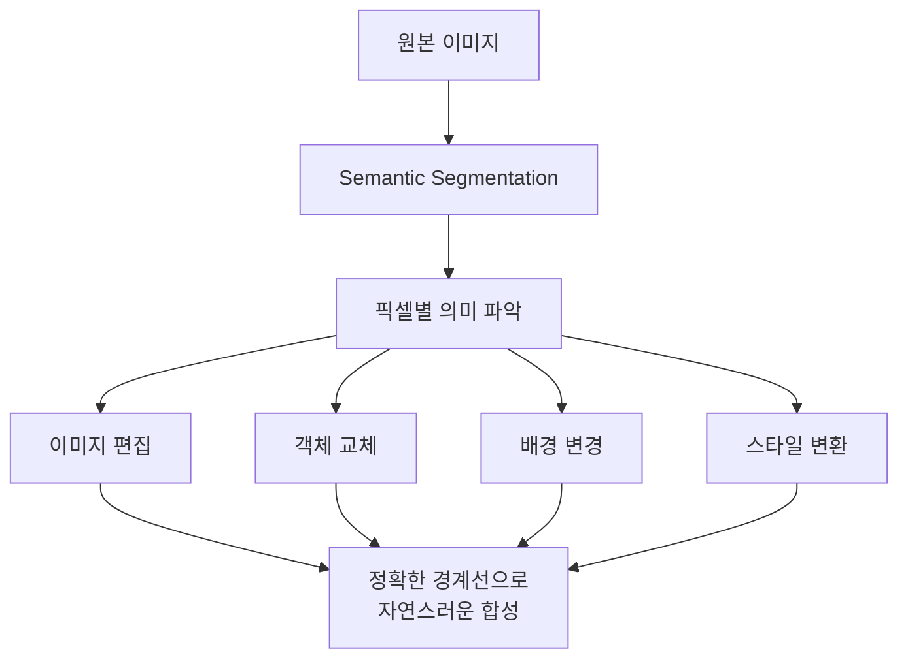

**구체적인 활용 사례:**
- **배경 교체**: 사람만 정확히 분리하여 다른 배경과 합성
- **객체 제거/추가**: 특정 물체만 골라서 자연스럽게 편집
- **스타일 변환**: 영역별로 다른 스타일 적용 (하늘은 인상파, 건물은 사실적)
- **데이터 증강**: 정확한 마스크로 현실적인 가상 데이터 생성

**픽셀별 이해의 핵심:**

각 픽셀이 어떤 **의미적 범주**에 속하는지 파악하는 것입니다:

$\text{픽셀}(x, y) \rightarrow \text{클래스} \in \{\text{하늘, 나무, 자동차, 사람, ...}\}$

- `(x, y)`: 이미지 상의 픽셀 좌표
- `클래스`: 해당 픽셀이 속하는 의미적 범주

### 1.2. 전체 이미지 분류와의 차이점

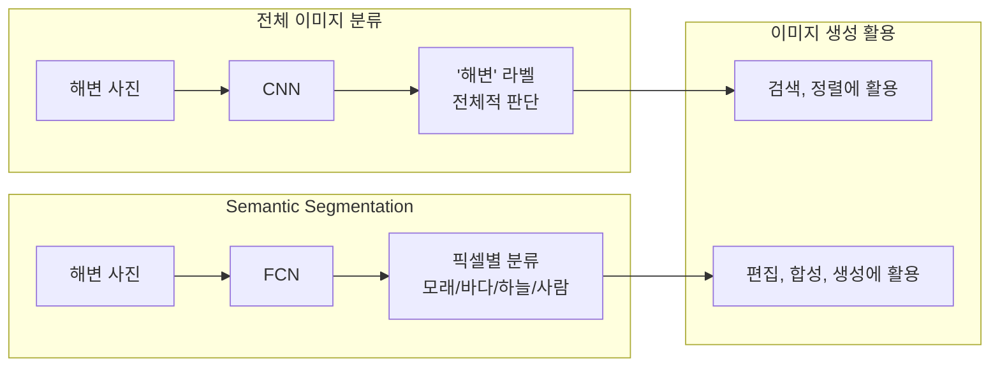

**이미지 생성 관점에서의 차이점:**

| 구분 | 전체 이미지 분류 | Semantic Segmentation |
|------|-----------------|---------------------|
| **생성 활용도** | 제한적 (분류 기반 검색) | 핵심적 (정밀한 편집/생성) |
| **편집 가능성** | 전체 이미지만 처리 | 영역별 세밀한 편집 |
| **합성 품질** | 부자연스러운 경계 | 자연스러운 경계 |
| **창의적 활용** | 단순한 필터 적용 | 복잡한 장면 구성 |

### 1.3. 픽셀 단위 예측 메커니즘

**이미지 생성에서의 픽셀 예측 과정:**

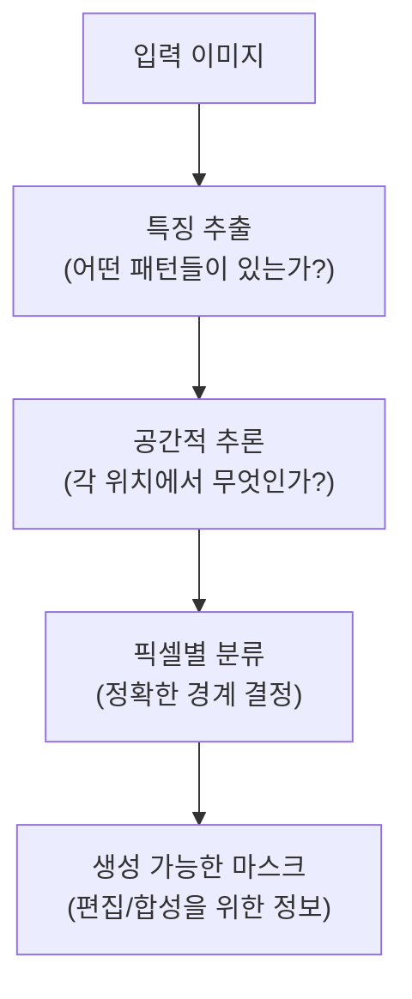

**소프트맥스를 통한 확률 계산:**

$P(\text{픽셀}_{i,j} = \text{하늘}) = \frac{\exp(\text{하늘 점수})}{\exp(\text{하늘 점수}) + \exp(\text{나무 점수}) + \exp(\text{건물 점수}) + ...}$

- `픽셀_{i,j}`: 위치 (i,j)의 픽셀
- `exp()`: 지수 함수 (모든 점수를 양수로 변환)
- 모든 클래스의 확률 합 = 1 (100%)

**생성 응용에서의 활용:**
```python
# 세그멘테이션 결과를 이용한 이미지 편집
segmentation_mask = model.predict(image)  # 각 픽셀의 클래스
sky_mask = (segmentation_mask == SKY_CLASS)  # 하늘 영역만 선택
image[sky_mask] = new_sky_texture  # 하늘만 다른 텍스처로 교체
```

### 1.4. 성능 측정과 평가

**이미지 생성 품질에 직결되는 평가 지표:**

**1) IoU (Intersection over Union) - 경계의 정확성**

$\text{IoU} = \frac{\text{예측과 정답이 겹치는 영역}}{\text{예측과 정답을 합친 전체 영역}}$

- IoU가 높을수록 → 객체 경계가 정확 → 자연스러운 이미지 편집 가능
- IoU가 낮으면 → 경계가 부정확 → 편집 시 어색한 결과

**2) 픽셀 정확도 - 전체적인 이해도**

$\text{픽셀 정확도} = \frac{\text{올바르게 분류된 픽셀 수}}{\text{전체 픽셀 수}} \times 100\%$

**생성 품질과의 연관성:**
- 정확도 95% 이상: 고품질 이미지 편집 가능
- 정확도 90% 미만: 편집 시 인공적인 느낌 발생

### 1.5. 이미지 생성에서의 활용

**핵심 응용 분야:**

**1) 조건부 이미지 생성**
- "강아지가 있는 공원 그림을 그려줘" → 각 영역(강아지/잔디/나무)을 정확히 구분하여 생성

**2) 이미지 인페인팅 (복원)**
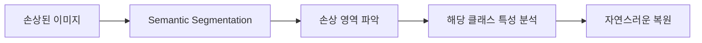

**3) 스타일 전이 (Style Transfer)**
- 각 의미 영역별로 다른 스타일 적용
- 예: 사람은 사진처럼, 배경은 수채화처럼

**4) 가상 데이터 생성**
- 자율주행을 위한 다양한 도로 상황 생성
- 의료 영상에서 병변이 있는 합성 이미지 생성

**최신 응용: AI 아트와 창작 도구**
- **Adobe Photoshop의 AI 기능**: 객체별 자동 선택 및 편집
- **DALL-E, Midjourney**: 텍스트 설명을 바탕으로 영역별 이미지 생성
- **가상 패션**: 의류만 선택하여 다른 옷으로 교체

---

## 2. FCN: 이미지 생성을 위한 네트워크 구조

### 2.1. 공간 정보를 보존하는 방법

**FCN**은 **이미지 생성의 혁명**을 일으킨 네트워크 구조입니다. 가장 중요한 혁신은 **"어디에"라는 위치 정보를 잃지 않는 것**입니다.

**왜 위치 정보가 이미지 생성에 중요한가요?**

이미지를 생성하거나 편집할 때는 **"무엇을"** 만들지뿐만 아니라 **"어디에"** 배치할지가 핵심입니다.

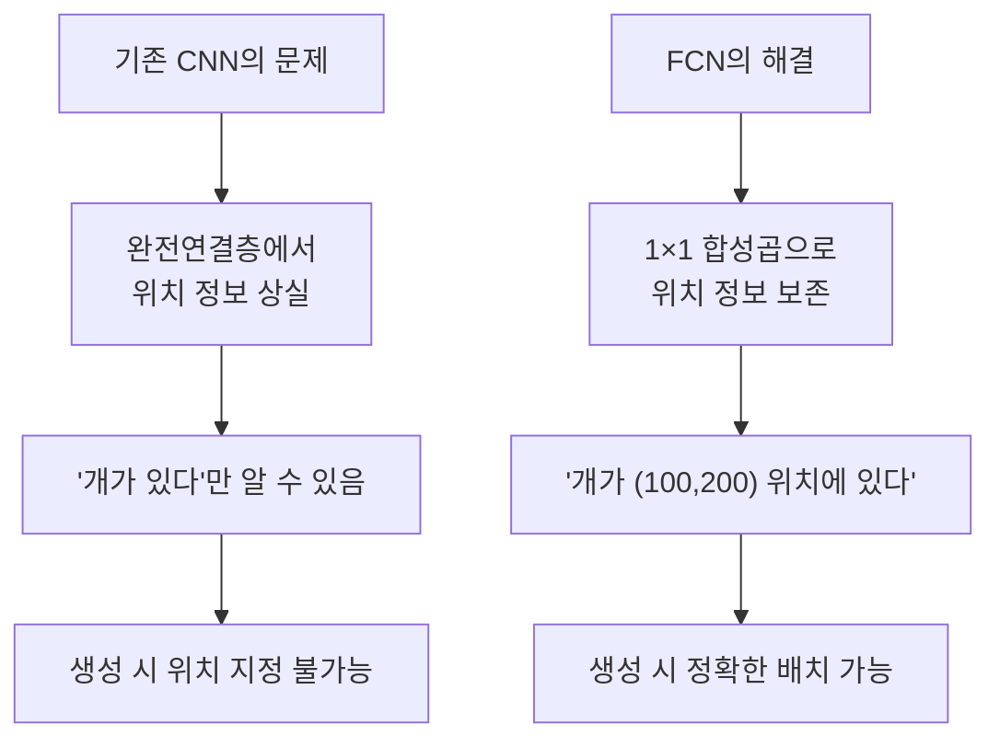

**1×1 합성곱의 핵심 아이디어:**

완전연결층 $y = Wx + b$를 1×1 합성곱으로 변환:

$y_{i,j} = W * x_{i,j} + b$

- `y_{i,j}`: 위치 (i,j)에서의 출력 (위치 정보 유지)
- `W`: 학습 가능한 가중치 (완전연결층과 동일한 역할)
- `*`: 합성곱 연산 (공간 구조 보존)

### 2.2. 기존 분류 네트워크의 한계 극복

**이미지 생성 관점에서의 문제점과 해결책:**

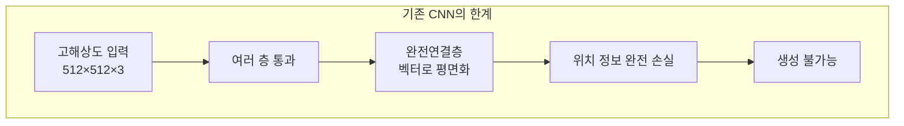

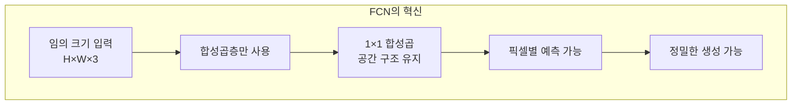

**생성 성능에 미치는 영향:**

| 측면 | 기존 CNN | FCN |
|------|----------|-----|
| **이미지 크기 제약** | 고정 크기만 가능 | 임의 크기 처리 |
| **세부사항 보존** | 전역 정보만 | 지역 정보까지 |
| **편집 정밀도** | 전체 이미지만 | 픽셀 단위 편집 |
| **생성 품질** | 저해상도, 뭉개짐 | 고해상도, 선명함 |

### 2.3. 인코더-디코더 구조의 원리

**이미지 생성을 위한 완벽한 설계:**

FCN의 인코더-디코더 구조는 **"이해하고 재구성하기"** 과정과 같습니다.

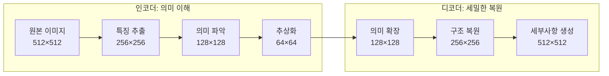

**각 단계별 역할:**

**인코더 (Encoder):**
- **1단계**: 색깔, 모서리 같은 기본 특징 추출
- **2단계**: 텍스처, 패턴 같은 중간 특징 파악  
- **3단계**: 객체, 장면 같은 고수준 의미 이해

**디코더 (Decoder):**
- **1단계**: 고수준 의미를 바탕으로 대략적인 배치 결정
- **2단계**: 객체의 형태와 구조를 구체화
- **3단계**: 세밀한 디테일과 경계선을 정교하게 생성

### 2.4. 세밀한 이미지 복원 기법

**업샘플링: 저해상도에서 고해상도로**

이미지 생성에서 가장 어려운 부분 중 하나는 **작은 정보로 큰 이미지를 만드는 것**입니다.

**전치 합성곱 (Transpose Convolution):**

일반 합성곱의 역과정으로, 작은 특징 맵을 큰 이미지로 확장합니다.

```python
# 전치 합성곱으로 이미지 크기 2배 확장
upconv = nn.ConvTranspose2d(
    in_channels=256,    # 입력 채널
    out_channels=128,   # 출력 채널  
    kernel_size=4,      # 필터 크기
    stride=2,           # 2배 확대
    padding=1           # 경계 처리
)
```

**스킵 연결: 세부사항을 놓치지 않는 비법**

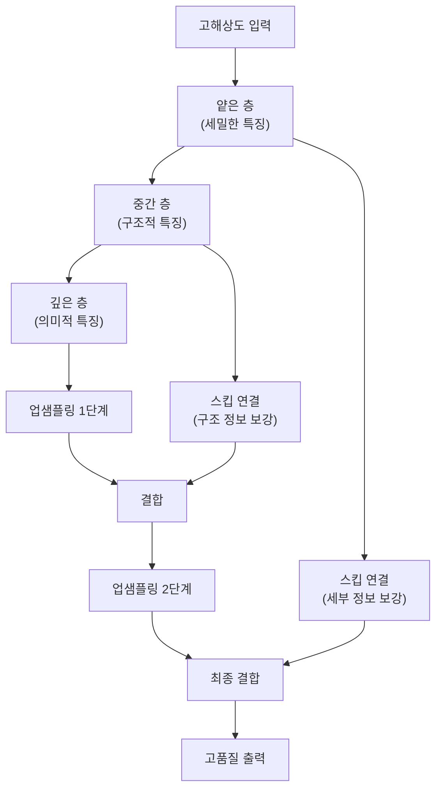

**스킵 연결이 생성 품질을 높이는 이유:**

1. **세부사항 보존**: 업샘플링 과정에서 손실되기 쉬운 디테일 복구
2. **경계 선명도**: 객체와 배경의 경계를 더 정확하게 구분
3. **텍스처 품질**: 표면의 질감과 패턴을 더 자연스럽게 재현
4. **전체적 일관성**: 지역적 세부사항과 전역적 구조의 조화

**생성 품질 비교:**
- **스킵 연결 없음**: 뭉개지고 경계가 불분명한 결과
- **스킵 연결 있음**: 선명하고 자연스러운 고품질 결과

---

## 3. GAN: 적대적 이미지 생성

### 3.1. 가짜 이미지를 만드는 생성자

**생성자(Generator)**는 **창조적인 예술가**입니다. 무에서 유를 창조하듯, 무작위 노이즈에서 아름다운 이미지를 만들어냅니다.

**이미지 생성의 마법 같은 과정:**

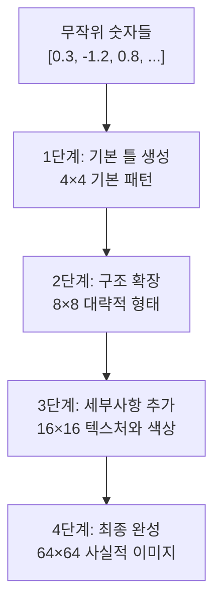

**생성자의 핵심 철학:**
- **다양성**: 같은 노이즈라도 매번 다른 이미지 생성 가능
- **창의성**: 훈련 데이터에 없던 새로운 조합 창조
- **일관성**: 생성된 이미지가 자연스럽고 현실적으로 보임

**수학적 표현:**

$\text{생성자}: \text{노이즈} \rightarrow \text{이미지}$
$G(z) = \text{ConvTranspose}(...\text{ConvTranspose}(\text{Linear}(z)))$

- `z`: 잠재 공간의 무작위 벡터 (보통 100~512 차원)
- `G(z)`: 생성된 이미지 (예: 64×64×3)

```python
# 다양한 이미지 생성 예시
for i in range(5):
    noise = torch.randn(1, 100)  # 매번 다른 무작위 노이즈
    generated_image = generator(noise)  # 매번 다른 이미지 생성
    save_image(generated_image, f'generated_{i}.jpg')
```

**잠재 공간의 신비한 특성:**

잠재 공간에서는 **의미 있는 산술 연산**이 가능합니다:

```
남자 얼굴 - 여자 얼굴 + 여왕 얼굴 ≈ 남자 왕 얼굴
```

이는 생성자가 단순히 암기하는 것이 아니라, **이미지의 본질적 구조**를 학습했음을 의미합니다.

### 3.2. 진위를 판별하는 판별자

**판별자(Discriminator)**는 **예리한 감정사**입니다. 진짜와 가짜를 구분하는 전문가로서, 생성자가 만든 이미지의 품질을 평가합니다.

**판별자의 세밀한 검증 과정:**

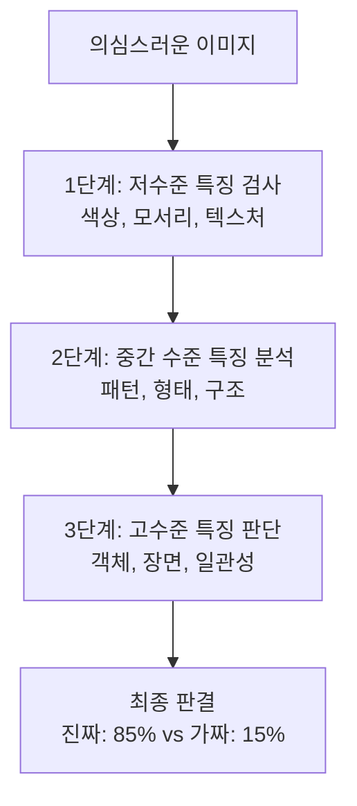

**판별자가 찾는 가짜의 단서들:**
- **부자연스러운 경계**: 객체와 배경의 연결이 어색함
- **일관성 부족**: 조명, 그림자, 원근법이 맞지 않음
- **디테일 부족**: 확대했을 때 세부사항이 뭉개짐
- **패턴 반복**: 훈련 데이터의 특정 패턴을 그대로 복사

**판별자의 수학적 목표:**

$D(x) = P(\text{이미지 x가 진짜일 확률})$

- `D(진짜 이미지) → 1`: 실제 사진은 높은 확률로 "진짜" 판정
- `D(가짜 이미지) → 0`: 생성된 이미지는 높은 확률로 "가짜" 판정

### 3.3. 두 네트워크의 경쟁 학습

**GAN의 핵심: 끝없는 경쟁을 통한 발전**

생성자와 판별자는 **제로섬 게임**을 벌입니다. 한쪽이 이기면 다른 쪽이 지는 구조에서 서로 발전합니다.

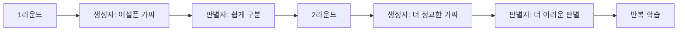

## 목차

1. [Semantic Segmentation과 이미지 분류](#1-semantic-segmentation과-이미지-분류)
   - 1.1. [Semantic Segmentation 개념](#11-semantic-segmentation-개념)
   - 1.2. [이미지 분류와의 차이점](#12-이미지-분류와의-차이점)
   - 1.3. [픽셀 단위 예측 원리](#13-픽셀-단위-예측-원리)
   - 1.4. [손실 함수와 평가 지표](#14-손실-함수와-평가-지표)
   - 1.5. [실제 응용 분야](#15-실제-응용-분야)

2. [Fully Convolutional Networks (FCN)](#2-fully-convolutional-networks-fcn)
   - 2.1. [FCN의 핵심 특징](#21-fcn의-핵심-특징)
   - 2.2. [기존 CNN과의 차이점](#22-기존-cnn과의-차이점)
   - 2.3. [아키텍처 구조](#23-아키텍처-구조)
   - 2.4. [업샘플링과 스킵 연결](#24-업샘플링과-스킵-연결)

3. [GAN의 생성자와 판별자](#3-gan의-생성자와-판별자)
   - 3.1. [생성자의 역할](#31-생성자의-역할)
   - 3.2. [판별자의 역할](#32-판별자의-역할)
   - 3.3. [적대적 학습 과정](#33-적대적-학습-과정)
   - 3.4. [핵심 이론과 한계점](#34-핵심-이론과-한계점)

4. [Diffusion 모델과 이미지 생성](#4-diffusion-모델과-이미지-생성)
   - 4.1. [Diffusion 모델의 기본 원리](#41-diffusion-모델의-기본-원리)
   - 4.2. [노이즈 추가와 제거 과정](#42-노이즈-추가와-제거-과정)
   - 4.3. [학습과 생성 과정](#43-학습과-생성-과정)
   - 4.4. [주요 장점과 응용](#44-주요-장점과-응용)

5. [용어집](#5-용어집)

---

## 1. Semantic Segmentation과 이미지 분류

### 1.1. Semantic Segmentation 개념

**Semantic Segmentation**(세맨틱 세그멘테이션)은 이미지의 **모든 픽셀을 분류**하는 컴퓨터 비전 작업입니다. 쉽게 말해, 이미지를 보고 "이 부분은 사람, 저 부분은 자동차, 그 부분은 배경"이라고 픽셀 하나하나를 구분하는 것입니다.

일반적인 이미지 분류가 "이 사진에는 개가 있다"라고 전체적으로 판단한다면, Semantic Segmentation은 "개는 정확히 어느 픽셀에 위치하는가"를 알려줍니다.

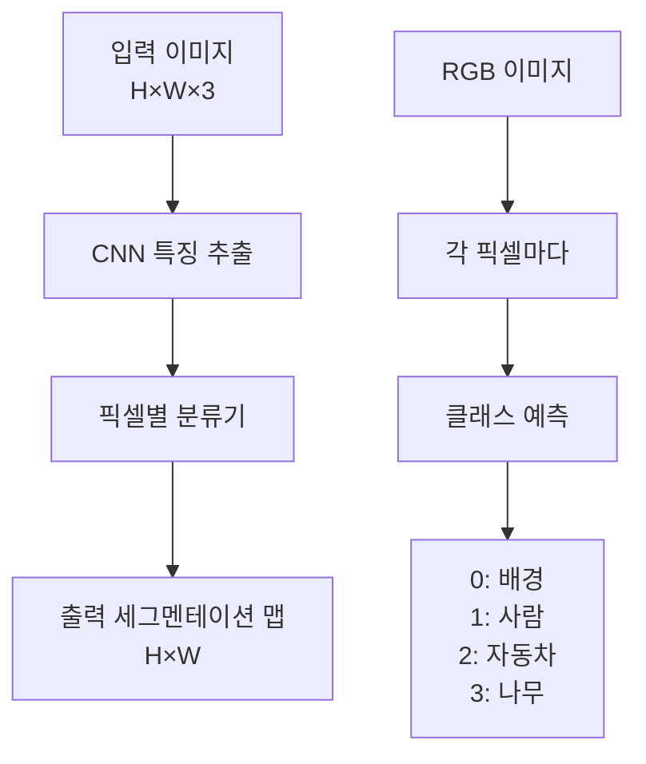

**핵심 특징:**
- **Dense Prediction**(덴스 프리딕션): 모든 픽셀에서 예측 수행
- **공간 정보 보존**: 객체의 정확한 위치와 모양 파악
- **픽셀 단위 분류**: 이미지를 의미 있는 영역으로 분할

### 1.2. 이미지 분류와의 차이점

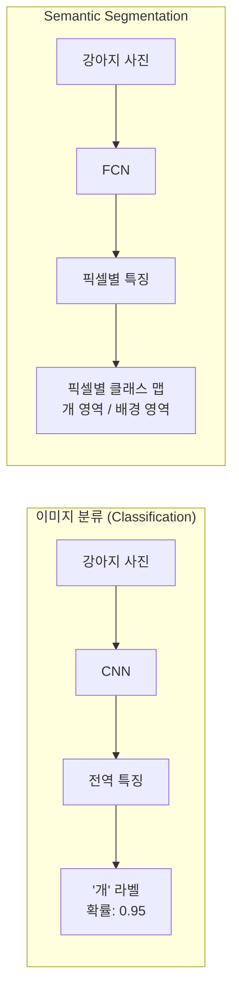

**주요 차이점 비교:**

| 구분 | 이미지 분류 | Semantic Segmentation |
|------|------------|---------------------|
| **목적** | "무엇이 있는가?" | "어디에 무엇이 있는가?" |
| **출력** | 단일 클래스 라벨 | 픽셀별 클래스 맵 |
| **정보량** | 전역적 정보만 | 세부적 위치 정보 포함 |
| **활용도** | 검색, 분류 | 자율주행, 의료영상 분석 |
| **연산량** | 상대적으로 적음 | 상대적으로 많음 |

### 1.3. 픽셀 단위 예측 원리

Semantic Segmentation에서 각 픽셀의 클래스를 예측하는 과정은 다음과 같습니다:

**1단계: 특징 추출**
이미지에서 의미 있는 특징을 추출합니다.

**2단계: 픽셀별 분류**
각 픽셀 위치에서 클래스 확률을 계산합니다.

$$P(y_{i,j} = c | x) = \frac{\exp(z_{i,j,c})}{\sum_{k=0}^{C-1} \exp(z_{i,j,k})}$$

- `P(y_{i,j} = c | x)`: 픽셀 (i,j)가 클래스 c일 확률
- `z_{i,j,c}`: 픽셀 (i,j)에서 클래스 c에 대한 로짓(logit) 값
- `C`: 전체 클래스 개수
- `exp()`: 지수 함수 (소프트맥스 함수의 구성 요소)

**3단계: 최종 예측**
가장 높은 확률을 가진 클래스를 선택합니다.

```python
# 픽셀별 예측 과정
output_logits = model(input_image)  # [배치, 클래스수, 높이, 너비]
probabilities = F.softmax(output_logits, dim=1)  # 확률로 변환
predicted_classes = torch.argmax(probabilities, dim=1)  # 최대 확률 클래스 선택
```

### 1.4. 손실 함수와 평가 지표

**주요 손실 함수:**

**1) 크로스 엔트로피 손실 (Cross-Entropy Loss)**

$$L_{CE} = -\frac{1}{H \times W} \sum_{i=1}^{H} \sum_{j=1}^{W} \sum_{c=0}^{C-1} y_{i,j,c} \log(p_{i,j,c})$$

- `L_CE`: 크로스 엔트로피 손실값
- `H, W`: 이미지의 높이와 너비
- `y_{i,j,c}`: 픽셀 (i,j)가 클래스 c인지 나타내는 정답 라벨 (0 또는 1)
- `p_{i,j,c}`: 픽셀 (i,j)가 클래스 c일 예측 확률
- `log()`: 자연로그 함수

**2) 다이스 손실 (Dice Loss)**
클래스 불균형 문제를 해결하는 데 유용합니다.

$$L_{Dice} = 1 - \frac{2 \times |P \cap G|}{|P| + |G|}$$

- `L_Dice`: 다이스 손실값
- `P`: 예측된 픽셀 집합
- `G`: 정답 픽셀 집합
- `|P ∩ G|`: 예측과 정답이 일치하는 픽셀 개수
- `|P|, |G|`: 각각 예측과 정답의 총 픽셀 개수

**주요 평가 지표:**

**1) 픽셀 정확도 (Pixel Accuracy)**

$$PA = \frac{\text{올바르게 분류된 픽셀 수}}{\text{전체 픽셀 수}}$$

**2) 평균 IoU (Mean Intersection over Union)**

$$mIoU = \frac{1}{C} \sum_{c=0}^{C-1} \frac{\text{교집합}}{\text{합집합}}$$

- 각 클래스별로 IoU를 계산한 후 평균을 구합니다
- IoU가 높을수록 예측이 정확함을 의미합니다

### 1.5. 실제 응용 분야

**자율주행 자동차:**
- 도로, 차선, 다른 차량, 보행자, 신호등 등을 실시간으로 구분
- 안전한 주행 경로 계획에 필수적

**의료 영상 분석:**
- CT, MRI 스캔에서 종양이나 병변 부위를 정확히 찾아내기
- 수술 계획 수립과 치료 효과 모니터링

**위성 이미지 분석:**
- 토지 이용 현황 파악 (건물, 도로, 농지, 산림 등)
- 환경 변화 모니터링과 도시 계획

---

## 2. Fully Convolutional Networks (FCN)

### 2.1. FCN의 핵심 특징

**FCN**은 2015년에 제안된 Semantic Segmentation을 위한 혁신적인 신경망 구조입니다. 가장 큰 특징은 **완전연결층(Fully Connected Layer)을 완전히 제거**하고 **합성곱층(Convolutional Layer)만 사용**한다는 점입니다.

**왜 이것이 혁신적인가요?**

기존 CNN은 마지막에 완전연결층을 사용해서 **공간 정보를 모두 잃어버렸습니다**. 하지만 Semantic Segmentation에서는 "어디에" 무엇이 있는지가 중요하므로, 공간 정보를 보존해야 합니다.

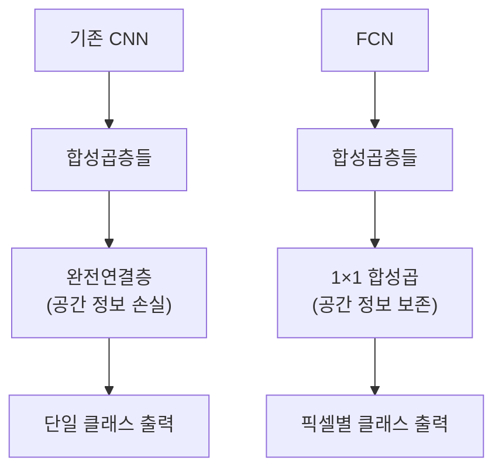

**핵심 아이디어:**
- **1×1 합성곱**: 완전연결층의 역할을 하면서도 공간 구조 유지
- **업샘플링**: 작아진 특징 맵을 원본 크기로 복원
- **엔드-투-엔드 학습**: 한 번에 전체 네트워크 학습 가능

### 2.2. 기존 CNN과의 차이점

**공간 정보 처리 방식의 차이:**

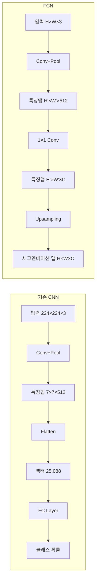

**주요 차이점:**

1. **완전연결층 제거**: 공간 구조를 평면화(flatten)하지 않음
2. **임의 크기 입력**: 고정된 입력 크기에 제약받지 않음
3. **효율적 연산**: 슬라이딩 윈도우 방식보다 훨씬 빠름
4. **엔드-투-엔드**: 전체 과정을 한 번에 학습

### 2.3. 아키텍처 구조

FCN은 **인코더-디코더** 구조를 따릅니다:

**인코더 (Encoder) 단계:**
- 기존 CNN 백본(AlexNet, VGG 등)을 사용
- 이미지에서 의미적 특징을 추출
- 점진적으로 해상도를 줄이면서 채널 수를 늘림

**디코더 (Decoder) 단계:**
- 저해상도 특징 맵을 원본 크기로 복원
- **전치 합성곱(Transpose Convolution)** 사용
- 픽셀별 분류를 위한 최종 출력 생성

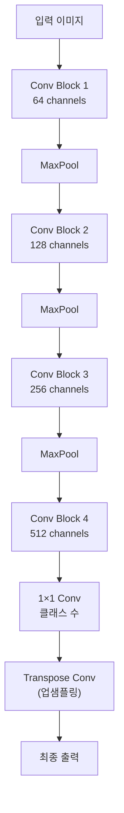

**FCN의 세 가지 버전:**

- **FCN-32s**: 마지막 층에서만 32배 업샘플링
- **FCN-16s**: 중간 층과 결합하여 16배 업샘플링
- **FCN-8s**: 더 많은 층을 결합하여 8배 업샘플링 (가장 세밀함)

### 2.4. 업샘플링과 스킵 연결

**업샘플링 (Upsampling):**

작아진 특징 맵을 원본 크기로 키우는 과정입니다. 두 가지 주요 방법이 있습니다:

**1) 이중선형 보간 (Bilinear Interpolation):**
- 주변 픽셀들의 값을 선형 조합하여 중간값 계산
- 빠르지만 학습 불가능

**2) 전치 합성곱 (Transpose Convolution):**
- 학습 가능한 파라미터로 업샘플링
- 더 정교한 복원 가능하지만 연산량 증가

```python
# 전치 합성곱 예시
upconv = nn.ConvTranspose2d(in_channels=512, out_channels=256,
                           kernel_size=4, stride=2, padding=1)
```

**스킵 연결 (Skip Connection):**

깊은 층의 추상적 특징과 얕은 층의 세밀한 특징을 결합하는 기법입니다.

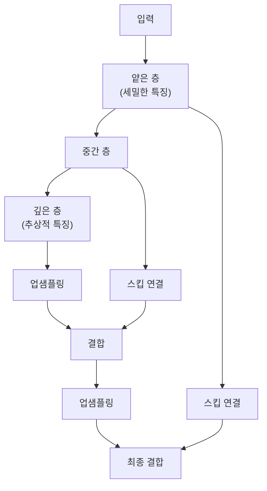

**스킵 연결의 장점:**
- **세부 정보 보존**: 업샘플링 과정에서 손실되는 디테일 복구
- **경계 개선**: 객체의 경계를 더 정확하게 구분
- **그래디언트 흐름**: 역전파 시 그래디언트가 더 잘 전달됨

---

## 3. GAN의 생성자와 판별자

### 3.1. 생성자의 역할

**생성자(Generator)**는 **무작위 노이즈에서 실제 같은 데이터를 만들어내는** 신경망입니다. 마치 "예술가"와 같은 역할을 합니다.

**생성자의 기본 과정:**
1. **잠재 벡터(Latent Vector)** 입력 받기
2. 여러 층을 거쳐 점진적으로 **크기 확장**
3. 최종적으로 실제와 같은 **이미지 생성**

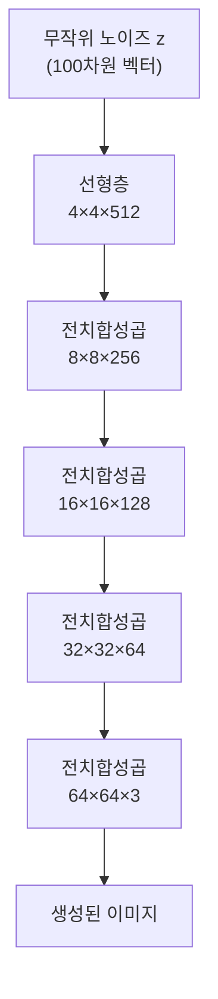

**수학적 표현:**

$$G: \mathbb{R}^d \rightarrow \mathbb{R}^{H \times W \times 3}$$

- `G`: 생성자 함수
- `d`: 잠재 벡터의 차원 (보통 100~1000)
- `H×W×3`: 생성할 이미지의 크기 (높이×너비×RGB)

```python
# 생성자 사용 예시
noise = torch.randn(batch_size, latent_dim)  # 무작위 노이즈 생성
fake_images = generator(noise)  # 가짜 이미지 생성
```

**생성자의 목표:**
- 판별자를 "속이는" 것
- 실제 데이터와 구별할 수 없는 가짜 데이터 생성

### 3.2. 판별자의 역할

**판별자(Discriminator)**는 **진짜와 가짜를 구분하는** 이진 분류기입니다. 마치 "감정사"와 같은 역할을 합니다.

**판별자의 기본 과정:**
1. 이미지를 입력으로 받기
2. 여러 합성곱층을 통해 **특징 추출**
3. 최종적으로 **진짜/가짜 확률** 출력

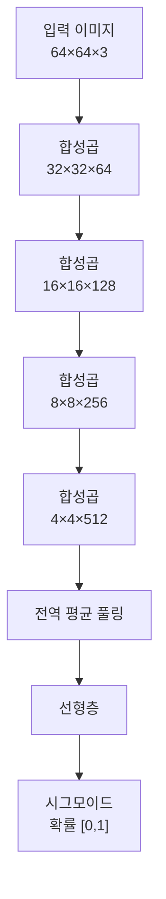

**수학적 표현:**

$$D(x) = P(\text{x가 진짜일 확률})$$

- `D(x)`: 판별자의 출력 (0~1 사이의 확률값)
- `x`: 입력 이미지
- 1에 가까우면 진짜, 0에 가까우면 가짜로 판단

**판별자의 목표:**
- 실제 이미지는 1(진짜)로 분류
- 생성된 이미지는 0(가짜)로 분류

### 3.3. 적대적 학습 과정

GAN의 학습은 **미니맥스 게임(Minimax Game)**입니다. 생성자와 판별자가 서로 경쟁하면서 둘 다 발전합니다.

```mermaid
graph LR
    A["1단계:<br/>판별자 학습"] --> B["2단계:<br/>생성자 학습"]
    B --> C["3단계:<br/>성능 평가"]
    C --> D["수렴했는가?"]
    D -->|No| A
    D -->|Yes| E["학습 완료"]
```

**상세한 학습 과정:**

**1단계: 판별자 학습**
```python
# 실제 이미지로 학습
real_images = next(dataloader)
real_predictions = discriminator(real_images)
real_loss = criterion(real_predictions, ones)  # 1로 학습

# 가짜 이미지로 학습  
fake_images = generator(noise)
fake_predictions = discriminator(fake_images.detach())
fake_loss = criterion(fake_predictions, zeros)  # 0으로 학습

discriminator_loss = real_loss + fake_loss
```

**2단계: 생성자 학습**
```python
# 생성자는 판별자를 속이려고 함
fake_images = generator(noise)
fake_predictions = discriminator(fake_images)
generator_loss = criterion(fake_predictions, ones)  # 1로 속이려 함
```

**미니맥스 게임의 수학적 표현:**

$$\min_G \max_D V(D,G) = \mathbb{E}_{x \sim p_{data}}[\log D(x)] + \mathbb{E}_{z \sim p_z}[\log(1-D(G(z)))]$$

- `min_G`: 생성자 G는 목적함수를 최소화하려 함
- `max_D`: 판별자 D는 목적함수를 최대화하려 함  
- `p_data`: 실제 데이터 분포
- `p_z`: 노이즈 분포
- `E[·]`: 기댓값 (평균)

### 3.4. 핵심 이론과 한계점

**이론적 수렴점:**

이상적인 상황에서 GAN은 **내쉬 균형(Nash Equilibrium)**에 도달합니다:

$$p_g = p_{data}, \quad D^*(x) = \frac{1}{2}$$

- `p_g`: 생성자가 만든 데이터 분포
- `p_data`: 실제 데이터 분포  
- `D*(x) = 1/2`: 판별자가 진짜/가짜를 구분하지 못함

**주요 한계점:**

**1) 모드 붕괴(Mode Collapse)**
- 생성자가 다양한 데이터를 만들지 못하고 특정 패턴만 반복
- 예: 숫자 7만 계속 생성

**2) 학습 불안정성**
- 생성자와 판별자의 균형 맞추기 어려움
- 한쪽이 너무 강해지면 학습 실패

**3) 그래디언트 소실**
- 판별자가 너무 완벽해지면 생성자가 학습하지 못함

**해결 방법들:**
- **WGAN**: 다른 거리 함수 사용
- **Progressive GAN**: 점진적으로 해상도 증가
- **StyleGAN**: 스타일과 콘텐츠 분리

---

## 4. Diffusion 모델과 이미지 생성

### 4.1. Diffusion 모델의 기본 원리

**Diffusion 모델**은 **물리학의 확산 현상**에서 영감을 받은 생성 모델입니다. 마치 물에 떨어뜨린 잉크가 퍼져나가는 과정과 반대로, **노이즈에서 점진적으로 이미지를 복원**합니다.

**핵심 아이디어:**
1. **순방향**: 실제 이미지에 점진적으로 노이즈 추가
2. **역방향**: 노이즈에서 점진적으로 이미지 복원
3. **학습 목표**: 각 단계에서 노이즈를 제거하는 방법 학습

```mermaid
graph LR
    A["실제 이미지<br/>x₀"] --> B["약간의 노이즈<br/>x₁"]
    B --> C["더 많은 노이즈<br/>x₂"]
    C --> D["..."]
    D --> E["순수 노이즈<br/>xₜ"]
    
    F["순수 노이즈<br/>xₜ"] --> G["디노이징<br/>xₜ₋₁"]
    G --> H["점진적 복원<br/>xₜ₋₂"]
    H --> I["..."]
    I --> J["복원된 이미지<br/>x₀"]
```

**GAN과의 비교:**
- **GAN**: 한 번에 노이즈에서 이미지 생성
- **Diffusion**: 여러 단계에 걸쳐 점진적으로 생성
- **안정성**: Diffusion이 더 안정적인 학습
- **속도**: GAN이 더 빠른 생성

### 4.2. 노이즈 추가와 제거 과정

**순방향 과정 (Forward Process):**

실제 이미지 x₀에 T 단계에 걸쳐 가우시안 노이즈를 추가합니다.

$$q(x_t|x_{t-1}) = \mathcal{N}(x_t; \sqrt{1-\beta_t}x_{t-1}, \beta_t I)$$

- `q(x_t|x_{t-1})`: 이전 단계에서 현재 단계로의 노이즈 추가 과정
- `N(μ, σ²)`: 평균 μ, 분산 σ²인 가우시안 분포
- `β_t`: 각 단계의 노이즈 스케줄 (보통 0.0001~0.02)
- `I`: 단위 행렬

**중요한 특성: 직접 계산 가능**

임의의 단계 t에서 노이즈가 추가된 이미지를 바로 계산할 수 있습니다:

$$x_t = \sqrt{\bar{\alpha_t}}x_0 + \sqrt{1-\bar{\alpha_t}}\epsilon$$

- `α_t = 1 - β_t`: 노이즈 보존 비율
- `ᾱ_t = ∏(s=1 to t) α_s`: 누적 노이즈 보존 비율
- `ε ~ N(0, I)`: 표준 가우시안 노이즈

```python
# 순방향 과정 구현
def add_noise(x0, t, noise_schedule):
    alpha_bar = noise_schedule[t]
    noise = torch.randn_like(x0)
    noisy_image = torch.sqrt(alpha_bar) * x0 + torch.sqrt(1 - alpha_bar) * noise
    return noisy_image, noise
```

**역방향 과정 (Reverse Process):**

신경망이 각 단계에서 노이즈를 예측하고 제거합니다.

$p_\theta(x_{t-1}|x_t) = \mathcal{N}(x_{t-1}; \mu_\theta(x_t, t), \sigma_t^2 I)$

- `p_θ(x_{t-1}|x_t)`: 신경망이 학습하는 역방향 과정
- `μ_θ(x_t, t)`: 신경망이 예측하는 이전 단계의 평균
- `σ_t²`: 각 단계의 분산 (고정값 또는 학습 가능)

### 4.3. 학습과 생성 과정

**학습 목표:**

Diffusion 모델은 각 단계에서 **추가된 노이즈를 예측**하도록 학습됩니다.

**손실 함수:**

$L = \mathbb{E}_{t,x_0,\epsilon}[\|\epsilon - \epsilon_\theta(x_t, t)\|^2]$

- `L`: 평균 제곱 오차 손실
- `ε`: 실제로 추가된 노이즈
- `ε_θ(x_t, t)`: 신경망이 예측한 노이즈
- `x_t`: t 단계의 노이즈가 추가된 이미지

**학습 알고리즘:**
```python
# Diffusion 모델 학습
def train_step(model, x0, noise_schedule):
    t = random.randint(1, T)  # 무작위 시간 단계 선택
    noise = torch.randn_like(x0)  # 실제 노이즈 생성
    x_t = add_noise(x0, t, noise_schedule)  # 노이즈 추가
    predicted_noise = model(x_t, t)  # 노이즈 예측
    loss = F.mse_loss(predicted_noise, noise)  # 손실 계산
    return loss
```

**생성 과정:**

```mermaid
graph TD
    A["순수 노이즈 xₜ"] --> B["신경망으로 노이즈 예측"]
    B --> C["노이즈 제거하여 xₜ₋₁ 생성"]
    C --> D["t = t-1"]
    D --> E["t > 0인가?"]
    E -->|Yes| B
    E -->|No| F["최종 이미지 x₀"]
```

**생성 알고리즘:**
```python
# 이미지 생성
def generate_image(model, shape, noise_schedule, T):
    x = torch.randn(shape)  # 순수 노이즈에서 시작
    
    for t in reversed(range(T)):
        predicted_noise = model(x, t)
        # 노이즈 제거하여 이전 단계로
        x = denoise_step(x, predicted_noise, t, noise_schedule)
    
    return x  # 최종 생성된 이미지
```

### 4.4. 주요 장점과 응용

**Diffusion 모델의 장점:**

**1) 학습 안정성**
- GAN처럼 두 네트워크가 경쟁하지 않음
- 단순한 노이즈 예측 작업으로 안정적 학습

**2) 고품질 생성**
- 점진적 생성으로 세밀한 디테일 표현
- 모드 붕괴(Mode Collapse) 문제 없음

**3) 다양성**
- 매번 다른 노이즈에서 시작하여 다양한 결과 생성
- 동일한 조건에서도 다양한 변형 가능

**조건부 생성 (Conditional Generation):**

텍스트나 클래스 정보를 조건으로 하여 원하는 이미지 생성:

$\epsilon_\theta(x_t, t, c) = \epsilon_\theta(x_t, t) + w \cdot [\epsilon_\theta(x_t, t, c) - \epsilon_\theta(x_t, t)]$

- `c`: 조건 정보 (텍스트, 클래스 등)
- `w`: 가이던스 강도 (높을수록 조건을 더 잘 따름)

**주요 응용 분야:**

```mermaid
graph TD
    A["Diffusion 모델"] --> B["텍스트-투-이미지"]
    A --> C["이미지 편집"]
    A --> D["초해상도"]
    A --> E["3D 생성"]
    
    B --> F["DALL-E 2<br/>Midjourney<br/>Stable Diffusion"]
    C --> G["인페인팅<br/>아웃페인팅<br/>스타일 변환"]
    D --> H["저해상도 → 고해상도"]
    E --> I["2D 이미지 → 3D 모델"]
```

**1) 텍스트-투-이미지 생성**
- "고양이가 모자를 쓰고 있는 그림" → 해당 이미지 생성
- 자연어 이해와 이미지 생성 기술의 결합

**2) 이미지 편집**
- **인페인팅**: 이미지의 일부분을 자연스럽게 채우기
- **아웃페인팅**: 이미지 영역을 확장하여 새로운 내용 생성

**3) 의료 및 과학 분야**
- 의료 영상 데이터 증강
- 분자 구조 생성
- 재료 설계

**Latent Diffusion 모델:**

픽셀 공간 대신 **압축된 잠재 공간**에서 확산 과정을 수행하여 효율성 크게 향상:

```mermaid
graph LR
    A["고해상도 이미지"] --> B["VAE 인코더"]
    B --> C["저차원 잠재 표현"]
    C --> D["Diffusion 과정"]
    D --> E["VAE 디코더"]
    E --> F["고해상도 결과"]
```

**장점:**
- **연산량 대폭 감소**: 512×512 대신 64×64에서 작업
- **메모리 효율성**: 소비자용 GPU에서도 실행 가능
- **품질 유지**: 최종 결과는 여전히 고해상도

---

## 5. 용어집

| 용어 | 영문 | 설명 |
|------|------|------|
| 의미적 분할 | Semantic Segmentation | 이미지의 각 픽셀을 의미 있는 클래스로 분류하는 컴퓨터 비전 작업 |
| 조밀 예측 | Dense Prediction | 이미지의 모든 픽셀 위치에서 예측을 수행하는 방식 |
| 픽셀 정확도 | Pixel Accuracy | 전체 픽셀 중 올바르게 분류된 픽셀의 비율 |
| 교집합 비율 | Intersection over Union | 예측 영역과 정답 영역의 교집합을 합집합으로 나눈 비율 |
| 다이스 손실 | Dice Loss | 클래스 불균형 문제 해결을 위해 사용하는 손실 함수 |
| 완전 합성곱 네트워크 | Fully Convolutional Networks | 완전연결층 없이 합성곱층만으로 구성된 신경망 |
| 전치 합성곱 | Transpose Convolution | 특징 맵의 크기를 확대하는 학습 가능한 업샘플링 방법 |
| 이중선형 보간 | Bilinear Interpolation | 주변 네 픽셀의 값을 선형 조합하여 중간값을 계산하는 방법 |
| 스킵 연결 | Skip Connection | 깊은 층과 얕은 층의 특징을 직접 연결하는 구조 |
| 인코더-디코더 | Encoder-Decoder | 입력을 압축하여 특징을 추출한 후 다시 확장하는 구조 |
| 생성적 적대 신경망 | Generative Adversarial Networks | 생성자와 판별자가 서로 경쟁하며 학습하는 생성 모델 |
| 잠재 공간 | Latent Space | 고차원 데이터를 저차원으로 압축한 특징 공간 |
| 잠재 벡터 | Latent Vector | 잠재 공간에서 데이터를 표현하는 저차원 벡터 |
| 미니맥스 게임 | Minimax Game | 한 플레이어의 이득이 다른 플레이어의 손실이 되는 제로섬 게임 |
| 내쉬 균형 | Nash Equilibrium | 모든 플레이어가 최적 전략을 선택하여 균형을 이룬 상태 |
| 모드 붕괴 | Mode Collapse | 생성자가 다양성을 잃고 제한된 패턴만 반복 생성하는 현상 |
| 그래디언트 소실 | Gradient Vanishing | 역전파 과정에서 그래디언트가 사라져 학습이 어려워지는 문제 |
| 확산 모델 | Diffusion Model | 점진적 노이즈 추가와 제거 과정을 통해 데이터를 생성하는 모델 |
| 디노이징 | Denoising | 노이즈가 포함된 데이터에서 노이즈를 제거하여 원본을 복원하는 과정 |
| 순방향 과정 | Forward Process | 실제 데이터에 점진적으로 노이즈를 추가하는 과정 |
| 역방향 과정 | Reverse Process | 노이즈에서 점진적으로 원본 데이터를 복원하는 과정 |
| 가우시안 분포 | Gaussian Distribution | 정규분포라고도 하며, 자연계에서 가장 일반적인 확률 분포 |
| 노이즈 스케줄 | Noise Schedule | 각 단계에서 추가할 노이즈의 양을 정의하는 계획 |
| 마르코프 체인 | Markov Chain | 현재 상태가 직전 상태에만 의존하는 확률 과정 |
| 변분 하한 | Variational Lower Bound | 복잡한 확률 분포를 근사하기 위한 수학적 최적화 기법 |
| 클래시파이어 프리 가이던스 | Classifier-free Guidance | 별도 분류기 없이 조건부 생성 품질을 향상시키는 기법 |
| 잠재 확산 | Latent Diffusion | 픽셀 공간 대신 압축된 잠재 공간에서 수행하는 확산 과정 |
| 조건부 생성 | Conditional Generation | 텍스트, 클래스 등의 조건 정보를 바탕으로 데이터를 생성하는 방법 |
| 인페인팅 | Inpainting | 이미지의 손실되거나 가려진 부분을 자연스럽게 복원하는 기술 |
| 아웃페인팅 | Outpainting | 이미지의 경계를 확장하여 새로운 영역을 생성하는 기술 |
| 변분 자동인코더 | Variational Autoencoder | 확률적 생성 모델의 한 종류로, 데이터를 잠재 공간으로 압축하고 복원 |
| 교차 주의 | Cross Attention | 서로 다른 종류의 정보(텍스트-이미지)를 연결하는 어텐션 메커니즘 |