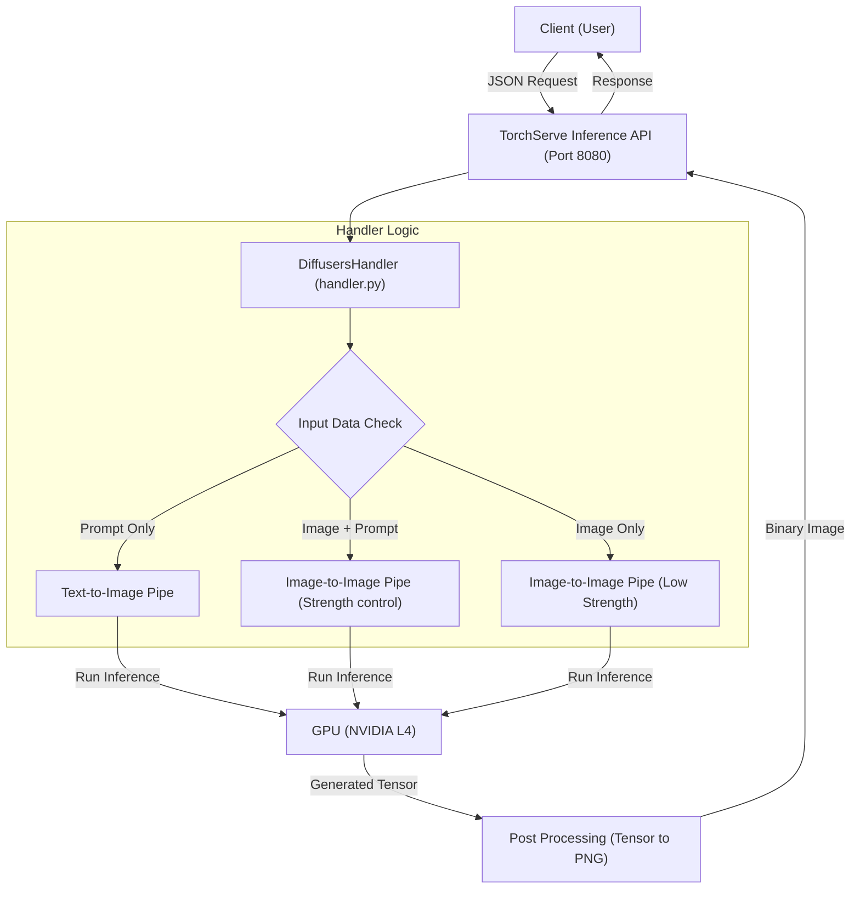

# SDXL 이미지 생성 서비스 구축 가이드

본 문서는 GCP L4 GPU 인스턴스 환경에서 SDXL 모델을 서빙하기 위한 전체 과정을 다룹니다. 환경 설정부터 핸들러(Handler) 구현, 모델 패키징, 그리고 서비스 구동 및 클라이언트 테스트까지의 단계를 포함합니다.

## 1. 개요 (Overview)

이 서비스는 PyTorch 기반의 서빙 프레임워크인 **TorchServe**를 사용하여 구축됩니다. 단일 엔드포인트에서 텍스트 프롬프트 입력과 이미지 입력을 모두 처리할 수 있도록 커스텀 핸들러를 구현합니다.

### 1.1. 주요 기능

* **Text-to-Image**: 텍스트 프롬프트를 입력받아 이미지를 생성합니다.
* **Image-to-Image**: 원본 이미지와 프롬프트를 입력받아, 원본의 구도를 유지하며 스타일을 변경합니다.
* **Image Variation**: 프롬프트 없이 원본 이미지와 유사한 변형 이미지를 생성합니다.

### 1.2. 시스템 요구사항

* **OS**: Linux (Ubuntu 22.04 권장)
* **GPU**: NVIDIA L4 (24GB VRAM) 이상 권장
* **Driver**: CUDA 12.4 호환 드라이버
* **Python**: 3.11.x

---

## 2. 환경 설정 (Environment Setup)

Anaconda를 사용하여 가상 환경을 구성하고 필수 라이브러리를 설치합니다.

### 2.1. Conda 환경 생성

제공된 `sdxl_environment.yml` 파일을 사용하여 환경을 생성하거나, 수동으로 패키지를 설치할 수 있습니다.

#### 2.1.1. YAML 파일 이용 (권장)

```bash
# 환경 파일이 있는 디렉토리에서 실행
conda env create -f sdxl_environment.yml
conda activate sdxl

```

#### 2.1.2. 주요 의존성 패키지 확인

만약 수동으로 설치해야 한다면 다음의 핵심 패키지들이 필요합니다.

* `torch`, `torchvision`, `torchaudio` (CUDA 12.4 지원 버전)
* `diffusers`, `transformers`, `accelerate` (Hugging Face 생태계)
* `torchserve`, `torch-model-archiver` (모델 서빙)
* `nvgpu` (GPU 모니터링)

```bash
# 예시 설치 명령어 (YAML을 사용하지 않을 경우)
pip install torch torchvision torchaudio --index-url https://download.pytorch.org/whl/cu124
pip install diffusers transformers accelerate torchserve torch-model-archiver nvgpu

```

---

## 3. 커스텀 핸들러 구현 (Custom Handler Implementation)

TorchServe의 기본 핸들러 대신, `diffusers` 라이브러리를 효율적으로 사용하기 위한 커스텀 핸들러 `handler.py`를 작성합니다.

### 3.1. 메모리 최적화 전략

L4 GPU의 VRAM 효율성을 극대화하기 위해 다음과 같은 최적화(optimization)를 적용합니다.

1. **FP16 Precision**: `torch.float16`을 사용하여 메모리 사용량을 절반으로 줄입니다.
2. **Component Sharing**: Text-to-Image 파이프라인과 Image-to-Image 파이프라인을 별도로 로드하지 않고, UNet, VAE, Text Encoder 등의 핵심 컴포넌트를 공유(shared)하여 메모리 중복을 방지합니다.
3. **xFormers**: `enable_xformers_memory_efficient_attention()`을 활성화하여 어텐션 연산 속도를 높이고 메모리를 절약합니다.

### 3.2. 핸들러 코드 작성

아래 코드를 `handler.py`로 저장합니다. 이 코드는 입력 데이터의 형태(이미지 유무, 프롬프트 유무)에 따라 분기 처리를 수행합니다.

```python
import torch
import io
import base64
from PIL import Image
from diffusers import StableDiffusionXLPipeline, StableDiffusionXLImg2ImgPipeline
from ts.context import Context

class DiffusersHandler:
    def initialize(self, context):
        """
        모델 및 파이프라인 초기화
        Text-to-Image와 Image-to-Image 파이프라인을 모두 로드하되,
        메모리 절약을 위해 구성 요소를 공유합니다.
        """
        # 1. Text-to-Image 파이프라인 로드
        self.txt2img_pipe = StableDiffusionXLPipeline.from_pretrained(
            "stabilityai/stable-diffusion-xl-base-1.0",
            torch_dtype=torch.float16,
            use_safetensors=True,
        ).to("cuda")

        # 가속을 위한 메모리 최적화 (xformers)
        self.txt2img_pipe.enable_xformers_memory_efficient_attention()

        # 2. Image-to-Image 파이프라인 로드 (컴포넌트 재사용)
        self.img2img_pipe = StableDiffusionXLImg2ImgPipeline(
            vae=self.txt2img_pipe.vae,
            text_encoder=self.txt2img_pipe.text_encoder,
            text_encoder_2=self.txt2img_pipe.text_encoder_2,
            tokenizer=self.txt2img_pipe.tokenizer,
            tokenizer_2=self.txt2img_pipe.tokenizer_2,
            unet=self.txt2img_pipe.unet,
            scheduler=self.txt2img_pipe.scheduler,
        ).to("cuda")

        self.img2img_pipe.enable_xformers_memory_efficient_attention()
        print("SDXL Handler initialized with txt2img and img2img support.")

    def handle(self, data, context):
        """
        요청 처리 메인 메서드
        입력 데이터에 따라 txt2img, img2img, img2img(유사) 중 선택 실행합니다.
        """
        if not data:
            return None

        row = data[0]
        payload = row.get("data") or row.get("body")

        if isinstance(payload, dict):
            params = payload
        else:
            import json
            params = json.loads(payload)

        prompt = params.get("prompt")
        input_image_b64 = params.get("image")

        # 분기 처리 로직
        if input_image_b64 and prompt:
            print("Processing Image-to-Image request (with text guidance)...")
            try:
                image_data = base64.b64decode(input_image_b64)
                init_image = Image.open(io.BytesIO(image_data)).convert("RGB")
                strength = float(params.get("strength", 0.75))

                output = self.img2img_pipe(
                    prompt=prompt,
                    image=init_image,
                    strength=strength,
                )
            except Exception as e:
                print(f"Error during img2img processing: {e}")
                return None

        elif input_image_b64 and not prompt:
            print("Processing Image-to-Image request (similar image)...")
            try:
                image_data = base64.b64decode(input_image_b64)
                init_image = Image.open(io.BytesIO(image_data)).convert("RGB")
                # 프롬프트 없이 변형 시 strength를 낮게 설정 (유사도 유지)
                strength = float(params.get("strength", 0.3))

                output = self.img2img_pipe(
                    prompt="", 
                    image=init_image,
                    strength=strength,
                )
            except Exception as e:
                print(f"Error during img2img (similar) processing: {e}")
                return None

        elif prompt and not input_image_b64:
            print("Processing Text-to-Image request...")
            output = self.txt2img_pipe(prompt=prompt)

        else:
            print("Error: Either prompt or image is required.")
            return None

        # 결과 이미지 후처리 (PNG 변환)
        image = output.images[0]
        byte_arr = io.BytesIO()
        image.save(byte_arr, format="PNG")
        return [byte_arr.getvalue()]

```

---

## 4. 모델 패키징 (Model Archiving)

작성한 핸들러와 모델 정보를 `.mar` (Model Archive) 파일로 패키징합니다. 이 파일은 TorchServe가 모델을 로드하고 실행하는 단위가 됩니다.

### 4.1. 아카이빙 명령어

```bash
# 모델 스토어 디렉토리 생성 (없을 경우)
mkdir -p model_store

# 모델 아카이빙 실행
torch-model-archiver \
  --model-name sdxl \
  --version 1.0 \
  --handler handler.py \
  --export-path model_store \
  -f

```

* `--model-name`: 서비스할 모델의 이름 (URL 엔드포인트에 사용됨)
* `--handler`: 앞서 작성한 핸들러 파일 경로
* `--export-path`: `.mar` 파일이 저장될 위치

---

## 5. 서비스 구동 (Service Execution)

TorchServe를 실행하여 모델을 서빙합니다. 외부 접속을 허용하고 토큰 인증을 비활성화하는 설정을 적용합니다.

### 5.1. 설정 파일 (config.properties)

별도의 `config.properties` 파일을 생성하여 기본 설정을 관리할 수 있습니다.

```properties
inference_address=http://0.0.0.0:8080
management_address=http://0.0.0.0:8081
metrics_address=http://0.0.0.0:8082
enable_token_auth=false
install_py_dep_per_model=true
number_of_gpu=1

```

### 5.2. 실행 명령어

환경 변수를 통해 바인딩 주소를 명시적으로 설정하고, 토큰 인증 비활성화 플래그를 사용하여 실행합니다. 이는 외부 IP 접속 시 발생할 수 있는 400 Bad Request(Token Authorization Failed) 오류를 방지합니다.

```bash
# 1. 기존 실행 중인 서버 중지 (안전 조치)
torchserve --stop

# 2. 서버 실행
TS_INFERENCE_ADDRESS=http://0.0.0.0:8080 \
TS_MANAGEMENT_ADDRESS=http://0.0.0.0:8081 \
torchserve --start --ncs \
  --model-store model_store \
  --models sdxl=sdxl.mar \
  --ts-config config.properties \
  --disable-token-auth

```

* `TS_INFERENCE_ADDRESS`: 추론 요청을 받을 주소. `0.0.0.0`으로 설정하여 모든 IP 접속 허용.
* `--disable-token-auth`: 토큰 기반 인증을 강제로 비활성화.
* `--ncs`: No Configuration Snapshot. 스냅샷 기능을 끕니다.

---

## 6. 클라이언트 구현 및 테스트 (Client Implementation)

서비스가 정상적으로 구동되었다면, Python 스크립트를 통해 이미지를 생성할 수 있습니다.

### 6.1. Python 클라이언트 코드

아래는 `requests` 라이브러리를 사용하여 세 가지 모드(Txt2Img, Img2Img, Variation)를 모두 지원하는 함수입니다.

```python
import requests
import base64
from PIL import Image
from io import BytesIO

def generate_image(prompt=None, image_path=None, strength=0.75, seed=None):
    """
    SDXL 이미지 생성 요청 함수
    
    Args:
        prompt (str): 생성할 이미지에 대한 설명
        image_path (str): 로컬 이미지 파일 경로 (Img2Img용)
        strength (float): 이미지 변형 강도 (0.0 ~ 1.0)
            - 1.0에 가까울수록 원본과 달라짐
            - 0.0에 가까울수록 원본 유지
        seed (int): 결과 재현을 위한 시드값
    """
    # 서버 공인 IP 주소 입력
    url = "http://34.64.206.210:8080/predictions/sdxl"
    
    payload = {}
    
    # 1. 프롬프트 설정
    if prompt:
        payload["prompt"] = prompt
    
    # 2. 이미지 인코딩 및 설정
    if image_path:
        with open(image_path, 'rb') as f:
            # 바이너리 이미지를 Base64 문자열로 변환
            image_b64 = base64.b64encode(f.read()).decode('utf-8')
            payload["image"] = image_b64
    
    # 3. 파라미터 설정
    payload["strength"] = strength
    if seed is not None:
        payload["seed"] = seed
    
    headers = {"Content-Type": "application/json"}
    
    try:
        response = requests.post(url, json=payload, headers=headers)
        response.raise_for_status()
        
        # 응답 받은 바이너리 데이터를 이미지로 변환
        image = Image.open(BytesIO(response.content))
        print(f"성공: prompt='{prompt}', image mode={'Yes' if image_path else 'No'}")
        return image
    except Exception as e:
        print(f"API 호출 실패: {e}")
        return None

# --- 사용 예시 ---

# 1. Text-to-Image
img1 = generate_image(prompt="A futuristic cyberpunk city, 8k resolution", seed=42)
img1.save("result_txt2img.png")

# 2. Image-to-Image (텍스트 가이드)
img2 = generate_image(
    prompt="Make it snowy", 
    image_path="result_txt2img.png", 
    strength=0.8
)
img2.save("result_img2img.png")

# 3. Image Variation (유사 이미지)
img3 = generate_image(
    image_path="result_txt2img.png", 
    strength=0.3 # 낮은 strength로 유사도 유지
)
img3.save("result_variation.png")

```

---

## 7. 시스템 아키텍처 (System Architecture)

전체 시스템의 데이터 흐름과 내부 처리 로직은 다음과 같습니다.



### 7.1. Strength 파라미터의 수학적 의미

Image-to-Image 생성 시 `strength` 파라미터(

)는 초기 노이즈의 양을 결정합니다.

* 
: 원본 이미지와 완전히 동일 (변화 없음)
* 
: 원본 이미지를 무시하고 프롬프트만으로 완전한 노이즈에서 생성

이 가이드를 통해 SDXL 모델을 성공적으로 배포하고, 다양한 이미지 생성 애플리케이션에 활용하시기 바랍니다.
